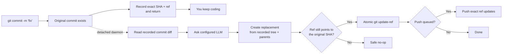

<p align="center">
  
</p>

<h1 align="center">Git AI — Asynchronous AI Commit Message Generator</h1>

<p align="center">
  <strong>Commit now. Keep coding. Let AI polish the message in the background.</strong>
  <br />
  Turn rough Git commit messages into clear Conventional Commits—after Git has safely recorded your work.
</p>

<p align="center">
  <a href="https://github.com/daidi/git-ai/releases"></a>
  <a href="https://github.com/daidi/git-ai/actions/workflows/ci.yml"></a>
  <a href="LICENSE"></a>
  <a href="https://marketplace.visualstudio.com/items?itemName=git-ai-async-commit-polisher.git-ai"></a>
  <a href="https://plugins.jetbrains.com/plugin/31221-git-ai"></a>
</p>

<p align="center">
  <a href="https://codegg.org/git-ai/"><strong>Website</strong></a>
  &nbsp;·&nbsp;
  <a href="#install">Install</a>
  &nbsp;·&nbsp;
  <a href="#quick-start">Quick start</a>
  &nbsp;·&nbsp;
  <a href="#how-it-works">How it works</a>
  &nbsp;·&nbsp;
  <a href="https://github.com/daidi/git-ai/issues">Support</a>
</p>

<p align="center">
  <sub>
    English ·
    <a href="README_zh-CN.md">简体中文</a> ·
    <a href="README_zh-TW.md">繁體中文</a> ·
    <a href="README_fr.md">Français</a> ·
    <a href="README_de.md">Deutsch</a> ·
    <a href="README_es.md">Español</a> ·
    <a href="README_it.md">Italiano</a> ·
    <a href="README_ja.md">日本語</a> ·
    <a href="README_ko.md">한국어</a> ·
    <a href="README_pt.md">Português</a> ·
    <a href="README_ru.md">Русский</a> ·
    <a href="README_ar.md">العربية</a> ·
    <a href="README_vi.md">Tiếng Việt</a> ·
    <a href="README_th.md">ไทย</a> ·
    <a href="README_id.md">Bahasa Indonesia</a> ·
    <a href="README_ms.md">Bahasa Melayu</a>
  </sub>
</p>

<p align="center">
  
</p>

<!-- Editable vector source: assets/readme-hero.svg -->

Git AI is a free, open-source **AI commit message generator** for the terminal, VS Code, and JetBrains IDEs. It turns quick drafts such as `fix auth` into useful commit history without putting an LLM response between you and your next line of code.

Unlike pre-commit generators, Git AI runs from a `post-commit` hook. Your original commit exists first; a detached daemon then reads that exact commit, asks the model you configured, creates a replacement with the same tree and parents, and updates the branch only when it is still safe.

> Git AI dogfoods its own workflow. [Browse this repository's commit history](https://github.com/daidi/git-ai/commits/main) to see the result.

## See the difference

```console
$ git commit -m "fix auth"
[main 1a2b3c4] fix auth
✨ Git AI: polishing in background (PID 2418)

# Your terminal is free immediately. When polishing finishes:
$ git log -1 --pretty=%s
fix(auth): prevent expired sessions on mobile
```

Git returns immediately. While the model works, you can edit, test, switch tools, or even run `git push`; Git AI coordinates the result in the background.

## Why Git AI

Most AI commit tools make generation part of the critical path. Git AI deliberately moves it after the commit.

| | Typical AI commit generator | Git AI |
|:--|:--|:--|
| **Workflow** | Generate → wait → review → commit | Commit → keep coding → polish in background |
| **Command** | A special command, button, or dialog | Your normal `git commit` |
| **If AI fails** | The commit may never happen | The original commit remains intact |
| **Newer work** | A blind amend can capture the wrong state | Replacement uses the recorded tree and parents |
| **Branch safety** | Tool-dependent | Atomic compare-and-swap; a moved ref becomes a safe no-op |
| **Immediate push** | Wait or coordinate it yourself | Queue the exact push, or choose strict blocking |
| **Where it works** | Usually one CLI or editor | Terminal, VS Code, JetBrains, and other Git clients |

**Commit first, think later** means your code is snapshotted before AI enters the workflow.

## Install

Choose the experience you already use. The IDE integrations provision and update the matching Git AI CLI automatically, with published SHA-256 verification.

| Use Git AI in | Install | Included experience |
|:--|:--|:--|
| **VS Code / compatible editors** | [Visual Studio Marketplace](https://marketplace.visualstudio.com/items?itemName=git-ai-async-commit-polisher.git-ai) · [Open VSX](https://open-vsx.org/extension/git-ai-async-commit-polisher/git-ai) | Activity Bar, status, history, settings, stats, logs, and recovery actions |
| **JetBrains IDEs** | [JetBrains Marketplace](https://plugins.jetbrains.com/plugin/31221-git-ai) | Native Tool Window, status widget, settings, history, stats, logs, and VCS actions |
| **Terminal / any Git client** | [GitHub Releases](https://github.com/daidi/git-ai/releases) · package managers below | Standalone Go binary and composable Git hooks |

### Standalone CLI

**Homebrew — macOS or Linux**

```bash
brew install daidi/tap/git-ai
```

**Scoop — Windows**

```powershell
scoop bucket add daidi https://github.com/daidi/scoop-bucket.git
scoop install daidi/git-ai
```

**Verified installer — macOS or Linux**

```bash
curl -fsSL https://raw.githubusercontent.com/daidi/git-ai/main/install.sh | bash
```

**Verified installer — Windows PowerShell**

```powershell
iwr https://raw.githubusercontent.com/daidi/git-ai/main/install.ps1 -useb | iex
```

**Go install**

```bash
go install github.com/daidi/git-ai/cli/cmd/git-ai@latest
```

Installing from source requires Go 1.26.6 or later.

Prebuilt binaries are available for macOS, Linux, and Windows on AMD64 and ARM64. See [GitHub Releases](https://github.com/daidi/git-ai/releases) for archives, checksums, `.deb`, and `.rpm` packages.

## Quick start

IDE users can open Git AI settings, connect a model, and accept the one-time repository initialization prompt. For the standalone CLI:

```bash
# Run once in each repository to install the composable hooks
cd your-project
git-ai init

# The default endpoint is DeepSeek; replace the placeholder with your key
git-ai config set api_key "sk-..." --global
git-ai config test

# Keep using Git exactly as before
git commit -m "fix login"
```

That is the complete daily workflow. Use `git-ai status` when you want visibility; otherwise Git AI stays out of the way.

Prefer a local model? No API key is required for Ollama:

```bash
git-ai config set provider ollama --global
git-ai config set model llama3 --global
git-ai config set base_url http://localhost:11434 --global
git-ai config test
```

## What you get

- **Truly asynchronous polishing** — the `post-commit` hook records the target and returns while a detached daemon handles the model request.
- **Git-safe replacement** — Git AI builds from the recorded commit, never from whatever happens to be staged later.
- **Push-aware workflow** — the default `queue` policy can replay exact ref updates after polishing; `block` keeps push manual.
- **Four message styles** — [Conventional Commits](https://www.conventionalcommits.org/), [Gitmoji](https://gitmoji.dev/), plain subjects, and structured subject plus body.
- **Bring your own model** — OpenAI-compatible APIs, Anthropic Claude, Google Gemini, DeepSeek, Qwen, and local Ollama.
- **Repository-aware output** — bounded smart diff trimming, static Commitlint JSON rules, output language, custom prompts, and optional explanations.
- **Validated built-in contracts** — empty, oversized, invalid, or wrong-format model responses are rejected; original Git trailers are preserved exactly.
- **Smart skip** — valid new messages can remain untouched while rough or repeated drafts are polished.
- **Recovery controls** — inspect status, retry, undo, cancel, skip the next commit, or recover from an interrupted operation.
- **Local observability** — AI history, generation latency, productivity estimates, bounded logs, and native system notifications.
- **Native IDE integrations** — managed installation and visual controls for [VS Code](vscode-extension/README.md) and [JetBrains IDEs](idea-plugin/README.md).
- **16 interface languages** — English plus Arabic, Simplified Chinese, Traditional Chinese, French, German, Indonesian, Italian, Japanese, Korean, Malay, Portuguese, Russian, Spanish, Thai, and Vietnamese localizations.
- **Reproducible quality checks** — a [public-commit evaluation harness](cli/eval/README.md) scores format, semantics, trailer preservation, diff context, and latency.

## How it works



### Safe by design

Git AI does **not** run a blind background `git commit --amend`.

1. Git creates the original commit before Git AI starts model work.
2. The hook records the exact commit SHA and branch ref, then exits.
3. The daemon reads the recorded commit—not the current index or worktree.
4. The replacement reuses the recorded tree and parents.
5. The branch advances with `git update-ref <ref> <new> <expected>` only if the expected SHA still matches.
6. A newer commit, moved branch, network error, invalid credentials, rate limit, malformed response, or model failure leaves the original commit and workspace unchanged.

Because a Git commit message is part of the commit object, a successful polish creates a new commit SHA. The safety check ensures Git AI changes only the commit it originally recorded.

### Privacy and local ownership

- **No Git AI relay server.** The bounded commit diff and draft message go directly to the model endpoint you configure.
- **Local inference is supported.** Use Ollama when code must stay on your machine.
- **Credentials stay out of repositories.** Persisted API keys are user-level only; environment variables are also supported.
- **Runtime state stays out of the worktree.** State, logs, and AI history live in the user cache; repository overrides use `.git/config`.
- **No uploaded analytics.** Productivity statistics and commit metadata remain local.
- **Sensitive diagnostics are excluded.** Logs do not contain API keys, prompts, diffs, response bodies, or credential-bearing remote URLs.
- **Downloads are verified.** The installers and IDE integrations validate released binaries against published SHA-256 checksums before replacement.

Release checks and managed downloads may contact GitHub or the Git AI release service.

## Providers and configuration

| Provider mode | Works with | API key |
|:--|:--|:--|
| `openai` | OpenAI-compatible endpoints including DeepSeek, OpenAI, Qwen, and compatible gateways | Required |
| `anthropic` | Native Anthropic Claude API | Required |
| `gemini` | Native Google Gemini API | Required |
| `ollama` | Local Ollama server | Not required |

Example for an OpenAI-compatible endpoint:

```bash
git-ai config set provider openai --global
git-ai config set base_url https://api.example.com/v1 --global
git-ai config set model your-model --global
git-ai config set api_key "sk-..." --global
git-ai config test
```

Useful behavior and output options:

| Setting | Default | Purpose |
|:--|:--|:--|
| `message_format` | `conventional` | `plain`, `conventional`, `gitmoji`, or `subject-body` |
| `commit_attribution` | `off` | Opt-in `Polished-by` trailer: `off` or `compact` |
| `language` | `en` | Language used for generated commit messages |
| `smart_skip` | `true` | Keep a valid new message instead of calling the model |
| `push_policy` | `queue` | Queue a safe background push, or set `block` for manual control |
| `max_diff_tokens` | `8000` | Bound the diff context sent to the model |
| `explain` | `false` | Add a short body explaining why the change was made |
| `prompt_template` | empty | Customize generation with `{{.Diff}}`, `{{.Hint}}`, and `{{.Language}}` |

Attribution is optional and disabled by default. Enable it for just this repository with `git-ai config set commit_attribution compact` (add `--global` for all repositories). Successful AI polishing appends this trailer after existing metadata:

```text
Polished-by: Git AI <https://codegg.org/git-ai/>
```

Original trailers are preserved, and an existing identical attribution is not added again. Smart-skipped, failed, and signed commits are not changed. `git-ai config set commit_attribution off` stops new attribution without removing existing trailers; `git-ai undo` restores the original message, including its original metadata. `GIT_AI_COMMIT_ATTRIBUTION` can override the setting.

Configuration precedence:

```text
GIT_AI_* environment variables
        ↓
repository overrides in .git/config
        ↓
user configuration in the OS application-config directory
        ↓
defaults
```

API keys are user-level only. Legacy `.git-ai.json` files in a worktree are ignored so a cloned repository cannot redirect your credential to an untrusted endpoint.

## Everyday commands

| Command | What it does |
|:--|:--|
| `git-ai status` | Show `idle`, `polishing`, `pushing`, or `failed` state |
| `git-ai retry` | Retry the current commit safely in the background |
| `git-ai undo` | Restore the original draft message |
| `git-ai cancel` | Stop active polishing without changing Git |
| `git-ai skip-next` | Leave the next commit untouched |
| `git-ai push` | Resume a deferred push or push the current branch |
| `git-ai log` | Show Git history with local AI metadata |
| `git-ai stats` | Show local productivity statistics |
| `git-ai config list` | Inspect effective configuration with secrets masked |
| `git-ai config schema` | Print the versioned configuration contract for IDEs and automation |
| `git-ai config models` | Discover models exposed by the configured provider |
| `git-ai update` | Install the latest verified CLI release |
| `git-ai uninstall` | Remove Git AI hooks and restore preserved hooks |

Run `git-ai --help` or `git-ai <command> --help` for the complete CLI reference.

## IDE integrations

### VS Code

The [VS Code extension](vscode-extension/README.md) supports VS Code 1.85+ and compatible Open VSX editors. It adds an Activity Bar control center, live status, AI history, visual global/project settings, local productivity stats, logs, and one-click recovery actions. Restricted workspaces never execute binaries, download updates, or install hooks.

```bash
code --install-extension git-ai-async-commit-polisher.git-ai
```

### JetBrains IDEs

The [JetBrains plugin](idea-plugin/README.md) supports IntelliJ Platform IDEs 2024.1+, including IntelliJ IDEA, WebStorm, PyCharm, GoLand, PhpStorm, CLion, DataGrip, and RubyMine. It provides a native Tool Window, status widget, settings page, VCS actions, history, stats, and bounded log viewing.

[Install Git AI from the JetBrains Marketplace →](https://plugins.jetbrains.com/plugin/31221-git-ai)

## Frequently asked questions

<details>
<summary><strong>Does Git AI change my source files, index, or staged work?</strong></summary>
<br />
No. The replacement commit is built from the exact recorded commit tree and parents. Staged, unstaged, and newer changes are never captured.
</details>

<details>
<summary><strong>What happens if I make another commit while AI is still working?</strong></summary>
<br />
The branch no longer points to the SHA Git AI recorded, so the atomic update becomes a safe no-op. Git AI never rewrites the newer commit.
</details>

<details>
<summary><strong>What happens if I push immediately?</strong></summary>
<br />
With the default <code>queue</code> policy, the pre-push hook records the exact ref updates and replays them after a safe polish. If background authentication is unavailable, initialization selects <code>block</code> so you can push manually instead.
</details>

<details>
<summary><strong>Can I review, retry, or reverse the generated message?</strong></summary>
<br />
Yes. Use <code>git-ai log</code>, <code>git-ai retry</code>, and <code>git-ai undo</code>, or the corresponding controls in either IDE integration.
</details>

<details>
<summary><strong>Does Git AI send my whole repository to a model?</strong></summary>
<br />
No. It sends a bounded representation of the recorded commit diff plus the draft message to your configured endpoint. Choose Ollama for local inference when no code should leave your machine.
</details>

<details>
<summary><strong>Does it work when I commit outside the IDE?</strong></summary>
<br />
Yes. Git AI is hook-based. Once a repository is initialized, commits from the terminal, an IDE, or another Git client use the same workflow.
</details>

<details>
<summary><strong>Is Git AI free?</strong></summary>
<br />
Git AI is MIT-licensed and free to use. You bring your own cloud API key or local Ollama model; a cloud provider may charge for its own usage.
</details>

## Development

The monorepo keeps persistence and Git operations in one engine:

- [`cli/`](cli/) — Go CLI, hooks, detached daemon, providers, state, and safe ref updates
- [`vscode-extension/`](vscode-extension/) — TypeScript integration that delegates operations to the CLI
- [`idea-plugin/`](idea-plugin/) — Kotlin IntelliJ Platform integration that delegates operations to the CLI

```bash
# CLI
cd cli
make build
make test
make lint
make eval

# VS Code extension
cd ../vscode-extension
npm ci
npm test

# JetBrains plugin
cd ../idea-plugin
./gradlew test buildPlugin
```

Before changing localized UI text, read the repository instructions and run `bash scripts/check-i18n-coverage.sh` from the project root.

## Help Git AI grow

If Git AI keeps you in flow, [star the repository](https://github.com/daidi/git-ai)—it helps other developers discover the project. Bug reports, focused feature requests, documentation fixes, and pull requests are welcome in [GitHub Issues](https://github.com/daidi/git-ai/issues).

## License

Git AI is available under the [MIT License](LICENSE).

---

<p align="center">
  <strong>Better commit history. Zero waiting.</strong>
  <br />
  <a href="#install">Install Git AI</a>
  &nbsp;·&nbsp;
  <a href="https://github.com/daidi/git-ai">Star on GitHub</a>
  &nbsp;·&nbsp;
  <a href="https://github.com/daidi/git-ai/issues">Report an issue</a>
</p>
