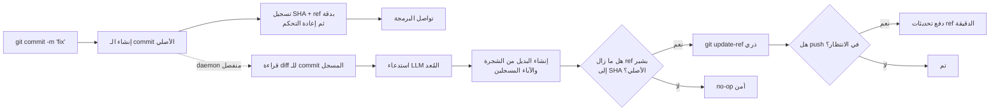

<p align="center">
  
</p>

<h1 align="center">Git AI — مولّد غير متزامن لرسائل Commit بالذكاء الاصطناعي</h1>

<p align="center" dir="rtl">
  <strong>أنشئ الـ commit الآن. واصل البرمجة. ودع الذكاء الاصطناعي يحسّن الرسالة في الخلفية.</strong>
  <br />
  حوّل المسودات السريعة إلى Conventional Commits واضحة بعد أن يحفظ Git عملك بأمان.
</p>

<p align="center">
  <a href="https://github.com/daidi/git-ai/releases"></a>
  <a href="https://github.com/daidi/git-ai/actions/workflows/ci.yml"></a>
  <a href="LICENSE"></a>
  <a href="https://marketplace.visualstudio.com/items?itemName=git-ai-async-commit-polisher.git-ai"></a>
  <a href="https://plugins.jetbrains.com/plugin/31221-git-ai"></a>
</p>

<p align="center" dir="rtl">
  <a href="https://codegg.org/git-ai/"><strong>الموقع</strong></a>
  &nbsp;·&nbsp;
  <a href="#التثبيت">التثبيت</a>
  &nbsp;·&nbsp;
  <a href="#البدء-السريع">البدء السريع</a>
  &nbsp;·&nbsp;
  <a href="#كيف-يعمل">كيف يعمل</a>
  &nbsp;·&nbsp;
  <a href="https://github.com/daidi/git-ai/issues">الدعم</a>
</p>

<p align="center">
  <sub>
    <a href="README.md">English</a> ·
    <a href="README_zh-CN.md">简体中文</a> ·
    <a href="README_zh-TW.md">繁體中文</a> ·
    <a href="README_fr.md">Français</a> ·
    <a href="README_de.md">Deutsch</a> ·
    <a href="README_es.md">Español</a> ·
    <a href="README_it.md">Italiano</a> ·
    <a href="README_ja.md">日本語</a> ·
    <a href="README_ko.md">한국어</a> ·
    <a href="README_pt.md">Português</a> ·
    <a href="README_ru.md">Русский</a> ·
    العربية ·
    <a href="README_vi.md">Tiếng Việt</a> ·
    <a href="README_th.md">ไทย</a> ·
    <a href="README_id.md">Bahasa Indonesia</a> ·
    <a href="README_ms.md">Bahasa Melayu</a>
  </sub>
</p>

<p align="center">
  
</p>

Git AI مشروع مجاني ومفتوح المصدر، وهو **مولّد رسائل commit بالذكاء الاصطناعي** للطرفية وVS Code وبيئات JetBrains. يحوّل مسودة مثل `fix auth` إلى سجل Git مفيد من دون أن يجعل انتظار استجابة LLM عائقًا بينك وبين السطر التالي من الشفرة.

بخلاف المولّدات التي تعمل قبل الـ commit، يستخدم Git AI خطاف `post-commit`. يُنشأ الـ commit الأصلي أولًا، ثم يقرأ daemon منفصل ذلك الـ commit بعينه، ويرسل الطلب إلى النموذج الذي أعددته، وينشئ بديلًا بالشجرة والآباء نفسيهما، ولا يحرّك الفرع إلا إذا ظل ذلك آمنًا.

> يستخدم Git AI سير عمله على مستودعه نفسه. [تصفّح سجل commits في هذا المستودع](https://github.com/daidi/git-ai/commits/main) لرؤية النتيجة.

## شاهد الفرق

```console
$ git commit -m "fix auth"
[main 1a2b3c4] fix auth
✨ Git AI: polishing in background (PID 2418)

# تصبح الطرفية متاحة فورًا. بعد اكتمال التحسين:
$ git log -1 --pretty=%s
fix(auth): prevent expired sessions on mobile
```

يعيد Git التحكم فورًا. وأثناء عمل النموذج يمكنك التعديل والاختبار وتبديل الأدوات، بل وتشغيل `git push`؛ ويتولى Git AI تنسيق النتيجة في الخلفية.

## لماذا Git AI

تضع معظم أدوات commits المعتمدة على الذكاء الاصطناعي عملية التوليد في المسار الإلزامي. أما Git AI فينقلها عمدًا إلى ما بعد الـ commit.

| | مولّد commit تقليدي بالذكاء الاصطناعي | Git AI |
|:--|:--|:--|
| **سير العمل** | توليد ← انتظار ← مراجعة ← commit | commit ← متابعة البرمجة ← تحسين في الخلفية |
| **الأمر** | أمر أو زر أو نافذة خاصة | أمر `git commit` المعتاد |
| **إذا فشل الذكاء الاصطناعي** | قد لا يُنشأ الـ commit | يبقى الـ commit الأصلي سليمًا |
| **العمل الأحدث** | قد يلتقط amend أعمى حالة خاطئة | يستخدم البديل الشجرة والآباء المسجلين |
| **سلامة الفرع** | تعتمد على الأداة | compare-and-swap ذري؛ تغيّر ref ينتج no-op آمنًا |
| **push فوري** | الانتظار أو التنسيق يدويًا | وضع تحديثات push الدقيقة في الطابور أو الحظر الصارم |
| **أماكن الاستخدام** | غالبًا CLI أو محرر واحد | الطرفية وVS Code وJetBrains وأي عميل Git آخر |

تعني فكرة **أنشئ الـ commit أولًا وفكّر لاحقًا** أن شفرتك تُحفظ قبل دخول الذكاء الاصطناعي إلى المسار.

## التثبيت

اختر البيئة التي تستخدمها بالفعل. تثبّت إضافات IDE أداة Git AI CLI المناسبة وتحدّثها تلقائيًا بعد التحقق من SHA-256 المنشور.

| استخدام Git AI في | التثبيت | التجربة المتاحة |
|:--|:--|:--|
| **VS Code / المحررات المتوافقة** | [Visual Studio Marketplace](https://marketplace.visualstudio.com/items?itemName=git-ai-async-commit-polisher.git-ai) · [Open VSX](https://open-vsx.org/extension/git-ai-async-commit-polisher/git-ai) | Activity Bar والحالة والسجل والإعدادات والإحصاءات والسجلات والاسترداد |
| **بيئات JetBrains** | [JetBrains Marketplace](https://plugins.jetbrains.com/plugin/31221-git-ai) | نافذة أدوات أصلية وودجت حالة وإعدادات وسجل وإحصاءات وسجلات وإجراءات VCS |
| **الطرفية / أي عميل Git** | [GitHub Releases](https://github.com/daidi/git-ai/releases) · مدراء الحزم أدناه | ملف Go تنفيذي مستقل وخطافات Git قابلة للدمج |

### أداة CLI المستقلة

**Homebrew — macOS أو Linux**

```bash
brew install daidi/tap/git-ai
```

**Scoop — Windows**

```powershell
scoop bucket add daidi https://github.com/daidi/scoop-bucket.git
scoop install daidi/git-ai
```

**مثبّت موثّق — macOS أو Linux**

```bash
curl -fsSL https://raw.githubusercontent.com/daidi/git-ai/main/install.sh | bash
```

**مثبّت موثّق — Windows PowerShell**

```powershell
iwr https://raw.githubusercontent.com/daidi/git-ai/main/install.ps1 -useb | iex
```

**Go install**

```bash
go install github.com/daidi/git-ai/cli/cmd/git-ai@latest
```

يتطلب التثبيت من المصدر Go 1.26.6 أو أحدث. توفّر [GitHub Releases](https://github.com/daidi/git-ai/releases) ملفات جاهزة لـ macOS وLinux وWindows على AMD64 وARM64، مع checksums وحزم `.deb` و`.rpm`.

## البدء السريع

في IDE، افتح إعدادات Git AI، وصِل نموذجًا، ووافق مرة واحدة على تهيئة المستودع. لاستخدام CLI المستقلة:

```bash
# شغّل مرة واحدة في كل مستودع لتثبيت الخطافات القابلة للدمج
cd your-project
git-ai init

# نقطة النهاية الافتراضية هي DeepSeek؛ استبدل العنصر النائب بمفتاحك
git-ai config set api_key "sk-..." --global
git-ai config test

# واصل استخدام Git بالطريقة المعتادة
git commit -m "fix login"
```

هذا هو سير العمل اليومي كاملًا. استخدم `git-ai status` عندما تريد رؤية الحالة؛ وفي بقية الوقت يبقى Git AI بعيدًا عن طريقك.

هل تفضّل نموذجًا محليًا؟ لا يحتاج Ollama إلى مفتاح API:

```bash
git-ai config set provider ollama --global
git-ai config set model llama3 --global
git-ai config set base_url http://localhost:11434 --global
git-ai config test
```

## ما الذي تحصل عليه

- **تحسين غير متزامن فعلًا** — يسجل خطاف `post-commit` الهدف ويعود فورًا بينما يعالج daemon منفصل طلب النموذج.
- **استبدال آمن لـ Git** — يبني Git AI من الـ commit المسجل، لا من الملفات التي قد تُضاف إلى stage لاحقًا.
- **سير عمل يراعي push** — يعيد `queue` تشغيل تحديثات ref الدقيقة بعد التحسين، بينما يُبقي `block` الدفع يدويًا.
- **أربعة أنماط للرسائل** — [Conventional Commits](https://www.conventionalcommits.org/) و[Gitmoji](https://gitmoji.dev/) وعنوان بسيط وعنوان مع متن.
- **استخدم نموذجك** — واجهات متوافقة مع OpenAI وAnthropic Claude وGoogle Gemini وDeepSeek وQwen وOllama المحلي.
- **مخرجات تراعي المستودع** — تقليم ذكي ومحدود للـ diff، وقواعد Commitlint JSON ثابتة، ولغة إخراج، وقوالب مخصصة، وشرح اختياري.
- **عقود مدمجة متحقق منها** — تُرفض الردود الفارغة أو الطويلة أو غير الصالحة أو المخالفة للتنسيق، وتُحفظ Git trailers الأصلية بدقة.
- **Smart skip** — يُبقي الرسالة الجديدة الصالحة كما هي، ويحسّن المسودات المبهمة أو المتكررة.
- **أدوات استرداد** — عرض الحالة وإعادة المحاولة والتراجع والإلغاء وتخطي الـ commit التالي واسترداد العمليات المتوقفة.
- **رؤية محلية** — سجل الذكاء الاصطناعي وزمن التوليد وتقديرات الإنتاجية وسجلات محدودة وإشعارات النظام.
- **تكامل أصلي مع IDE** — تثبيت مُدار وتحكم مرئي في [VS Code](vscode-extension/README.md) و[JetBrains](idea-plugin/README.md).
- **16 لغة للواجهة** — الإنجليزية والعربية والصينية المبسطة والصينية التقليدية والفرنسية والألمانية والإندونيسية والإيطالية واليابانية والكورية والماليزية والبرتغالية والروسية والإسبانية والتايلاندية والفيتنامية.
- **جودة قابلة لإعادة القياس** — [منظومة تقييم ببيانات commits عامة](cli/eval/README.md) تقيس التنسيق والمعنى والحفاظ على trailers وسياق diff وزمن الاستجابة.

## كيف يعمل



### آمن من أساس التصميم

لا ينفّذ Git AI عملية `git commit --amend` عمياء في الخلفية.

1. ينشئ Git الـ commit الأصلي قبل أن يستدعي Git AI النموذج.
2. يسجل الخطاف SHA وref الخاصين بالفرع بدقة ثم ينتهي.
3. يقرأ daemon الـ commit المسجل، لا index أو worktree الحاليين.
4. يعيد البديل استخدام الشجرة والآباء المسجلين.
5. لا يحرّك `git update-ref <ref> <new> <expected>` الفرع إلا إذا بقي SHA المتوقع مطابقًا.
6. عند وجود commit أحدث أو فرع متحرك أو خطأ شبكة أو مصادقة أو rate limit أو رد تالف أو فشل نموذج، يبقى الـ commit الأصلي وبيئة العمل بلا تغيير.

ولأن الرسالة جزء من كائن commit، ينشئ التحسين الناجح SHA جديدًا. يضمن فحص الأمان أن يغيّر Git AI الـ commit الذي سجله أولًا فقط.

### الخصوصية والملكية المحلية

- **لا يوجد خادم وسيط لنماذج Git AI.** تُرسل تغييرات commit المحدودة والمسودة وتلميحات المستودع (الفرع ومراجع المهام وscopes الشائعة) مباشرة إلى نقطة نهاية النموذج المحددة، دون نصوص الرسائل التاريخية.
- **يدعم الاستدلال المحلي.** استخدم Ollama عندما يجب أن تبقى الشفرة على جهازك.
- **بيانات الاعتماد خارج المستودعات.** تُحفظ مفاتيح API على مستوى المستخدم فقط، وتُدعم متغيرات البيئة أيضًا.
- **حالة التشغيل خارج worktree.** توجد الحالة والسجلات وتاريخ AI في cache المستخدم، وتستخدم إعدادات المستودع `.git/config`.
- **لا تُرفع التحليلات.** تبقى إحصاءات الإنتاجية وبيانات commits الوصفية محلية.
- **استبعاد البيانات الحساسة من التشخيص.** لا تحتوي السجلات على مفاتيح أو prompts أو diffs أو متون ردود أو روابط تضم بيانات اعتماد.
- **تنزيلات متحقق منها.** تتحقق المثبّتات وتكاملات IDE من SHA-256 المنشور قبل استبدال الملف التنفيذي.

قد تتصل فحوص الإصدارات والتنزيلات المُدارة بـ GitHub أو خدمة إصدارات Git AI.

## المزوّدون والإعداد

| الوضع | يعمل مع | مفتاح API |
|:--|:--|:--|
| `openai` | نقاط متوافقة مع OpenAI، ومنها DeepSeek وOpenAI وQwen والبوابات | مطلوب |
| `anthropic` | واجهة Anthropic Claude الأصلية | مطلوب |
| `gemini` | واجهة Google Gemini الأصلية | مطلوب |
| `ollama` | خادم Ollama محلي | غير مطلوب |

```bash
git-ai config set provider openai --global
git-ai config set base_url https://api.example.com/v1 --global
git-ai config set model your-model --global
git-ai config set api_key "sk-..." --global
git-ai config test
```

| الإعداد | الافتراضي | الغرض |
|:--|:--|:--|
| `message_format` | `conventional` | `plain` أو `conventional` أو `gitmoji` أو `subject-body` |
| `commit_attribution` | `off` | تذييل `Polished-by` اختياري: `off` أو `compact` |
| `language` | `en` | لغة رسائل commit المولّدة |
| `smart_skip` | `true` | الاحتفاظ برسالة جديدة صالحة من دون استدعاء النموذج |
| `push_policy` | `queue` | وضع push آمن في الطابور أو استخدام `block` للتحكم اليدوي |
| `max_diff_tokens` | `8000` | تقييد سياق diff المرسل إلى النموذج |
| `explain` | `false` | إضافة متن قصير يشرح سبب التغيير |
| `prompt_template` | فارغ | تخصيص التوليد عبر `{{.Diff}}` و`{{.Hint}}` و`{{.Language}}` |

ترتيب الأولوية: متغيرات `GIT_AI_*` ← إعدادات المستودع في `.git/config` ← إعدادات المستخدم في النظام ← القيم الافتراضية. مفاتيح API على مستوى المستخدم فقط. تُتجاهل ملفات `.git-ai.json` القديمة في worktree حتى لا يستطيع مستودع مستنسخ إعادة توجيه بيانات اعتمادك.

## الأوامر اليومية

| الأمر | ما يفعله |
|:--|:--|
| `git-ai status` | عرض الحالة `idle` أو `polishing` أو `pushing` أو `failed` |
| `git-ai retry` | إعادة معالجة الـ commit الحالي بأمان في الخلفية |
| `git-ai undo` | استعادة رسالة المسودة الأصلية |
| `git-ai cancel` | إيقاف التحسين دون تغيير Git |
| `git-ai skip-next` | ترك الـ commit التالي بلا تعديل |
| `git-ai push` | استئناف push مؤجل أو دفع الفرع الحالي |
| `git-ai log` | عرض سجل Git مع بيانات AI المحلية |
| `git-ai stats` | عرض إحصاءات الإنتاجية المحلية |
| `git-ai config list` | فحص الإعداد الفعلي مع إخفاء الأسرار |
| `git-ai update` | تثبيت أحدث CLI متحقق منها |
| `git-ai uninstall` | إزالة خطافات Git AI واستعادة الخطافات المحفوظة |

استخدم `git-ai --help` أو `git-ai <command> --help` للمرجع الكامل.

## تكاملات IDE

### VS Code

يدعم [امتداد VS Code](vscode-extension/README.md) الإصدار 1.85+ والمحررات المتوافقة مع Open VSX. يضيف مركز تحكم في Activity Bar وحالة مباشرة وسجل AI وإعدادات عامة وللمشروع وإحصاءات محلية وسجلات واستردادًا بنقرة واحدة. لا تشغّل مساحات العمل المقيّدة ملفات تنفيذية ولا تنزّل تحديثات ولا تثبّت خطافات.

```bash
code --install-extension git-ai-async-commit-polisher.git-ai
```

### بيئات JetBrains

يدعم [مكوّن JetBrains](idea-plugin/README.md) بيئات IntelliJ Platform 2024.1+، ومنها IntelliJ IDEA وWebStorm وPyCharm وGoLand وPhpStorm وCLion وDataGrip وRubyMine. يوفّر Tool Window أصلية وودجت حالة وإعدادات وإجراءات VCS وسجلًا وإحصاءات وعرضًا محدودًا للسجلات.

[ثبّت Git AI من JetBrains Marketplace ←](https://plugins.jetbrains.com/plugin/31221-git-ai)

## الأسئلة الشائعة

<details>
<summary><strong>هل يغيّر Git AI ملفات المصدر أو index أو التغييرات في stage؟</strong></summary>
<br />
لا. يُبنى البديل من الشجرة والآباء الدقيقين للـ commit المسجل. لا تُلتقط التغييرات في stage أو خارجه أو التغييرات الأحدث.
</details>

<details>
<summary><strong>ماذا يحدث إذا أنشأت commit آخر أثناء عمل الذكاء الاصطناعي؟</strong></summary>
<br />
لن يعود الفرع مشيرًا إلى SHA المسجل، فيصبح التحديث الذري no-op آمنًا. لا يعيد Git AI كتابة الـ commit الأحدث.
</details>

<details>
<summary><strong>ماذا يحدث إذا نفذت push فورًا؟</strong></summary>
<br />
مع `queue` يسجل خطاف pre-push تحديثات ref الدقيقة ويعيد تنفيذها بعد تحسين آمن. إذا لم تتوفر مصادقة خلفية، تختار التهيئة `block` لكي تنفذ push يدويًا.
</details>

<details>
<summary><strong>هل يمكنني مراجعة الرسالة المولّدة أو إعادة المحاولة أو التراجع؟</strong></summary>
<br />
نعم. استخدم `git-ai log` و`git-ai retry` و`git-ai undo` أو أدوات IDE المقابلة.
</details>

<details>
<summary><strong>هل يرسل Git AI المستودع كاملًا إلى النموذج؟</strong></summary>
<br />
لا. يرسل تمثيلًا محدودًا لـ diff الخاص بالـ commit المسجل والمسودة وتلميحات المستودع (الفرع ومراجع المهام وscopes الشائعة)، وليس نصوص الرسائل التاريخية. اختر Ollama للاستدلال المحلي.
</details>

<details>
<summary><strong>هل يعمل عند إنشاء commit خارج IDE؟</strong></summary>
<br />
نعم. بعد تهيئة المستودع يعمل سير الخطافات نفسه في الطرفية وIDE وأي عميل Git آخر.
</details>

<details>
<summary><strong>هل Git AI مجاني؟</strong></summary>
<br />
Git AI مجاني بترخيص MIT. تستخدم مفتاح API سحابيًا خاصًا بك أو نموذج Ollama محليًا؛ وقد يفرض مزوّد السحابة رسوم استخدام.
</details>

## التطوير

يجمع المستودع الأحادي التخزين الدائم وعمليات Git في محرك واحد:

- [`cli/`](cli/) — أداة Go CLI والخطافات وdaemon والمزوّدون والحالة وتحديثات ref الآمنة
- [`vscode-extension/`](vscode-extension/) — تكامل TypeScript يفوّض العمليات إلى CLI
- [`idea-plugin/`](idea-plugin/) — تكامل Kotlin مع IntelliJ يفوّض العمليات إلى CLI

```bash
cd cli
make build
make test
make lint
make eval

cd ../vscode-extension
npm ci
npm test

cd ../idea-plugin
./gradlew test buildPlugin
```

قبل تغيير نصوص الواجهة المترجمة، اقرأ تعليمات المستودع وشغّل `bash scripts/check-i18n-coverage.sh` من جذر المشروع.

## ساعد Git AI على النمو

إذا ساعدك Git AI على الحفاظ على تركيزك، [أضف نجمة إلى المستودع](https://github.com/daidi/git-ai) ليسهل على مطورين آخرين اكتشافه. نرحب بتقارير الأخطاء والاقتراحات المحددة وتصحيحات التوثيق وطلبات السحب في [GitHub Issues](https://github.com/daidi/git-ai/issues).

## الترخيص

يتوفر Git AI بموجب [ترخيص MIT](LICENSE).

---

<p align="center" dir="rtl">
  <strong>سجل commits أفضل. بلا انتظار.</strong>
  <br />
  <a href="#التثبيت">ثبّت Git AI</a>
  &nbsp;·&nbsp;
  <a href="https://github.com/daidi/git-ai">أضف نجمة على GitHub</a>
  &nbsp;·&nbsp;
  <a href="https://github.com/daidi/git-ai/issues">أبلغ عن مشكلة</a>
</p>
