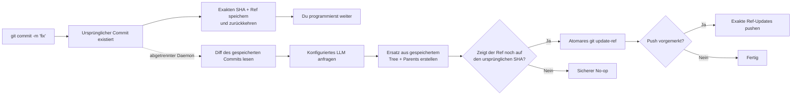

<p align="center">
  
</p>

<h1 align="center">Git AI — Asynchroner KI-Generator für Commit-Nachrichten</h1>

<p align="center">
  <strong>Jetzt committen. Weiter programmieren. Die KI optimiert die Nachricht im Hintergrund.</strong>
  <br />
  Verwandelt kurze Git-Commit-Nachrichten in klare Conventional Commits — nachdem Git deine Arbeit sicher gespeichert hat.
</p>

<p align="center">
  <a href="https://github.com/daidi/git-ai/releases"></a>
  <a href="https://github.com/daidi/git-ai/actions/workflows/ci.yml"></a>
  <a href="LICENSE"></a>
  <a href="https://marketplace.visualstudio.com/items?itemName=git-ai-async-commit-polisher.git-ai"></a>
  <a href="https://plugins.jetbrains.com/plugin/31221-git-ai"></a>
</p>

<p align="center">
  <a href="https://codegg.org/git-ai/"><strong>Website</strong></a>
  &nbsp;·&nbsp;
  <a href="#installation">Installation</a>
  &nbsp;·&nbsp;
  <a href="#schnellstart">Schnellstart</a>
  &nbsp;·&nbsp;
  <a href="#so-funktioniert-es">Funktionsweise</a>
  &nbsp;·&nbsp;
  <a href="https://github.com/daidi/git-ai/issues">Support</a>
</p>

<p align="center">
  <sub>
    <a href="README.md">English</a> ·
    <a href="README_zh-CN.md">简体中文</a> ·
    <a href="README_zh-TW.md">繁體中文</a> ·
    <a href="README_fr.md">Français</a> ·
    Deutsch ·
    <a href="README_es.md">Español</a> ·
    <a href="README_it.md">Italiano</a> ·
    <a href="README_ja.md">日本語</a> ·
    <a href="README_ko.md">한국어</a> ·
    <a href="README_pt.md">Português</a> ·
    <a href="README_ru.md">Русский</a> ·
    <a href="README_ar.md">العربية</a> ·
    <a href="README_vi.md">Tiếng Việt</a> ·
    <a href="README_th.md">ไทย</a> ·
    <a href="README_id.md">Bahasa Indonesia</a> ·
    <a href="README_ms.md">Bahasa Melayu</a>
  </sub>
</p>

<p align="center">
  
</p>

Git AI ist ein kostenloser, quelloffener **KI-Generator für Commit-Nachrichten** im Terminal, in VS Code und in JetBrains-IDEs. Aus Entwürfen wie `fix auth` entsteht eine aussagekräftige Git-Historie, ohne dass eine LLM-Antwort zwischen dir und der nächsten Codezeile steht.

Anders als Generatoren vor dem Commit arbeitet Git AI über einen `post-commit`-Hook. Der ursprüngliche Commit existiert zuerst. Danach liest ein abgetrennter Daemon genau diesen Commit, fragt das konfigurierte Modell an, erzeugt einen Ersatz mit identischem Tree und denselben Parents und verschiebt den Branch nur, solange dies sicher ist.

> Git AI nutzt den eigenen Workflow. [Sieh dir die Commit-Historie dieses Repositorys an](https://github.com/daidi/git-ai/commits/main).

## Der Unterschied in Aktion

```console
$ git commit -m "fix auth"
[main 1a2b3c4] fix auth
✨ Git AI: polishing in background (PID 2418)

# Das Terminal ist sofort wieder frei. Nach der Optimierung:
$ git log -1 --pretty=%s
fix(auth): prevent expired sessions on mobile
```

Git kehrt sofort zurück. Während das Modell arbeitet, kannst du bearbeiten, testen, andere Werkzeuge verwenden oder sogar `git push` ausführen; Git AI koordiniert das Ergebnis im Hintergrund.

## Warum Git AI

Die meisten KI-Commit-Werkzeuge legen die Generierung in den kritischen Pfad. Git AI verschiebt sie bewusst hinter den Commit.

| | Typischer KI-Commit-Generator | Git AI |
|:--|:--|:--|
| **Ablauf** | Generieren → warten → prüfen → committen | Committen → weiterarbeiten → im Hintergrund optimieren |
| **Befehl** | Besonderer Befehl, Button oder Dialog | Dein normales `git commit` |
| **Wenn die KI ausfällt** | Der Commit findet möglicherweise nicht statt | Der ursprüngliche Commit bleibt erhalten |
| **Neuere Arbeit** | Ein blindes Amend kann den falschen Zustand erfassen | Der Ersatz verwendet den aufgezeichneten Tree und die Parents |
| **Branch-Sicherheit** | Werkzeugabhängig | Atomarer Compare-and-Swap; ein verschobener Ref wird zum sicheren No-op |
| **Sofortiges Pushen** | Warten oder selbst koordinieren | Exaktes Push in die Warteschlange stellen oder streng blockieren |
| **Einsatzorte** | Häufig nur CLI oder Editor | Terminal, VS Code, JetBrains und andere Git-Clients |

**Erst committen, später nachdenken** bedeutet: Dein Code wird gespeichert, bevor die KI den Ablauf betritt.

## Installation

Wähle die Umgebung, die du bereits nutzt. Die IDE-Integrationen stellen die passende Git-AI-CLI automatisch bereit, aktualisieren sie und prüfen veröffentlichte SHA-256-Prüfsummen.

| Git AI verwenden in | Installation | Enthalten |
|:--|:--|:--|
| **VS Code / kompatible Editoren** | [Visual Studio Marketplace](https://marketplace.visualstudio.com/items?itemName=git-ai-async-commit-polisher.git-ai) · [Open VSX](https://open-vsx.org/extension/git-ai-async-commit-polisher/git-ai) | Activity Bar, Status, Verlauf, Einstellungen, Statistik, Logs und Wiederherstellung |
| **JetBrains-IDEs** | [JetBrains Marketplace](https://plugins.jetbrains.com/plugin/31221-git-ai) | Natives Tool Window, Status-Widget, Einstellungen, Verlauf, Statistik, Logs und VCS-Aktionen |
| **Terminal / jeder Git-Client** | [GitHub Releases](https://github.com/daidi/git-ai/releases) · Paketmanager unten | Eigenständige Go-Binärdatei und kombinierbare Git-Hooks |

### Eigenständige CLI

**Homebrew — macOS oder Linux**

```bash
brew install daidi/tap/git-ai
```

**Scoop — Windows**

```powershell
scoop bucket add daidi https://github.com/daidi/scoop-bucket.git
scoop install daidi/git-ai
```

**Verifizierter Installer — macOS oder Linux**

```bash
curl -fsSL https://raw.githubusercontent.com/daidi/git-ai/main/install.sh | bash
```

**Verifizierter Installer — Windows PowerShell**

```powershell
iwr https://raw.githubusercontent.com/daidi/git-ai/main/install.ps1 -useb | iex
```

**Go install**

```bash
go install github.com/daidi/git-ai/cli/cmd/git-ai@latest
```

Die Installation aus dem Quellcode benötigt Go 1.26.9 oder neuer. Vorgefertigte Binärdateien für macOS, Linux und Windows auf AMD64 und ARM64 findest du mit Prüfsummen sowie `.deb`- und `.rpm`-Paketen unter [GitHub Releases](https://github.com/daidi/git-ai/releases).

## Schnellstart

IDE-Nutzer öffnen die Git-AI-Einstellungen, verbinden ein Modell und bestätigen einmalig die Initialisierung des Repositorys. Für die eigenständige CLI:

```bash
# Einmal pro Repository ausführen, um die kombinierbaren Hooks zu installieren
cd your-project
git-ai init

# Der Standardendpunkt ist DeepSeek; Platzhalter durch deinen Schlüssel ersetzen
git-ai config set api_key "sk-..." --global
git-ai config test

# Git wie gewohnt weiterverwenden
git commit -m "fix login"
```

Das ist der gesamte tägliche Ablauf. `git-ai status` schafft bei Bedarf Transparenz; ansonsten bleibt Git AI im Hintergrund.

Für ein lokales Modell benötigt Ollama keinen API-Schlüssel:

```bash
git-ai config set provider ollama --global
git-ai config set model llama3 --global
git-ai config set base_url http://localhost:11434 --global
git-ai config test
```

## Funktionsumfang

- **Echte asynchrone Optimierung** — der `post-commit`-Hook zeichnet das Ziel auf und kehrt zurück, während ein abgetrennter Daemon die Modellanfrage verarbeitet.
- **Git-sicherer Ersatz** — Git AI arbeitet mit dem aufgezeichneten Commit, niemals mit später gestagten Dateien.
- **Push-bewusster Ablauf** — `queue` kann exakte Ref-Updates nach der Optimierung wiedergeben; `block` lässt das Pushen manuell.
- **Vier Nachrichtenstile** — [Conventional Commits](https://www.conventionalcommits.org/), [Gitmoji](https://gitmoji.dev/), einfacher Betreff und strukturierter Betreff mit Textkörper.
- **Freie Modellwahl** — OpenAI-kompatible APIs, Anthropic Claude, Google Gemini, DeepSeek, Qwen und lokales Ollama.
- **Repository-bezogene Ausgabe** — begrenztes intelligentes Diff-Trimming, statische Commitlint-JSON-Regeln, Ausgabesprache, eigene Prompts und optionale Erklärungen.
- **Validierte integrierte Verträge** — leere, zu lange, ungültige oder falsch formatierte Antworten werden abgelehnt; ursprüngliche Git-Trailer bleiben exakt erhalten.
- **Smart Skip** — gültige neue Nachrichten können unverändert bleiben, während grobe oder wiederholte Entwürfe optimiert werden.
- **Wiederherstellung** — Status prüfen, wiederholen, rückgängig machen, abbrechen, nächsten Commit überspringen oder unterbrochene Vorgänge fortsetzen.
- **Lokale Transparenz** — KI-Verlauf, Latenz, Produktivitätsschätzungen, begrenzte Logs und Systembenachrichtigungen.
- **Native IDE-Integrationen** — verwaltete Installation und visuelle Steuerung für [VS Code](vscode-extension/README.md) und [JetBrains-IDEs](idea-plugin/README.md).
- **16 Oberflächensprachen** — Englisch sowie Arabisch, vereinfachtes Chinesisch, traditionelles Chinesisch, Französisch, Deutsch, Indonesisch, Italienisch, Japanisch, Koreanisch, Malaiisch, Portugiesisch, Russisch, Spanisch, Thai und Vietnamesisch.
- **Reproduzierbare Qualitätsprüfung** — ein [Evaluationssystem mit öffentlichen Commits](cli/eval/README.md) misst Format, Semantik, Trailer-Erhalt, Diff-Kontext und Latenz.

## So funktioniert es



### Sicherheit als Grundprinzip

Git AI führt im Hintergrund **kein** blindes `git commit --amend` aus.

1. Git erstellt den ursprünglichen Commit, bevor Git AI das Modell aufruft.
2. Der Hook speichert den exakten SHA und Branch-Ref und beendet sich.
3. Der Daemon liest den gespeicherten Commit, nicht den aktuellen Index oder Worktree.
4. Der Ersatz verwendet dessen Tree und Parents.
5. `git update-ref <ref> <new> <expected>` verschiebt den Branch nur, wenn der erwartete SHA noch passt.
6. Neuerer Commit, verschobener Branch, Netzwerk-, Authentifizierungs-, Rate-Limit-, Antwort- oder Modellfehler: Original und Arbeitsbereich bleiben unverändert.

Da die Nachricht Teil des Commit-Objekts ist, erzeugt eine erfolgreiche Optimierung einen neuen SHA. Die Sicherheitsprüfung begrenzt die Änderung auf den ursprünglich aufgezeichneten Commit.

### Datenschutz und lokale Datenhoheit

- **Kein Git-AI-Modell-Relay.** Begrenzter Commit-Diff, Entwurf und Repository-Hinweise (Branch, Ticketreferenzen und häufige Scopes) gehen direkt an deinen Modellendpunkt, nicht die ursprünglichen historischen Nachrichten.
- **Lokale Inferenz.** Mit Ollama kann der Code auf deinem Rechner bleiben.
- **Keine Zugangsdaten im Repository.** Gespeicherte API-Schlüssel sind ausschließlich benutzerweit; Umgebungsvariablen werden unterstützt.
- **Laufzeitdaten außerhalb des Worktrees.** Status, Logs und KI-Verlauf liegen im Nutzer-Cache; Repository-Overrides in `.git/config`.
- **Keine hochgeladenen Analysen.** Produktivitätsstatistiken und Commit-Metadaten bleiben lokal.
- **Sensible Diagnoseinhalte ausgeschlossen.** Logs enthalten keine API-Schlüssel, Prompts, Diffs, Antworttexte oder Remote-URLs mit Zugangsdaten.
- **Verifizierte Downloads.** Installer und IDEs prüfen Releases vor dem Austausch anhand veröffentlichter SHA-256-Prüfsummen.

Release-Prüfungen und verwaltete Downloads können GitHub oder den Git-AI-Release-Dienst kontaktieren.

## Anbieter und Konfiguration

| Anbietermodus | Kompatibel mit | API-Schlüssel |
|:--|:--|:--|
| `openai` | OpenAI-kompatible Endpunkte, darunter DeepSeek, OpenAI, Qwen und Gateways | Erforderlich |
| `anthropic` | Native Anthropic-Claude-API | Erforderlich |
| `gemini` | Native Google-Gemini-API | Erforderlich |
| `ollama` | Lokaler Ollama-Server | Nicht erforderlich |

Beispiel für einen OpenAI-kompatiblen Endpunkt:

```bash
git-ai config set provider openai --global
git-ai config set base_url https://api.example.com/v1 --global
git-ai config set model your-model --global
git-ai config set api_key "sk-..." --global
git-ai config test
```

| Einstellung | Standard | Zweck |
|:--|:--|:--|
| `message_format` | `conventional` | `plain`, `conventional`, `gitmoji` oder `subject-body` |
| `commit_attribution` | `off` | Optionaler `Polished-by`-Trailer: `off` oder `compact` |
| `language` | `en` | Sprache der generierten Commit-Nachricht |
| `smart_skip` | `true` | Eine gültige neue Nachricht ohne Modellaufruf behalten |
| `push_policy` | `queue` | Sicheres Push vormerken oder mit `block` manuell steuern |
| `max_diff_tokens` | `8000` | An das Modell gesendeten Diff-Kontext begrenzen |
| `explain` | `false` | Kurzen Erklärungstext ergänzen |
| `prompt_template` | leer | Generierung mit `{{.Diff}}`, `{{.Hint}}` und `{{.Language}}` anpassen |

Priorität der Konfiguration: `GIT_AI_*`-Umgebungsvariablen → Repository-Overrides in `.git/config` → Nutzerkonfiguration im Betriebssystem → Standardwerte. API-Schlüssel sind nur benutzerweit. Alte `.git-ai.json`-Dateien im Worktree werden ignoriert, damit ein geklontes Repository Zugangsdaten nicht umleiten kann.

## Befehle für den Alltag

| Befehl | Funktion |
|:--|:--|
| `git-ai status` | Status `idle`, `polishing`, `pushing` oder `failed` anzeigen |
| `git-ai retry` | Aktuellen Commit sicher im Hintergrund erneut verarbeiten |
| `git-ai undo` | Ursprünglichen Entwurf wiederherstellen |
| `git-ai cancel` | Laufende Optimierung beenden, ohne Git zu verändern |
| `git-ai skip-next` | Nächsten Commit unverändert lassen |
| `git-ai push` | Zurückgestelltes Push fortsetzen oder aktuellen Branch pushen |
| `git-ai log` | Git-Verlauf mit lokalen KI-Metadaten anzeigen |
| `git-ai stats` | Lokale Produktivitätsstatistiken anzeigen |
| `git-ai config list` | Effektive Konfiguration mit maskierten Geheimnissen prüfen |
| `git-ai update` | Neueste verifizierte CLI-Version installieren |
| `git-ai uninstall` | Git-AI-Hooks entfernen und gesicherte Hooks wiederherstellen |

Die vollständige Referenz liefern `git-ai --help` und `git-ai <command> --help`.

## IDE-Integrationen

### VS Code

Die [VS-Code-Erweiterung](vscode-extension/README.md) unterstützt VS Code 1.85+ und kompatible Open-VSX-Editoren. Sie bietet Activity-Bar-Zentrale, Live-Status, KI-Verlauf, globale und projektspezifische Einstellungen, lokale Statistik, Logs und Wiederherstellungsaktionen. Eingeschränkte Workspaces führen keine Binärdateien aus, laden keine Updates und installieren keine Hooks.

```bash
code --install-extension git-ai-async-commit-polisher.git-ai
```

### JetBrains-IDEs

Das [JetBrains-Plugin](idea-plugin/README.md) unterstützt IntelliJ-Platform-IDEs ab 2024.1, darunter IntelliJ IDEA, WebStorm, PyCharm, GoLand, PhpStorm, CLion, DataGrip und RubyMine. Es bietet ein natives Tool Window, Status-Widget, Einstellungen, VCS-Aktionen, Verlauf, Statistik und begrenzte Log-Anzeige.

[Git AI im JetBrains Marketplace installieren →](https://plugins.jetbrains.com/plugin/31221-git-ai)

## Häufig gestellte Fragen

<details>
<summary><strong>Verändert Git AI Quelldateien, Index oder gestagte Arbeit?</strong></summary>
<br />
Nein. Der Ersatz entsteht aus Tree und Parents des exakt aufgezeichneten Commits. Gestagte, nicht gestagte und neuere Änderungen werden nie erfasst.
</details>

<details>
<summary><strong>Was passiert, wenn ich während der KI-Arbeit erneut committe?</strong></summary>
<br />
Der Branch zeigt nicht mehr auf den gespeicherten SHA; das atomare Update wird zum sicheren No-op. Git AI schreibt den neueren Commit nie um.
</details>

<details>
<summary><strong>Was passiert, wenn ich sofort pushe?</strong></summary>
<br />
Mit `queue` speichert der Pre-Push-Hook die exakten Ref-Updates und spielt sie nach einer sicheren Optimierung ab. Fehlt Authentifizierung im Hintergrund, wählt die Initialisierung `block`, damit du manuell pushst.
</details>

<details>
<summary><strong>Kann ich die generierte Nachricht prüfen, wiederholen oder zurücknehmen?</strong></summary>
<br />
Ja. Nutze `git-ai log`, `git-ai retry` und `git-ai undo` oder die entsprechenden IDE-Aktionen.
</details>

<details>
<summary><strong>Sendet Git AI mein gesamtes Repository an ein Modell?</strong></summary>
<br />
Nein. Eine begrenzte Darstellung des aufgezeichneten Commit-Diffs, der Entwurf und Repository-Hinweise (Branch, Ticketreferenzen und häufige Scopes) gehen an deinen Endpunkt, nicht die ursprünglichen historischen Nachrichten. Mit Ollama bleibt der Code lokal.
</details>

<details>
<summary><strong>Funktioniert Git AI auch außerhalb der IDE?</strong></summary>
<br />
Ja. Nach der Initialisierung gilt derselbe Hook-basierte Ablauf für Terminal, IDE und andere Git-Clients.
</details>

<details>
<summary><strong>Ist Git AI kostenlos?</strong></summary>
<br />
Git AI steht unter der MIT-Lizenz und ist kostenlos. Du verwendest einen eigenen Cloud-API-Schlüssel oder ein lokales Ollama-Modell; Cloud-Anbieter können Nutzungskosten berechnen.
</details>

## Entwicklung

Das Monorepo bündelt Persistenz und Git-Operationen in einer Engine:

- [`cli/`](cli/) — Go-CLI, Hooks, Daemon, Anbieter, Status und sichere Ref-Updates
- [`vscode-extension/`](vscode-extension/) — TypeScript-Integration, die an die CLI delegiert
- [`idea-plugin/`](idea-plugin/) — Kotlin-Integration für IntelliJ, die an die CLI delegiert

```bash
cd cli
make build
make test
make lint
make eval

cd ../vscode-extension
npm ci
npm test

cd ../idea-plugin
./gradlew test buildPlugin
```

Vor Änderungen an lokalisierten UI-Texten die Repository-Anweisungen lesen und im Projektstamm `bash scripts/check-i18n-coverage.sh` ausführen.

## Hilf Git AI zu wachsen

Wenn Git AI deinen Arbeitsfluss verbessert, [gib dem Repository einen Stern](https://github.com/daidi/git-ai). So entdecken weitere Entwickler das Projekt. Fehlerberichte, gezielte Funktionswünsche, Dokumentationskorrekturen und Pull Requests sind in den [GitHub Issues](https://github.com/daidi/git-ai/issues) willkommen.

## Lizenz

Git AI ist unter der [MIT-Lizenz](LICENSE) verfügbar.

---

<p align="center">
  <strong>Bessere Commit-Historie. Keine Wartezeit.</strong>
  <br />
  <a href="#installation">Git AI installieren</a>
  &nbsp;·&nbsp;
  <a href="https://github.com/daidi/git-ai">Stern auf GitHub geben</a>
  &nbsp;·&nbsp;
  <a href="https://github.com/daidi/git-ai/issues">Problem melden</a>
</p>
