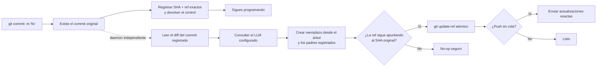

<p align="center">
  
</p>

<h1 align="center">Git AI — Generador asíncrono de mensajes de commit con IA</h1>

<p align="center">
  <strong>Haz commit ahora. Sigue programando. Deja que la IA mejore el mensaje en segundo plano.</strong>
  <br />
  Convierte borradores rápidos en Conventional Commits claros después de que Git haya guardado tu trabajo de forma segura.
</p>

<p align="center">
  <a href="https://github.com/daidi/git-ai/releases"></a>
  <a href="https://github.com/daidi/git-ai/actions/workflows/ci.yml"></a>
  <a href="LICENSE"></a>
  <a href="https://marketplace.visualstudio.com/items?itemName=git-ai-async-commit-polisher.git-ai"></a>
  <a href="https://plugins.jetbrains.com/plugin/31221-git-ai"></a>
</p>

<p align="center">
  <a href="https://codegg.org/git-ai/"><strong>Sitio web</strong></a>
  &nbsp;·&nbsp;
  <a href="#instalación">Instalación</a>
  &nbsp;·&nbsp;
  <a href="#inicio-rápido">Inicio rápido</a>
  &nbsp;·&nbsp;
  <a href="#cómo-funciona">Cómo funciona</a>
  &nbsp;·&nbsp;
  <a href="https://github.com/daidi/git-ai/issues">Soporte</a>
</p>

<p align="center">
  <sub>
    <a href="README.md">English</a> ·
    <a href="README_zh-CN.md">简体中文</a> ·
    <a href="README_zh-TW.md">繁體中文</a> ·
    <a href="README_fr.md">Français</a> ·
    <a href="README_de.md">Deutsch</a> ·
    Español ·
    <a href="README_it.md">Italiano</a> ·
    <a href="README_ja.md">日本語</a> ·
    <a href="README_ko.md">한국어</a> ·
    <a href="README_pt.md">Português</a> ·
    <a href="README_ru.md">Русский</a> ·
    <a href="README_ar.md">العربية</a> ·
    <a href="README_vi.md">Tiếng Việt</a> ·
    <a href="README_th.md">ไทย</a> ·
    <a href="README_id.md">Bahasa Indonesia</a> ·
    <a href="README_ms.md">Bahasa Melayu</a>
  </sub>
</p>

<p align="center">
  
</p>

Git AI es un **generador de mensajes de commit con IA** gratuito y de código abierto para la terminal, VS Code y los IDE de JetBrains. Convierte borradores como `fix auth` en un historial Git útil sin interponer la espera de un LLM entre tú y tu siguiente línea de código.

A diferencia de los generadores previos al commit, Git AI se ejecuta desde un hook `post-commit`. Primero existe el commit original; después, un daemon independiente lee exactamente ese commit, consulta el modelo configurado, crea un reemplazo con el mismo árbol y los mismos padres y solo avanza la rama si sigue siendo seguro.

> Git AI utiliza su propio flujo. [Consulta el historial de commits del repositorio](https://github.com/daidi/git-ai/commits/main) para ver el resultado.

## Mira la diferencia

```console
$ git commit -m "fix auth"
[main 1a2b3c4] fix auth
✨ Git AI: polishing in background (PID 2418)

# La terminal queda libre inmediatamente. Al terminar:
$ git log -1 --pretty=%s
fix(auth): prevent expired sessions on mobile
```

Git devuelve el control al instante. Mientras trabaja el modelo puedes editar, probar, cambiar de herramienta o incluso ejecutar `git push`; Git AI coordina el resultado en segundo plano.

## Por qué Git AI

La mayoría de las herramientas de commit con IA colocan la generación en la ruta crítica. Git AI la mueve deliberadamente después del commit.

| | Generador de commits con IA típico | Git AI |
|:--|:--|:--|
| **Flujo** | Generar → esperar → revisar → confirmar | Confirmar → seguir programando → mejorar en segundo plano |
| **Comando** | Comando, botón o diálogo especial | Tu `git commit` habitual |
| **Si falla la IA** | Puede que el commit no llegue a existir | El commit original permanece intacto |
| **Trabajo posterior** | Un amend ciego puede capturar un estado equivocado | El reemplazo usa el árbol y los padres registrados |
| **Seguridad de la rama** | Depende de la herramienta | Compare-and-swap atómico; una ref movida se convierte en un no-op seguro |
| **Push inmediato** | Esperar o coordinarlo manualmente | Poner en cola el push exacto o elegir bloqueo estricto |
| **Dónde funciona** | Normalmente una CLI o un editor | Terminal, VS Code, JetBrains y otros clientes Git |

**Primero haz commit, piensa después** significa que tu código queda guardado antes de que intervenga la IA.

## Instalación

Elige la experiencia que ya utilizas. Las integraciones para IDE instalan y actualizan automáticamente la CLI adecuada, verificando el SHA-256 publicado.

| Usa Git AI en | Instalación | Experiencia incluida |
|:--|:--|:--|
| **VS Code / editores compatibles** | [Visual Studio Marketplace](https://marketplace.visualstudio.com/items?itemName=git-ai-async-commit-polisher.git-ai) · [Open VSX](https://open-vsx.org/extension/git-ai-async-commit-polisher/git-ai) | Activity Bar, estado, historial, ajustes, estadísticas, logs y recuperación |
| **IDE de JetBrains** | [JetBrains Marketplace](https://plugins.jetbrains.com/plugin/31221-git-ai) | Ventana nativa, widget de estado, ajustes, historial, estadísticas, logs y acciones VCS |
| **Terminal / cualquier cliente Git** | [GitHub Releases](https://github.com/daidi/git-ai/releases) · gestores siguientes | Binario Go autónomo y hooks Git componibles |

### CLI autónoma

**Homebrew — macOS o Linux**

```bash
brew install daidi/tap/git-ai
```

**Scoop — Windows**

```powershell
scoop bucket add daidi https://github.com/daidi/scoop-bucket.git
scoop install daidi/git-ai
```

**Instalador verificado — macOS o Linux**

```bash
curl -fsSL https://raw.githubusercontent.com/daidi/git-ai/main/install.sh | bash
```

**Instalador verificado — Windows PowerShell**

```powershell
iwr https://raw.githubusercontent.com/daidi/git-ai/main/install.ps1 -useb | iex
```

**Go install**

```bash
go install github.com/daidi/git-ai/cli/cmd/git-ai@latest
```

Instalar desde el código fuente requiere Go 1.26.6 o posterior. En [GitHub Releases](https://github.com/daidi/git-ai/releases) encontrarás binarios para macOS, Linux y Windows en AMD64 y ARM64, sumas de comprobación y paquetes `.deb` y `.rpm`.

## Inicio rápido

En el IDE, abre los ajustes de Git AI, conecta un modelo y acepta la inicialización única del repositorio. Para la CLI autónoma:

```bash
# Ejecuta una vez en cada repositorio para instalar los hooks componibles
cd your-project
git-ai init

# DeepSeek es el endpoint predeterminado; sustituye el marcador por tu clave
git-ai config set api_key "sk-..." --global
git-ai config test

# Sigue usando Git como siempre
git commit -m "fix login"
```

Ese es todo el flujo diario. Usa `git-ai status` cuando quieras visibilidad; el resto del tiempo Git AI no estorba.

¿Prefieres un modelo local? Ollama no necesita clave API:

```bash
git-ai config set provider ollama --global
git-ai config set model llama3 --global
git-ai config set base_url http://localhost:11434 --global
git-ai config test
```

## Lo que incluye

- **Mejora realmente asíncrona** — el hook `post-commit` registra el objetivo y vuelve mientras un daemon independiente procesa la petición.
- **Reemplazo seguro para Git** — Git AI parte del commit registrado, nunca de lo que se prepare después.
- **Flujo consciente del push** — `queue` reproduce las actualizaciones exactas tras la mejora; `block` mantiene el push manual.
- **Cuatro estilos** — [Conventional Commits](https://www.conventionalcommits.org/), [Gitmoji](https://gitmoji.dev/), asunto simple y asunto estructurado con cuerpo.
- **Tu propio modelo** — APIs compatibles con OpenAI, Anthropic Claude, Google Gemini, DeepSeek, Qwen y Ollama local.
- **Salida consciente del repositorio** — recorte inteligente y acotado del diff, reglas Commitlint JSON estáticas, idioma, prompts personalizados y explicaciones opcionales.
- **Contratos integrados validados** — se rechazan respuestas vacías, excesivas, inválidas o con formato incorrecto; los trailers Git originales se preservan exactamente.
- **Smart skip** — conserva los mensajes nuevos que ya son válidos y mejora borradores vagos o repetidos.
- **Controles de recuperación** — consulta el estado, reintenta, deshaz, cancela, omite el siguiente commit o recupera una operación interrumpida.
- **Observabilidad local** — historial de IA, latencia, estimaciones de productividad, logs acotados y notificaciones del sistema.
- **Integraciones nativas** — instalación gestionada y controles visuales para [VS Code](vscode-extension/README.md) y [JetBrains](idea-plugin/README.md).
- **16 idiomas de interfaz** — inglés, árabe, chino simplificado, chino tradicional, francés, alemán, indonesio, italiano, japonés, coreano, malayo, portugués, ruso, español, tailandés y vietnamita.
- **Calidad reproducible** — un [banco de evaluación con commits públicos](cli/eval/README.md) mide formato, semántica, trailers, contexto del diff y latencia.

## Cómo funciona



### Seguro por diseño

Git AI **no** ejecuta un `git commit --amend` ciego en segundo plano.

1. Git crea el commit original antes de que Git AI invoque el modelo.
2. El hook registra el SHA y la ref exactos y termina.
3. El daemon lee ese commit, no el índice ni el árbol de trabajo actuales.
4. El reemplazo reutiliza el árbol y los padres registrados.
5. `git update-ref <ref> <new> <expected>` solo avanza la rama si el SHA esperado aún coincide.
6. Un commit nuevo, rama movida, error de red, autenticación, límite, respuesta o modelo deja intactos el commit original y el espacio de trabajo.

Como el mensaje forma parte del objeto commit, una mejora correcta crea un SHA nuevo. La comprobación limita el cambio al commit que Git AI registró.

### Privacidad y control local

- **Sin servidor intermediario de Git AI.** El diff acotado y el borrador van directamente al endpoint configurado.
- **Inferencia local disponible.** Usa Ollama si el código debe permanecer en tu equipo.
- **Credenciales fuera de repositorios.** Las claves persistidas son solo de usuario; también se admiten variables de entorno.
- **Estado fuera del árbol de trabajo.** Estado, logs e historial de IA viven en la caché del usuario; los ajustes del repositorio usan `.git/config`.
- **Sin analítica enviada.** Las estadísticas y metadatos de commits permanecen en local.
- **Diagnósticos sin datos sensibles.** Los logs no contienen claves, prompts, diffs, cuerpos de respuesta ni URLs remotas con credenciales.
- **Descargas verificadas.** Instaladores e IDE verifican el SHA-256 publicado antes de reemplazar el binario.

La comprobación de versiones y las descargas gestionadas pueden contactar con GitHub o con el servicio de versiones de Git AI.

## Proveedores y configuración

| Modo | Funciona con | Clave API |
|:--|:--|:--|
| `openai` | Endpoints compatibles con OpenAI: DeepSeek, OpenAI, Qwen y gateways | Necesaria |
| `anthropic` | API nativa de Anthropic Claude | Necesaria |
| `gemini` | API nativa de Google Gemini | Necesaria |
| `ollama` | Servidor Ollama local | No necesaria |

```bash
git-ai config set provider openai --global
git-ai config set base_url https://api.example.com/v1 --global
git-ai config set model your-model --global
git-ai config set api_key "sk-..." --global
git-ai config test
```

| Ajuste | Predeterminado | Propósito |
|:--|:--|:--|
| `message_format` | `conventional` | `plain`, `conventional`, `gitmoji` o `subject-body` |
| `commit_attribution` | `off` | Pie `Polished-by` opcional: `off` o `compact` |
| `language` | `en` | Idioma de los mensajes generados |
| `smart_skip` | `true` | Conservar un mensaje válido sin invocar el modelo |
| `push_policy` | `queue` | Poner en cola un push seguro o usar `block` para control manual |
| `max_diff_tokens` | `8000` | Acotar el contexto del diff enviado al modelo |
| `explain` | `false` | Añadir un cuerpo breve que explique el cambio |
| `prompt_template` | vacío | Personalizar con `{{.Diff}}`, `{{.Hint}}` y `{{.Language}}` |

Prioridad: variables `GIT_AI_*` → ajustes del repositorio en `.git/config` → configuración de usuario del sistema → valores predeterminados. Las claves API son solo de usuario. Los antiguos `.git-ai.json` del árbol de trabajo se ignoran para impedir que un repositorio clonado redirija tus credenciales.

## Comandos habituales

| Comando | Acción |
|:--|:--|
| `git-ai status` | Mostrar `idle`, `polishing`, `pushing` o `failed` |
| `git-ai retry` | Reintentar de forma segura el commit actual |
| `git-ai undo` | Restaurar el borrador original |
| `git-ai cancel` | Detener la mejora sin modificar Git |
| `git-ai skip-next` | Dejar intacto el próximo commit |
| `git-ai push` | Reanudar un push aplazado o enviar la rama actual |
| `git-ai log` | Mostrar el historial Git con metadatos de IA locales |
| `git-ai stats` | Mostrar estadísticas de productividad locales |
| `git-ai config list` | Ver la configuración efectiva con secretos ocultos |
| `git-ai update` | Instalar la última CLI verificada |
| `git-ai uninstall` | Quitar hooks de Git AI y restaurar los conservados |

Consulta `git-ai --help` o `git-ai <command> --help` para la referencia completa.

## Integraciones con IDE

### VS Code

La [extensión para VS Code](vscode-extension/README.md) admite VS Code 1.85+ y editores Open VSX compatibles. Añade centro de control en Activity Bar, estado en vivo, historial de IA, ajustes globales y del proyecto, estadísticas, logs y recuperación con un clic. Los espacios restringidos no ejecutan binarios, descargan actualizaciones ni instalan hooks.

```bash
code --install-extension git-ai-async-commit-polisher.git-ai
```

### IDE de JetBrains

El [plugin de JetBrains](idea-plugin/README.md) admite IDE de IntelliJ Platform 2024.1+, incluidos IntelliJ IDEA, WebStorm, PyCharm, GoLand, PhpStorm, CLion, DataGrip y RubyMine. Ofrece ventana nativa, widget de estado, ajustes, acciones VCS, historial, estadísticas y vista acotada de logs.

[Instalar Git AI desde JetBrains Marketplace →](https://plugins.jetbrains.com/plugin/31221-git-ai)

## Preguntas frecuentes

<details>
<summary><strong>¿Git AI modifica mis archivos, el índice o los cambios preparados?</strong></summary>
<br />
No. El reemplazo usa el árbol y los padres exactos del commit registrado. Nunca captura cambios preparados, sin preparar o posteriores.
</details>

<details>
<summary><strong>¿Qué ocurre si hago otro commit mientras trabaja la IA?</strong></summary>
<br />
La rama deja de apuntar al SHA registrado y la actualización atómica se vuelve un no-op seguro. Git AI nunca reescribe el commit nuevo.
</details>

<details>
<summary><strong>¿Qué ocurre si hago push inmediatamente?</strong></summary>
<br />
Con `queue`, el hook pre-push registra las refs exactas y las reproduce después de una mejora segura. Si no hay autenticación en segundo plano, la inicialización usa `block` para que hagas push manualmente.
</details>

<details>
<summary><strong>¿Puedo revisar, reintentar o revertir el mensaje?</strong></summary>
<br />
Sí. Usa `git-ai log`, `git-ai retry` y `git-ai undo`, o los controles equivalentes del IDE.
</details>

<details>
<summary><strong>¿Git AI envía todo mi repositorio a un modelo?</strong></summary>
<br />
No. Envía una representación acotada del diff registrado y el borrador al endpoint elegido. Usa Ollama para inferencia local.
</details>

<details>
<summary><strong>¿Funciona si hago commit fuera del IDE?</strong></summary>
<br />
Sí. Tras inicializar el repositorio, el mismo flujo basado en hooks funciona en terminal, IDE y otros clientes Git.
</details>

<details>
<summary><strong>¿Git AI es gratuito?</strong></summary>
<br />
Git AI es gratuito y tiene licencia MIT. Tú aportas una clave de API cloud o un modelo Ollama local; el proveedor cloud puede cobrar su uso.
</details>

## Desarrollo

El monorepo centraliza la persistencia y las operaciones Git en un motor:

- [`cli/`](cli/) — CLI Go, hooks, daemon, proveedores, estado y actualizaciones seguras de refs
- [`vscode-extension/`](vscode-extension/) — integración TypeScript que delega en la CLI
- [`idea-plugin/`](idea-plugin/) — integración Kotlin IntelliJ que delega en la CLI

```bash
cd cli
make build
make test
make lint
make eval

cd ../vscode-extension
npm ci
npm test

cd ../idea-plugin
./gradlew test buildPlugin
```

Antes de cambiar textos de interfaz localizados, lee las instrucciones del repositorio y ejecuta `bash scripts/check-i18n-coverage.sh` desde la raíz.

## Ayuda a crecer a Git AI

Si Git AI te mantiene concentrado, [da una estrella al repositorio](https://github.com/daidi/git-ai); ayudará a que otros desarrolladores lo descubran. Los informes de errores, propuestas concretas, correcciones de documentación y pull requests son bienvenidos en [GitHub Issues](https://github.com/daidi/git-ai/issues).

## Licencia

Git AI se distribuye bajo la [licencia MIT](LICENSE).

---

<p align="center">
  <strong>Mejor historial de commits. Cero esperas.</strong>
  <br />
  <a href="#instalación">Instalar Git AI</a>
  &nbsp;·&nbsp;
  <a href="https://github.com/daidi/git-ai">Dar una estrella en GitHub</a>
  &nbsp;·&nbsp;
  <a href="https://github.com/daidi/git-ai/issues">Informar de un problema</a>
</p>
