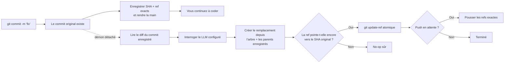

<p align="center">
  
</p>

<h1 align="center">Git AI — Générateur asynchrone de messages de commit par IA</h1>

<p align="center">
  <strong>Commitez maintenant. Continuez à coder. Laissez l’IA améliorer le message en arrière-plan.</strong>
  <br />
  Transformez vos brouillons Git en Conventional Commits clairs — une fois votre travail enregistré en toute sécurité par Git.
</p>

<p align="center">
  <a href="https://github.com/daidi/git-ai/releases"></a>
  <a href="https://github.com/daidi/git-ai/actions/workflows/ci.yml"></a>
  <a href="LICENSE"></a>
  <a href="https://marketplace.visualstudio.com/items?itemName=git-ai-async-commit-polisher.git-ai"></a>
  <a href="https://plugins.jetbrains.com/plugin/31221-git-ai"></a>
</p>

<p align="center">
  <a href="https://codegg.org/git-ai/"><strong>Site web</strong></a>
  &nbsp;·&nbsp;
  <a href="#installation">Installation</a>
  &nbsp;·&nbsp;
  <a href="#démarrage-rapide">Démarrage rapide</a>
  &nbsp;·&nbsp;
  <a href="#fonctionnement">Fonctionnement</a>
  &nbsp;·&nbsp;
  <a href="https://github.com/daidi/git-ai/issues">Assistance</a>
</p>

<p align="center">
  <sub>
    <a href="README.md">English</a> ·
    <a href="README_zh-CN.md">简体中文</a> ·
    <a href="README_zh-TW.md">繁體中文</a> ·
    Français ·
    <a href="README_de.md">Deutsch</a> ·
    <a href="README_es.md">Español</a> ·
    <a href="README_it.md">Italiano</a> ·
    <a href="README_ja.md">日本語</a> ·
    <a href="README_ko.md">한국어</a> ·
    <a href="README_pt.md">Português</a> ·
    <a href="README_ru.md">Русский</a> ·
    <a href="README_ar.md">العربية</a> ·
    <a href="README_vi.md">Tiếng Việt</a> ·
    <a href="README_th.md">ไทย</a> ·
    <a href="README_id.md">Bahasa Indonesia</a> ·
    <a href="README_ms.md">Bahasa Melayu</a>
  </sub>
</p>

<p align="center">
  
</p>

Git AI est un **générateur de messages de commit par IA** libre et gratuit pour le terminal, VS Code et les IDE JetBrains. Il transforme un brouillon comme `fix auth` en historique Git utile, sans placer l’attente d’un LLM entre vous et votre prochaine ligne de code.

Contrairement aux générateurs pré-commit, Git AI s’exécute via un hook `post-commit`. Le commit original existe d’abord ; un démon détaché lit ensuite ce commit précis, interroge le modèle configuré, crée un remplacement avec le même arbre et les mêmes parents, puis avance la branche uniquement si l’opération reste sûre.

> Git AI utilise son propre flux de travail. [Parcourez l’historique des commits du dépôt](https://github.com/daidi/git-ai/commits/main) pour voir le résultat.

## Voir la différence

```console
$ git commit -m "fix auth"
[main 1a2b3c4] fix auth
✨ Git AI: polishing in background (PID 2418)

# Votre terminal est immédiatement disponible. Une fois le traitement terminé :
$ git log -1 --pretty=%s
fix(auth): prevent expired sessions on mobile
```

Git rend la main immédiatement. Pendant que le modèle travaille, vous pouvez modifier, tester, changer d’outil ou même lancer `git push` ; Git AI coordonne le résultat en arrière-plan.

## Pourquoi Git AI

La plupart des outils de commit par IA placent la génération sur le chemin critique. Git AI la déplace volontairement après le commit.

| | Générateur de commit par IA classique | Git AI |
|:--|:--|:--|
| **Flux** | Générer → attendre → relire → commiter | Commiter → continuer à coder → améliorer en arrière-plan |
| **Commande** | Commande, bouton ou dialogue spécifique | Votre `git commit` habituel |
| **Si l’IA échoue** | Le commit peut ne jamais être créé | Le commit original reste intact |
| **Travail plus récent** | Un amend aveugle peut capturer le mauvais état | Le remplacement réutilise l’arbre et les parents enregistrés |
| **Sécurité de branche** | Selon l’outil | Compare-and-swap atomique ; une ref déplacée produit un no-op sûr |
| **Push immédiat** | Attendre ou gérer soi-même | Mettre le push exact en file ou choisir le blocage strict |
| **Environnements** | Souvent un seul CLI ou éditeur | Terminal, VS Code, JetBrains et autres clients Git |

**Commiter d’abord, réfléchir ensuite** signifie que votre code est enregistré avant l’intervention de l’IA.

## Installation

Choisissez l’environnement que vous utilisez déjà. Les intégrations IDE installent et mettent à jour automatiquement le bon binaire Git AI, après vérification du SHA-256 publié.

| Utiliser Git AI dans | Installation | Expérience incluse |
|:--|:--|:--|
| **VS Code / éditeurs compatibles** | [Visual Studio Marketplace](https://marketplace.visualstudio.com/items?itemName=git-ai-async-commit-polisher.git-ai) · [Open VSX](https://open-vsx.org/extension/git-ai-async-commit-polisher/git-ai) | Activity Bar, état, historique, réglages, statistiques, journaux et récupération |
| **IDE JetBrains** | [JetBrains Marketplace](https://plugins.jetbrains.com/plugin/31221-git-ai) | Fenêtre d’outils native, widget d’état, réglages, historique, statistiques, journaux et actions VCS |
| **Terminal / tout client Git** | [GitHub Releases](https://github.com/daidi/git-ai/releases) · gestionnaires ci-dessous | Binaire Go autonome et hooks Git composables |

### CLI autonome

**Homebrew — macOS ou Linux**

```bash
brew install daidi/tap/git-ai
```

**Scoop — Windows**

```powershell
scoop bucket add daidi https://github.com/daidi/scoop-bucket.git
scoop install daidi/git-ai
```

**Installateur vérifié — macOS ou Linux**

```bash
curl -fsSL https://raw.githubusercontent.com/daidi/git-ai/main/install.sh | bash
```

**Installateur vérifié — Windows PowerShell**

```powershell
iwr https://raw.githubusercontent.com/daidi/git-ai/main/install.ps1 -useb | iex
```

**Go install**

```bash
go install github.com/daidi/git-ai/cli/cmd/git-ai@latest
```

L’installation depuis les sources nécessite Go 1.26.6 ou une version ultérieure. Des binaires macOS, Linux et Windows pour AMD64 et ARM64, leurs sommes de contrôle et les paquets `.deb` et `.rpm` sont disponibles dans [GitHub Releases](https://github.com/daidi/git-ai/releases).

## Démarrage rapide

Dans un IDE, ouvrez les réglages Git AI, connectez un modèle et acceptez l’initialisation unique du dépôt. Pour la CLI autonome :

```bash
# À exécuter une fois dans chaque dépôt pour installer les hooks composables
cd your-project
git-ai init

# DeepSeek est le point d’accès par défaut ; remplacez le texte par votre clé
git-ai config set api_key "sk-..." --global
git-ai config test

# Continuez à utiliser Git normalement
git commit -m "fix login"
```

C’est tout le flux quotidien. `git-ai status` donne de la visibilité lorsque vous le souhaitez ; sinon Git AI reste discret.

Vous préférez un modèle local ? Ollama ne demande aucune clé API :

```bash
git-ai config set provider ollama --global
git-ai config set model llama3 --global
git-ai config set base_url http://localhost:11434 --global
git-ai config test
```

## Fonctionnalités

- **Amélioration réellement asynchrone** — le hook `post-commit` enregistre la cible et rend la main pendant qu’un démon détaché traite la requête.
- **Remplacement sûr pour Git** — Git AI repart du commit enregistré, jamais de ce qui a été indexé plus tard.
- **Flux conscient du push** — `queue` rejoue les mises à jour de refs exactes après traitement ; `block` conserve un push manuel.
- **Quatre styles** — [Conventional Commits](https://www.conventionalcommits.org/), [Gitmoji](https://gitmoji.dev/), sujet simple et sujet structuré avec corps.
- **Votre modèle, votre choix** — API compatibles OpenAI, Anthropic Claude, Google Gemini, DeepSeek, Qwen et Ollama local.
- **Résultat adapté au dépôt** — découpage intelligent et borné du diff, règles Commitlint JSON statiques, langue, prompts personnalisés et explications facultatives.
- **Contrats intégrés validés** — les réponses vides, trop longues, invalides ou mal formatées sont rejetées ; les trailers Git d’origine sont préservés exactement.
- **Smart skip** — conserver un bon nouveau message, tout en améliorant les brouillons vagues ou répétés.
- **Outils de récupération** — consulter l’état, réessayer, annuler, interrompre, ignorer le prochain commit ou reprendre une opération interrompue.
- **Observabilité locale** — historique IA, latence, estimations de productivité, journaux bornés et notifications système.
- **Intégrations IDE natives** — installation gérée et commandes visuelles pour [VS Code](vscode-extension/README.md) et les [IDE JetBrains](idea-plugin/README.md).
- **16 langues d’interface** — anglais, arabe, chinois simplifié, chinois traditionnel, français, allemand, indonésien, italien, japonais, coréen, malais, portugais, russe, espagnol, thaï et vietnamien.
- **Qualité reproductible** — un [banc d’évaluation sur des commits publics](cli/eval/README.md) mesure format, sémantique, trailers, contexte du diff et latence.

## Fonctionnement



### Sûr par conception

Git AI ne lance **jamais** un `git commit --amend` aveugle en arrière-plan.

1. Git crée le commit original avant tout appel au modèle.
2. Le hook enregistre son SHA et la ref de branche exacts, puis se termine.
3. Le démon lit ce commit enregistré, et non l’index ou le répertoire de travail actuels.
4. Le remplacement conserve l’arbre et les parents enregistrés.
5. `git update-ref <ref> <new> <expected>` avance la branche seulement si le SHA attendu correspond encore.
6. Nouveau commit, branche déplacée, erreur réseau, authentification, limite, réponse incorrecte ou modèle défaillant : le commit original et l’espace de travail restent inchangés.

Un message faisant partie de l’objet commit, une amélioration réussie crée un nouveau SHA. La vérification garantit que Git AI ne touche qu’au commit initialement enregistré.

### Confidentialité et maîtrise locale

- **Aucun serveur relais Git AI.** Le diff borné et le brouillon vont directement au point d’accès que vous configurez.
- **Inférence locale disponible.** Utilisez Ollama pour garder le code sur votre machine.
- **Identifiants hors des dépôts.** Les clés persistées sont uniquement au niveau utilisateur ; les variables d’environnement sont aussi prises en charge.
- **État hors du répertoire de travail.** État, journaux et historique IA résident dans le cache utilisateur ; les réglages du dépôt utilisent `.git/config`.
- **Aucune télémétrie envoyée.** Statistiques de productivité et métadonnées de commit restent locales.
- **Diagnostics sensibles exclus.** Aucun journal ne contient clé API, prompt, diff, corps de réponse ou URL distante avec identifiants.
- **Téléchargements vérifiés.** Installateurs et IDE valident le SHA-256 publié avant remplacement.

La recherche de versions et les téléchargements gérés peuvent contacter GitHub ou le service de versions Git AI.

## Fournisseurs et configuration

| Mode | Compatible avec | Clé API |
|:--|:--|:--|
| `openai` | Points d’accès compatibles OpenAI : DeepSeek, OpenAI, Qwen et passerelles | Requise |
| `anthropic` | API native Anthropic Claude | Requise |
| `gemini` | API native Google Gemini | Requise |
| `ollama` | Serveur Ollama local | Non requise |

Exemple pour un point d’accès compatible OpenAI :

```bash
git-ai config set provider openai --global
git-ai config set base_url https://api.example.com/v1 --global
git-ai config set model your-model --global
git-ai config set api_key "sk-..." --global
git-ai config test
```

| Réglage | Valeur initiale | Rôle |
|:--|:--|:--|
| `message_format` | `conventional` | `plain`, `conventional`, `gitmoji` ou `subject-body` |
| `commit_attribution` | `off` | Mention `Polished-by` facultative : `off` ou `compact` |
| `language` | `en` | Langue des messages générés |
| `smart_skip` | `true` | Conserver un bon nouveau message sans appeler le modèle |
| `push_policy` | `queue` | Mettre en file un push sûr, ou choisir `block` pour le contrôle manuel |
| `max_diff_tokens` | `8000` | Borner le contexte de diff envoyé au modèle |
| `explain` | `false` | Ajouter un court corps expliquant la raison du changement |
| `prompt_template` | vide | Personnaliser avec `{{.Diff}}`, `{{.Hint}}` et `{{.Language}}` |

Priorité : variables `GIT_AI_*` → réglages du dépôt dans `.git/config` → configuration utilisateur du système → valeurs par défaut. Les clés API restent au niveau utilisateur. Les anciens `.git-ai.json` du répertoire de travail sont ignorés afin qu’un dépôt cloné ne puisse pas rediriger vos identifiants.

## Commandes courantes

| Commande | Action |
|:--|:--|
| `git-ai status` | Afficher l’état `idle`, `polishing`, `pushing` ou `failed` |
| `git-ai retry` | Réessayer le commit courant sans risque en arrière-plan |
| `git-ai undo` | Restaurer le message brouillon original |
| `git-ai cancel` | Arrêter l’amélioration sans modifier Git |
| `git-ai skip-next` | Laisser le prochain commit intact |
| `git-ai push` | Reprendre un push différé ou pousser la branche courante |
| `git-ai log` | Afficher l’historique Git avec les métadonnées IA locales |
| `git-ai stats` | Afficher les statistiques de productivité locales |
| `git-ai config list` | Inspecter la configuration effective, secrets masqués |
| `git-ai update` | Installer la dernière CLI vérifiée |
| `git-ai uninstall` | Retirer les hooks Git AI et restaurer les hooks conservés |

Utilisez `git-ai --help` ou `git-ai <command> --help` pour la référence complète.

## Intégrations IDE

### VS Code

L’[extension VS Code](vscode-extension/README.md) prend en charge VS Code 1.85+ et les éditeurs Open VSX compatibles. Elle ajoute un centre de contrôle dans l’Activity Bar, l’état en direct, l’historique IA, les réglages globaux et projet, les statistiques locales, les journaux et la récupération en un clic. Les espaces de travail restreints n’exécutent aucun binaire, ne téléchargent aucune mise à jour et n’installent aucun hook.

```bash
code --install-extension git-ai-async-commit-polisher.git-ai
```

### IDE JetBrains

Le [plugin JetBrains](idea-plugin/README.md) prend en charge les IDE IntelliJ Platform 2024.1+, dont IntelliJ IDEA, WebStorm, PyCharm, GoLand, PhpStorm, CLion, DataGrip et RubyMine. Il propose une fenêtre d’outils native, un widget d’état, des réglages, des actions VCS, l’historique, les statistiques et un affichage borné des journaux.

[Installer Git AI depuis le JetBrains Marketplace →](https://plugins.jetbrains.com/plugin/31221-git-ai)

## Questions fréquentes

<details>
<summary><strong>Git AI modifie-t-il mes fichiers source, mon index ou mes changements indexés ?</strong></summary>
<br />
Non. Le remplacement réutilise l’arbre et les parents exacts du commit enregistré. Les changements indexés, non indexés ou plus récents ne sont jamais capturés.
</details>

<details>
<summary><strong>Que se passe-t-il si je crée un autre commit pendant le traitement ?</strong></summary>
<br />
La branche ne pointe plus vers le SHA enregistré : la mise à jour atomique devient un no-op sûr. Git AI ne réécrit jamais le commit plus récent.
</details>

<details>
<summary><strong>Que se passe-t-il si je pousse immédiatement ?</strong></summary>
<br />
Avec `queue`, le hook pre-push enregistre les refs exactes et les rejoue après un traitement sûr. Si l’authentification en arrière-plan manque, l’initialisation choisit `block` afin de vous laisser pousser manuellement.
</details>

<details>
<summary><strong>Puis-je relire, réessayer ou annuler le message généré ?</strong></summary>
<br />
Oui. Utilisez `git-ai log`, `git-ai retry` et `git-ai undo`, ou les contrôles correspondants dans l’IDE.
</details>

<details>
<summary><strong>Git AI envoie-t-il tout mon dépôt à un modèle ?</strong></summary>
<br />
Non. Seuls une représentation bornée du diff enregistré et le brouillon sont envoyés au point d’accès configuré. Ollama permet une inférence locale.
</details>

<details>
<summary><strong>Fonctionne-t-il quand je commite hors de l’IDE ?</strong></summary>
<br />
Oui. Une fois le dépôt initialisé, le même flux par hooks s’applique au terminal, à l’IDE et aux autres clients Git.
</details>

<details>
<summary><strong>Git AI est-il gratuit ?</strong></summary>
<br />
Git AI est gratuit sous licence MIT. Vous fournissez votre clé d’API cloud ou votre modèle Ollama local ; le fournisseur cloud peut facturer son utilisation.
</details>

## Développement

Le monorepo centralise la persistance et les opérations Git dans un seul moteur :

- [`cli/`](cli/) — CLI Go, hooks, démon, fournisseurs, état et mises à jour sûres des refs
- [`vscode-extension/`](vscode-extension/) — intégration TypeScript qui délègue à la CLI
- [`idea-plugin/`](idea-plugin/) — intégration Kotlin IntelliJ qui délègue à la CLI

```bash
cd cli
make build
make test
make lint
make eval

cd ../vscode-extension
npm ci
npm test

cd ../idea-plugin
./gradlew test buildPlugin
```

Avant de modifier un texte d’interface localisé, lisez les instructions du dépôt et exécutez `bash scripts/check-i18n-coverage.sh` depuis sa racine.

## Aider Git AI à grandir

Si Git AI vous aide à rester concentré, [ajoutez une étoile au dépôt](https://github.com/daidi/git-ai) : cela permet à d’autres développeurs de le découvrir. Les rapports de bug, demandes ciblées, corrections de documentation et pull requests sont bienvenus dans les [GitHub Issues](https://github.com/daidi/git-ai/issues).

## Licence

Git AI est distribué sous [licence MIT](LICENSE).

---

<p align="center">
  <strong>Un meilleur historique de commits. Zéro attente.</strong>
  <br />
  <a href="#installation">Installer Git AI</a>
  &nbsp;·&nbsp;
  <a href="https://github.com/daidi/git-ai">Ajouter une étoile sur GitHub</a>
  &nbsp;·&nbsp;
  <a href="https://github.com/daidi/git-ai/issues">Signaler un problème</a>
</p>
