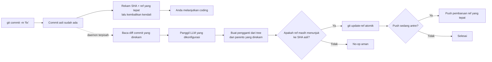

<p align="center">
  
</p>

<h1 align="center">Git AI — Pembuat pesan commit asinkron dengan AI</h1>

<p align="center">
  <strong>Commit sekarang. Lanjutkan coding. Biarkan AI menyempurnakan pesannya di latar belakang.</strong>
  <br />
  Ubah draf singkat menjadi Conventional Commit yang jelas setelah Git menyimpan pekerjaan Anda dengan aman.
</p>

<p align="center">
  <a href="https://github.com/daidi/git-ai/releases"></a>
  <a href="https://github.com/daidi/git-ai/actions/workflows/ci.yml"></a>
  <a href="LICENSE"></a>
  <a href="https://marketplace.visualstudio.com/items?itemName=git-ai-async-commit-polisher.git-ai"></a>
  <a href="https://plugins.jetbrains.com/plugin/31221-git-ai"></a>
</p>

<p align="center">
  <a href="https://codegg.org/git-ai/"><strong>Situs web</strong></a>
  &nbsp;·&nbsp;
  <a href="#instalasi">Instalasi</a>
  &nbsp;·&nbsp;
  <a href="#mulai-cepat">Mulai cepat</a>
  &nbsp;·&nbsp;
  <a href="#cara-kerja">Cara kerja</a>
  &nbsp;·&nbsp;
  <a href="https://github.com/daidi/git-ai/issues">Dukungan</a>
</p>

<p align="center">
  <sub>
    <a href="README.md">English</a> ·
    <a href="README_zh-CN.md">简体中文</a> ·
    <a href="README_zh-TW.md">繁體中文</a> ·
    <a href="README_fr.md">Français</a> ·
    <a href="README_de.md">Deutsch</a> ·
    <a href="README_es.md">Español</a> ·
    <a href="README_it.md">Italiano</a> ·
    <a href="README_ja.md">日本語</a> ·
    <a href="README_ko.md">한국어</a> ·
    <a href="README_pt.md">Português</a> ·
    <a href="README_ru.md">Русский</a> ·
    <a href="README_ar.md">العربية</a> ·
    <a href="README_vi.md">Tiếng Việt</a> ·
    <a href="README_th.md">ไทย</a> ·
    Bahasa Indonesia ·
    <a href="README_ms.md">Bahasa Melayu</a>
  </sub>
</p>

<p align="center">
  
</p>

Git AI adalah **pembuat pesan commit dengan AI** gratis dan sumber terbuka untuk terminal, VS Code, serta IDE JetBrains. Git AI mengubah draf seperti `fix auth` menjadi riwayat Git yang berguna tanpa membuat Anda menunggu respons LLM sebelum menulis baris kode berikutnya.

Berbeda dari generator pra-commit, Git AI berjalan melalui hook `post-commit`. Commit asli dibuat terlebih dahulu; lalu daemon terpisah membaca commit itu secara tepat, memanggil model yang dikonfigurasi, membuat pengganti dengan tree dan parents yang sama, serta hanya memajukan branch ketika masih aman.

> Git AI menggunakan alurnya sendiri. [Lihat riwayat commit repository ini](https://github.com/daidi/git-ai/commits/main) untuk melihat hasilnya.

## Lihat perbedaannya

```console
$ git commit -m "fix auth"
[main 1a2b3c4] fix auth
✨ Git AI: polishing in background (PID 2418)

# Terminal langsung siap dipakai. Setelah selesai:
$ git log -1 --pretty=%s
fix(auth): prevent expired sessions on mobile
```

Git langsung mengembalikan kendali. Selama model bekerja, Anda bisa mengedit, menguji, berpindah alat, bahkan menjalankan `git push`; Git AI mengoordinasikan hasilnya di latar belakang.

## Mengapa Git AI

Sebagian besar alat commit dengan AI menempatkan pembuatan pesan pada jalur yang wajib ditunggu. Git AI sengaja memindahkannya ke setelah commit.

| | Pembuat commit dengan AI biasa | Git AI |
|:--|:--|:--|
| **Alur** | Buat → tunggu → tinjau → commit | Commit → lanjut coding → sempurnakan di latar belakang |
| **Perintah** | Perintah, tombol, atau dialog khusus | `git commit` seperti biasa |
| **Jika AI gagal** | Commit mungkin tidak pernah dibuat | Commit asli tetap utuh |
| **Pekerjaan lebih baru** | Amend buta dapat menangkap kondisi yang salah | Pengganti memakai tree dan parents yang direkam |
| **Keamanan branch** | Bergantung alat | Compare-and-swap atomik; ref yang berpindah menjadi no-op aman |
| **Push langsung** | Menunggu atau mengatur sendiri | Antrekan push yang tepat atau pilih pemblokiran ketat |
| **Tempat bekerja** | Biasanya satu CLI atau editor | Terminal, VS Code, JetBrains, dan klien Git lain |

**Commit dahulu, pikirkan nanti** berarti snapshot kode dibuat sebelum AI masuk ke dalam alur.

## Instalasi

Pilih lingkungan yang sudah Anda gunakan. Integrasi IDE memasang dan memperbarui Git AI CLI yang sesuai secara otomatis, disertai verifikasi SHA-256 yang diterbitkan.

| Gunakan Git AI di | Instalasi | Pengalaman yang tersedia |
|:--|:--|:--|
| **VS Code / editor kompatibel** | [Visual Studio Marketplace](https://marketplace.visualstudio.com/items?itemName=git-ai-async-commit-polisher.git-ai) · [Open VSX](https://open-vsx.org/extension/git-ai-async-commit-polisher/git-ai) | Activity Bar, status, riwayat, pengaturan, statistik, log, dan pemulihan |
| **IDE JetBrains** | [JetBrains Marketplace](https://plugins.jetbrains.com/plugin/31221-git-ai) | Tool Window native, widget status, pengaturan, riwayat, statistik, log, dan aksi VCS |
| **Terminal / klien Git apa pun** | [GitHub Releases](https://github.com/daidi/git-ai/releases) · pengelola paket di bawah | Binary Go mandiri dan hook Git yang dapat digabungkan |

### CLI mandiri

**Homebrew — macOS atau Linux**

```bash
brew install daidi/tap/git-ai
```

**Scoop — Windows**

```powershell
scoop bucket add daidi https://github.com/daidi/scoop-bucket.git
scoop install daidi/git-ai
```

**Penginstal terverifikasi — macOS atau Linux**

```bash
curl -fsSL https://raw.githubusercontent.com/daidi/git-ai/main/install.sh | bash
```

**Penginstal terverifikasi — Windows PowerShell**

```powershell
iwr https://raw.githubusercontent.com/daidi/git-ai/main/install.ps1 -useb | iex
```

**Go install**

```bash
go install github.com/daidi/git-ai/cli/cmd/git-ai@latest
```

Instalasi dari sumber memerlukan Go 1.26.6 atau lebih baru. [GitHub Releases](https://github.com/daidi/git-ai/releases) menyediakan binary macOS, Linux, dan Windows untuk AMD64/ARM64, checksum, serta paket `.deb` dan `.rpm`.

## Mulai cepat

Di IDE, buka pengaturan Git AI, hubungkan model, dan setujui inisialisasi repository satu kali. Untuk CLI mandiri:

```bash
# Jalankan sekali di setiap repository untuk memasang hook yang dapat digabungkan
cd your-project
git-ai init

# Endpoint default adalah DeepSeek; ganti placeholder dengan key Anda
git-ai config set api_key "sk-..." --global
git-ai config test

# Lanjutkan menggunakan Git seperti biasa
git commit -m "fix login"
```

Itulah seluruh alur harian. Gunakan `git-ai status` saat ingin melihat status; selain itu Git AI tidak mengganggu pekerjaan.

Lebih suka model lokal? Ollama tidak memerlukan API key:

```bash
git-ai config set provider ollama --global
git-ai config set model llama3 --global
git-ai config set base_url http://localhost:11434 --global
git-ai config test
```

## Yang Anda dapatkan

- **Penyempurnaan benar-benar asinkron** — hook `post-commit` merekam target lalu kembali, sementara daemon terpisah menangani permintaan model.
- **Penggantian aman untuk Git** — Git AI membangun dari commit yang direkam, bukan dari apa pun yang di-stage kemudian.
- **Alur yang memahami push** — `queue` mengulang pembaruan ref yang tepat setelah penyempurnaan; `block` menjaga push tetap manual.
- **Empat gaya pesan** — [Conventional Commits](https://www.conventionalcommits.org/), [Gitmoji](https://gitmoji.dev/), subject sederhana, dan subject dengan body.
- **Gunakan model pilihan Anda** — API kompatibel OpenAI, Anthropic Claude, Google Gemini, DeepSeek, Qwen, dan Ollama lokal.
- **Output yang memahami repository** — pemangkasan diff cerdas dan terbatas, aturan Commitlint JSON statis, bahasa, prompt khusus, dan penjelasan opsional.
- **Kontrak bawaan yang divalidasi** — respons kosong, terlalu panjang, tidak valid, atau salah format ditolak; Git trailers asli dipertahankan tepat.
- **Smart skip** — pertahankan pesan baru yang valid dan sempurnakan draf yang kasar atau berulang.
- **Kontrol pemulihan** — lihat status, coba lagi, batalkan perubahan, hentikan, lewati commit berikutnya, atau pulihkan operasi terputus.
- **Observabilitas lokal** — riwayat AI, latensi pembuatan, perkiraan produktivitas, log terbatas, dan notifikasi sistem.
- **Integrasi IDE native** — instalasi terkelola dan kontrol visual untuk [VS Code](vscode-extension/README.md) dan [JetBrains](idea-plugin/README.md).
- **16 bahasa antarmuka** — Inggris, Arab, Tionghoa Sederhana, Tionghoa Tradisional, Prancis, Jerman, Indonesia, Italia, Jepang, Korea, Melayu, Portugis, Rusia, Spanyol, Thailand, dan Vietnam.
- **Evaluasi kualitas yang dapat direproduksi** — [harness dengan commit publik](cli/eval/README.md) menilai format, semantik, trailers, konteks diff, dan latensi.

## Cara kerja



### Aman sejak dirancang

Git AI **tidak** menjalankan `git commit --amend` secara buta di latar belakang.

1. Git membuat commit asli sebelum Git AI memanggil model.
2. Hook merekam SHA commit dan branch ref yang tepat, lalu selesai.
3. Daemon membaca commit yang direkam, bukan index atau worktree saat ini.
4. Commit pengganti menggunakan kembali tree dan parents yang direkam.
5. `git update-ref <ref> <new> <expected>` hanya memajukan branch jika SHA yang diharapkan masih cocok.
6. Commit baru, branch berpindah, atau kegagalan jaringan, autentikasi, rate limit, respons, maupun model tidak mengubah commit asli dan workspace.

Karena pesan adalah bagian dari objek commit, penyempurnaan yang berhasil menghasilkan SHA baru. Pemeriksaan keamanan membatasi perubahan hanya pada commit yang direkam pertama kali.

### Privasi dan kepemilikan lokal

- **Tanpa server perantara Git AI.** Commit diff terbatas dan draf dikirim langsung ke endpoint model yang Anda atur.
- **Mendukung inferensi lokal.** Gunakan Ollama ketika kode harus tetap di komputer.
- **Kredensial di luar repository.** API key tersimpan hanya pada tingkat pengguna; environment variable juga didukung.
- **Status di luar worktree.** Status, log, dan riwayat AI berada di cache pengguna; pengaturan repository menggunakan `.git/config`.
- **Tidak ada analytics yang diunggah.** Statistik produktivitas dan metadata commit tetap lokal.
- **Data sensitif dikecualikan dari diagnosis.** Log tidak berisi key, prompt, diff, body respons, atau URL dengan kredensial.
- **Unduhan terverifikasi.** Penginstal dan IDE memeriksa SHA-256 yang diterbitkan sebelum mengganti binary.

Pemeriksaan rilis dan unduhan terkelola dapat menghubungi GitHub atau layanan rilis Git AI.

## Penyedia dan konfigurasi

| Mode | Bekerja dengan | API key |
|:--|:--|:--|
| `openai` | Endpoint kompatibel OpenAI termasuk DeepSeek, OpenAI, Qwen, dan gateway | Wajib |
| `anthropic` | API native Anthropic Claude | Wajib |
| `gemini` | API native Google Gemini | Wajib |
| `ollama` | Server Ollama lokal | Tidak wajib |

```bash
git-ai config set provider openai --global
git-ai config set base_url https://api.example.com/v1 --global
git-ai config set model your-model --global
git-ai config set api_key "sk-..." --global
git-ai config test
```

| Pengaturan | Default | Tujuan |
|:--|:--|:--|
| `message_format` | `conventional` | `plain`, `conventional`, `gitmoji`, atau `subject-body` |
| `language` | `en` | Bahasa pesan commit yang dibuat |
| `smart_skip` | `true` | Mempertahankan pesan valid tanpa memanggil model |
| `push_policy` | `queue` | Mengantrekan push aman atau memakai `block` untuk kontrol manual |
| `max_diff_tokens` | `8000` | Membatasi konteks diff yang dikirim ke model |
| `explain` | `false` | Menambahkan body singkat yang menjelaskan perubahan |
| `prompt_template` | kosong | Menyesuaikan dengan `{{.Diff}}`, `{{.Hint}}`, dan `{{.Language}}` |

Urutan prioritas: environment variable `GIT_AI_*` → pengaturan repository di `.git/config` → konfigurasi pengguna sistem operasi → default. API key hanya berada di tingkat pengguna. Berkas lama `.git-ai.json` di worktree diabaikan agar repository hasil clone tidak dapat mengalihkan kredensial Anda.

## Perintah sehari-hari

| Perintah | Fungsi |
|:--|:--|
| `git-ai status` | Menampilkan status `idle`, `polishing`, `pushing`, atau `failed` |
| `git-ai retry` | Mencoba lagi commit saat ini dengan aman di latar belakang |
| `git-ai undo` | Mengembalikan pesan draf asli |
| `git-ai cancel` | Menghentikan penyempurnaan tanpa mengubah Git |
| `git-ai skip-next` | Membiarkan commit berikutnya apa adanya |
| `git-ai push` | Melanjutkan push tertunda atau push branch saat ini |
| `git-ai log` | Menampilkan riwayat Git dengan metadata AI lokal |
| `git-ai stats` | Menampilkan statistik produktivitas lokal |
| `git-ai config list` | Melihat konfigurasi efektif dengan secret disamarkan |
| `git-ai update` | Memasang CLI terverifikasi terbaru |
| `git-ai uninstall` | Menghapus hook Git AI dan memulihkan hook yang disimpan |

Gunakan `git-ai --help` atau `git-ai <command> --help` untuk referensi lengkap.

## Integrasi IDE

### VS Code

[Ekstensi VS Code](vscode-extension/README.md) mendukung VS Code 1.85+ dan editor Open VSX yang kompatibel. Ekstensi menyediakan pusat kontrol Activity Bar, status langsung, riwayat AI, pengaturan global dan proyek, statistik lokal, log, serta pemulihan sekali klik. Restricted workspace tidak menjalankan binary, mengunduh pembaruan, atau memasang hook.

```bash
code --install-extension git-ai-async-commit-polisher.git-ai
```

### IDE JetBrains

[Plugin JetBrains](idea-plugin/README.md) mendukung IDE IntelliJ Platform 2024.1+, termasuk IntelliJ IDEA, WebStorm, PyCharm, GoLand, PhpStorm, CLion, DataGrip, dan RubyMine. Tersedia Tool Window native, widget status, pengaturan, aksi VCS, riwayat, statistik, dan tampilan log terbatas.

[Pasang Git AI dari JetBrains Marketplace →](https://plugins.jetbrains.com/plugin/31221-git-ai)

## Pertanyaan umum

<details>
<summary><strong>Apakah Git AI mengubah berkas sumber, index, atau perubahan yang di-stage?</strong></summary>
<br />
Tidak. Commit pengganti dibuat dari tree dan parents yang tepat pada commit rekaman. Perubahan yang di-stage, belum di-stage, atau lebih baru tidak pernah ikut terbawa.
</details>

<details>
<summary><strong>Apa yang terjadi jika saya membuat commit lain saat AI bekerja?</strong></summary>
<br />
Branch tidak lagi menunjuk ke SHA rekaman, sehingga pembaruan atomik menjadi no-op aman. Git AI tidak pernah menulis ulang commit yang lebih baru.
</details>

<details>
<summary><strong>Apa yang terjadi jika saya langsung melakukan push?</strong></summary>
<br />
Dengan `queue`, hook pre-push merekam pembaruan ref yang tepat dan mengulangnya setelah penyempurnaan aman. Jika autentikasi latar belakang tidak tersedia, inisialisasi memilih `block` agar Anda melakukan push manual.
</details>

<details>
<summary><strong>Bisakah saya meninjau, mencoba lagi, atau membatalkan pesan?</strong></summary>
<br />
Bisa. Gunakan `git-ai log`, `git-ai retry`, `git-ai undo`, atau kontrol yang sesuai di IDE.
</details>

<details>
<summary><strong>Apakah Git AI mengirim seluruh repository ke model?</strong></summary>
<br />
Tidak. Hanya representasi terbatas dari commit diff yang direkam dan draf yang dikirim ke endpoint pilihan Anda. Gunakan Ollama untuk inferensi lokal.
</details>

<details>
<summary><strong>Apakah tetap bekerja ketika commit dibuat di luar IDE?</strong></summary>
<br />
Ya. Setelah inisialisasi, alur berbasis hook yang sama bekerja dari terminal, IDE, maupun klien Git lain.
</details>

<details>
<summary><strong>Apakah Git AI gratis?</strong></summary>
<br />
Git AI gratis dengan lisensi MIT. Anda memakai API key cloud sendiri atau model Ollama lokal; penyedia cloud dapat mengenakan biaya penggunaan.
</details>

## Pengembangan

Monorepo memusatkan persistensi dan operasi Git dalam satu engine:

- [`cli/`](cli/) — Go CLI, hook, daemon, penyedia, status, dan pembaruan ref yang aman
- [`vscode-extension/`](vscode-extension/) — integrasi TypeScript yang mendelegasikan operasi ke CLI
- [`idea-plugin/`](idea-plugin/) — integrasi Kotlin IntelliJ yang mendelegasikan operasi ke CLI

```bash
cd cli
make build
make test
make lint
make eval

cd ../vscode-extension
npm ci
npm test

cd ../idea-plugin
./gradlew test buildPlugin
```

Sebelum mengubah teks UI yang dilokalkan, baca petunjuk repository dan jalankan `bash scripts/check-i18n-coverage.sh` dari root proyek.

## Bantu Git AI berkembang

Jika Git AI membantu Anda tetap fokus, [beri Star pada repository](https://github.com/daidi/git-ai) agar lebih banyak developer menemukan proyek ini. Laporan bug, permintaan terarah, perbaikan dokumentasi, dan pull request diterima melalui [GitHub Issues](https://github.com/daidi/git-ai/issues).

## Lisensi

Git AI tersedia di bawah [lisensi MIT](LICENSE).

---

<p align="center">
  <strong>Riwayat commit lebih baik. Tanpa menunggu.</strong>
  <br />
  <a href="#instalasi">Pasang Git AI</a>
  &nbsp;·&nbsp;
  <a href="https://github.com/daidi/git-ai">Beri Star di GitHub</a>
  &nbsp;·&nbsp;
  <a href="https://github.com/daidi/git-ai/issues">Laporkan masalah</a>
</p>
