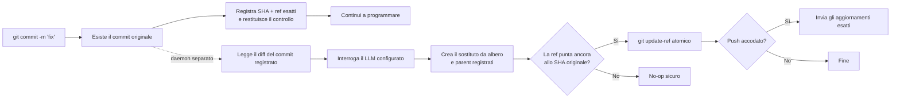

<p align="center">
  
</p>

<h1 align="center">Git AI — Generatore asincrono di messaggi di commit con IA</h1>

<p align="center">
  <strong>Fai commit adesso. Continua a programmare. Lascia che l’IA perfezioni il messaggio in background.</strong>
  <br />
  Trasforma bozze rapide in Conventional Commit chiari dopo che Git ha salvato il lavoro in sicurezza.
</p>

<p align="center">
  <a href="https://github.com/daidi/git-ai/releases"></a>
  <a href="https://github.com/daidi/git-ai/actions/workflows/ci.yml"></a>
  <a href="LICENSE"></a>
  <a href="https://marketplace.visualstudio.com/items?itemName=git-ai-async-commit-polisher.git-ai"></a>
  <a href="https://plugins.jetbrains.com/plugin/31221-git-ai"></a>
</p>

<p align="center">
  <a href="https://codegg.org/git-ai/"><strong>Sito web</strong></a>
  &nbsp;·&nbsp;
  <a href="#installazione">Installazione</a>
  &nbsp;·&nbsp;
  <a href="#avvio-rapido">Avvio rapido</a>
  &nbsp;·&nbsp;
  <a href="#come-funziona">Come funziona</a>
  &nbsp;·&nbsp;
  <a href="https://github.com/daidi/git-ai/issues">Supporto</a>
</p>

<p align="center">
  <sub>
    <a href="README.md">English</a> ·
    <a href="README_zh-CN.md">简体中文</a> ·
    <a href="README_zh-TW.md">繁體中文</a> ·
    <a href="README_fr.md">Français</a> ·
    <a href="README_de.md">Deutsch</a> ·
    <a href="README_es.md">Español</a> ·
    Italiano ·
    <a href="README_ja.md">日本語</a> ·
    <a href="README_ko.md">한국어</a> ·
    <a href="README_pt.md">Português</a> ·
    <a href="README_ru.md">Русский</a> ·
    <a href="README_ar.md">العربية</a> ·
    <a href="README_vi.md">Tiếng Việt</a> ·
    <a href="README_th.md">ไทย</a> ·
    <a href="README_id.md">Bahasa Indonesia</a> ·
    <a href="README_ms.md">Bahasa Melayu</a>
  </sub>
</p>

<p align="center">
  
</p>

Git AI è un **generatore di messaggi di commit con IA** gratuito e open source per terminale, VS Code e IDE JetBrains. Trasforma bozze come `fix auth` in una cronologia Git utile, senza mettere l’attesa di un LLM tra te e la prossima riga di codice.

A differenza dei generatori pre-commit, Git AI si attiva con un hook `post-commit`. Prima esiste il commit originale; poi un daemon separato legge esattamente quel commit, interroga il modello configurato, crea un sostituto con lo stesso albero e gli stessi parent e sposta il branch solo quando è ancora sicuro.

> Git AI usa il proprio flusso di lavoro. [Guarda la cronologia dei commit del repository](https://github.com/daidi/git-ai/commits/main) per vedere il risultato.

## Guarda la differenza

```console
$ git commit -m "fix auth"
[main 1a2b3c4] fix auth
✨ Git AI: polishing in background (PID 2418)

# Il terminale è subito libero. Al termine:
$ git log -1 --pretty=%s
fix(auth): prevent expired sessions on mobile
```

Git restituisce subito il controllo. Mentre il modello lavora puoi modificare, testare, cambiare strumento o perfino eseguire `git push`; Git AI coordina il risultato in background.

## Perché Git AI

Molti strumenti di commit con IA inseriscono la generazione nel percorso critico. Git AI la sposta intenzionalmente dopo il commit.

| | Tipico generatore di commit con IA | Git AI |
|:--|:--|:--|
| **Flusso** | Genera → attendi → rivedi → commit | Commit → continua a programmare → perfeziona in background |
| **Comando** | Comando, pulsante o finestra dedicata | Il normale `git commit` |
| **Se l’IA fallisce** | Il commit potrebbe non avvenire | Il commit originale resta intatto |
| **Lavoro successivo** | Un amend cieco può catturare lo stato sbagliato | Il sostituto usa albero e parent registrati |
| **Sicurezza del branch** | Dipende dallo strumento | Compare-and-swap atomico; una ref spostata diventa un no-op sicuro |
| **Push immediato** | Attendi o coordina manualmente | Accoda il push esatto oppure scegli il blocco stretto |
| **Dove funziona** | Spesso un solo CLI o editor | Terminale, VS Code, JetBrains e altri client Git |

**Prima il commit, poi il pensiero** significa che il codice viene salvato prima dell’ingresso dell’IA nel flusso.

## Installazione

Scegli l’esperienza che usi già. Le integrazioni IDE installano e aggiornano automaticamente la CLI corretta verificandone il checksum SHA-256 pubblicato.

| Usa Git AI in | Installazione | Esperienza inclusa |
|:--|:--|:--|
| **VS Code / editor compatibili** | [Visual Studio Marketplace](https://marketplace.visualstudio.com/items?itemName=git-ai-async-commit-polisher.git-ai) · [Open VSX](https://open-vsx.org/extension/git-ai-async-commit-polisher/git-ai) | Activity Bar, stato, cronologia, impostazioni, statistiche, log e ripristino |
| **IDE JetBrains** | [JetBrains Marketplace](https://plugins.jetbrains.com/plugin/31221-git-ai) | Tool Window nativa, widget di stato, impostazioni, cronologia, statistiche, log e azioni VCS |
| **Terminale / qualsiasi client Git** | [GitHub Releases](https://github.com/daidi/git-ai/releases) · package manager qui sotto | Binario Go autonomo e hook Git componibili |

### CLI autonoma

**Homebrew — macOS o Linux**

```bash
brew install daidi/tap/git-ai
```

**Scoop — Windows**

```powershell
scoop bucket add daidi https://github.com/daidi/scoop-bucket.git
scoop install daidi/git-ai
```

**Installer verificato — macOS o Linux**

```bash
curl -fsSL https://raw.githubusercontent.com/daidi/git-ai/main/install.sh | bash
```

**Installer verificato — Windows PowerShell**

```powershell
iwr https://raw.githubusercontent.com/daidi/git-ai/main/install.ps1 -useb | iex
```

**Go install**

```bash
go install github.com/daidi/git-ai/cli/cmd/git-ai@latest
```

L’installazione dai sorgenti richiede Go 1.26.6 o successivo. In [GitHub Releases](https://github.com/daidi/git-ai/releases) trovi binari per macOS, Linux e Windows su AMD64 e ARM64, checksum e pacchetti `.deb` e `.rpm`.

## Avvio rapido

Da IDE, apri le impostazioni di Git AI, collega un modello e accetta l’inizializzazione una tantum del repository. Per la CLI autonoma:

```bash
# Esegui una volta in ogni repository per installare gli hook componibili
cd your-project
git-ai init

# L’endpoint predefinito è DeepSeek; sostituisci il segnaposto con la tua chiave
git-ai config set api_key "sk-..." --global
git-ai config test

# Continua a usare Git come sempre
git commit -m "fix login"
```

Questo è l’intero flusso quotidiano. Usa `git-ai status` quando vuoi visibilità; altrimenti Git AI resta in disparte.

Preferisci un modello locale? Ollama non richiede una chiave API:

```bash
git-ai config set provider ollama --global
git-ai config set model llama3 --global
git-ai config set base_url http://localhost:11434 --global
git-ai config test
```

## Cosa offre

- **Perfezionamento davvero asincrono** — l’hook `post-commit` registra l’obiettivo e ritorna mentre un daemon separato gestisce il modello.
- **Sostituzione sicura per Git** — Git AI parte dal commit registrato, mai da ciò che viene aggiunto all’indice in seguito.
- **Flusso consapevole del push** — `queue` riproduce gli aggiornamenti esatti dopo il perfezionamento; `block` lascia il push manuale.
- **Quattro stili** — [Conventional Commits](https://www.conventionalcommits.org/), [Gitmoji](https://gitmoji.dev/), oggetto semplice e oggetto strutturato con corpo.
- **Scegli il modello** — API compatibili OpenAI, Anthropic Claude, Google Gemini, DeepSeek, Qwen e Ollama locale.
- **Output consapevole del repository** — ritaglio intelligente e limitato del diff, regole Commitlint JSON statiche, lingua, prompt personalizzati e spiegazioni facoltative.
- **Contratti integrati validati** — risposte vuote, eccessive, invalide o nel formato errato vengono rifiutate; i trailer Git originali restano identici.
- **Smart skip** — mantiene un buon messaggio nuovo, perfezionando bozze vaghe o ripetute.
- **Controlli di recupero** — stato, nuovo tentativo, annullamento, arresto, salto del prossimo commit e recupero di operazioni interrotte.
- **Osservabilità locale** — cronologia IA, latenza, stime di produttività, log limitati e notifiche di sistema.
- **Integrazioni IDE native** — installazione gestita e controlli visuali per [VS Code](vscode-extension/README.md) e [JetBrains](idea-plugin/README.md).
- **16 lingue dell’interfaccia** — inglese, arabo, cinese semplificato, cinese tradizionale, francese, tedesco, indonesiano, italiano, giapponese, coreano, malese, portoghese, russo, spagnolo, thai e vietnamita.
- **Qualità riproducibile** — un [sistema di valutazione con commit pubblici](cli/eval/README.md) misura formato, semantica, trailer, contesto del diff e latenza.

## Come funziona



### Sicuro per progettazione

Git AI **non** esegue un `git commit --amend` cieco in background.

1. Git crea il commit originale prima dell’uso del modello.
2. L’hook registra SHA e ref esatti, quindi termina.
3. Il daemon legge il commit registrato, non l’indice o il worktree attuali.
4. Il sostituto riusa albero e parent registrati.
5. `git update-ref <ref> <new> <expected>` avanza il branch solo se lo SHA atteso coincide ancora.
6. Nuovo commit, branch spostato, errore di rete, autenticazione, limite, risposta o modello: commit originale e area di lavoro restano invariati.

Poiché il messaggio fa parte dell’oggetto commit, un perfezionamento riuscito crea un nuovo SHA. Il controllo limita la modifica al commit registrato in origine.

### Privacy e controllo locale

- **Nessun relay Git AI.** Il diff limitato e la bozza vanno direttamente all’endpoint configurato.
- **Inferenza locale.** Usa Ollama quando il codice deve restare sul computer.
- **Credenziali fuori dai repository.** Le chiavi persistenti sono solo a livello utente; sono supportate anche le variabili d’ambiente.
- **Stato fuori dal worktree.** Stato, log e cronologia IA stanno nella cache utente; le eccezioni del repository usano `.git/config`.
- **Nessuna analisi caricata.** Statistiche e metadati dei commit restano locali.
- **Diagnostica senza dati sensibili.** I log non contengono chiavi, prompt, diff, corpi delle risposte o URL con credenziali.
- **Download verificati.** Installer e IDE convalidano lo SHA-256 pubblicato prima della sostituzione.

I controlli delle versioni e i download gestiti possono contattare GitHub o il servizio release di Git AI.

## Provider e configurazione

| Modalità | Funziona con | Chiave API |
|:--|:--|:--|
| `openai` | Endpoint compatibili OpenAI: DeepSeek, OpenAI, Qwen e gateway | Richiesta |
| `anthropic` | API nativa Anthropic Claude | Richiesta |
| `gemini` | API nativa Google Gemini | Richiesta |
| `ollama` | Server Ollama locale | Non richiesta |

```bash
git-ai config set provider openai --global
git-ai config set base_url https://api.example.com/v1 --global
git-ai config set model your-model --global
git-ai config set api_key "sk-..." --global
git-ai config test
```

| Impostazione | Predefinita | Scopo |
|:--|:--|:--|
| `message_format` | `conventional` | `plain`, `conventional`, `gitmoji` o `subject-body` |
| `commit_attribution` | `off` | Trailer `Polished-by` facoltativo: `off` o `compact` |
| `language` | `en` | Lingua dei messaggi generati |
| `smart_skip` | `true` | Mantiene un nuovo messaggio valido senza invocare il modello |
| `push_policy` | `queue` | Accoda un push sicuro o usa `block` per controllo manuale |
| `max_diff_tokens` | `8000` | Limita il contesto diff inviato al modello |
| `explain` | `false` | Aggiunge un breve corpo esplicativo |
| `prompt_template` | vuoto | Personalizza con `{{.Diff}}`, `{{.Hint}}` e `{{.Language}}` |

Priorità: variabili `GIT_AI_*` → eccezioni del repository in `.git/config` → configurazione utente del sistema → valori predefiniti. Le chiavi API sono solo a livello utente. I vecchi `.git-ai.json` nel worktree vengono ignorati per evitare che un repository clonato reindirizzi le credenziali.

## Comandi quotidiani

| Comando | Azione |
|:--|:--|
| `git-ai status` | Mostra lo stato `idle`, `polishing`, `pushing` o `failed` |
| `git-ai retry` | Riprova in sicurezza il commit corrente |
| `git-ai undo` | Ripristina la bozza originale |
| `git-ai cancel` | Ferma il perfezionamento senza cambiare Git |
| `git-ai skip-next` | Lascia invariato il prossimo commit |
| `git-ai push` | Riprende un push rinviato o invia il branch corrente |
| `git-ai log` | Mostra la cronologia Git con metadati IA locali |
| `git-ai stats` | Mostra statistiche di produttività locali |
| `git-ai config list` | Mostra la configurazione effettiva con segreti mascherati |
| `git-ai update` | Installa l’ultima CLI verificata |
| `git-ai uninstall` | Rimuove gli hook Git AI e ripristina quelli conservati |

Per la guida completa: `git-ai --help` o `git-ai <command> --help`.

## Integrazioni IDE

### VS Code

L’[estensione VS Code](vscode-extension/README.md) supporta VS Code 1.85+ e gli editor Open VSX compatibili. Aggiunge centro di controllo nell’Activity Bar, stato live, cronologia IA, impostazioni globali e di progetto, statistiche, log e recupero con un clic. I workspace con restrizioni non eseguono binari, non scaricano aggiornamenti e non installano hook.

```bash
code --install-extension git-ai-async-commit-polisher.git-ai
```

### IDE JetBrains

Il [plugin JetBrains](idea-plugin/README.md) supporta gli IDE IntelliJ Platform 2024.1+, inclusi IntelliJ IDEA, WebStorm, PyCharm, GoLand, PhpStorm, CLion, DataGrip e RubyMine. Offre Tool Window nativa, widget di stato, impostazioni, azioni VCS, cronologia, statistiche e visualizzazione limitata dei log.

[Installa Git AI dal JetBrains Marketplace →](https://plugins.jetbrains.com/plugin/31221-git-ai)

## Domande frequenti

<details>
<summary><strong>Git AI modifica file sorgente, indice o modifiche in staging?</strong></summary>
<br />
No. Il sostituto usa albero e parent esatti del commit registrato. Modifiche in staging, non in staging o successive non vengono mai catturate.
</details>

<details>
<summary><strong>Cosa succede se faccio un altro commit mentre l’IA lavora?</strong></summary>
<br />
Il branch non punta più allo SHA registrato: l’aggiornamento atomico diventa un no-op sicuro. Git AI non riscrive mai il commit più recente.
</details>

<details>
<summary><strong>Cosa succede se eseguo subito il push?</strong></summary>
<br />
Con `queue`, l’hook pre-push registra le ref esatte e le riproduce dopo un perfezionamento sicuro. Se manca l’autenticazione in background, l’inizializzazione usa `block` per lasciare il push manuale.
</details>

<details>
<summary><strong>Posso rivedere, riprovare o annullare il messaggio?</strong></summary>
<br />
Sì. Usa `git-ai log`, `git-ai retry` e `git-ai undo`, oppure i controlli equivalenti nell’IDE.
</details>

<details>
<summary><strong>Git AI invia tutto il repository a un modello?</strong></summary>
<br />
No. Invia una rappresentazione limitata del diff registrato e la bozza all’endpoint scelto. Ollama consente l’inferenza locale.
</details>

<details>
<summary><strong>Funziona se eseguo il commit fuori dall’IDE?</strong></summary>
<br />
Sì. Dopo l’inizializzazione, lo stesso flusso basato su hook funziona da terminale, IDE e altri client Git.
</details>

<details>
<summary><strong>Git AI è gratuito?</strong></summary>
<br />
Git AI è gratuito e distribuito con licenza MIT. Usi la tua chiave API cloud o un modello Ollama locale; il provider cloud può addebitare il consumo.
</details>

## Sviluppo

Il monorepo centralizza persistenza e operazioni Git in un solo motore:

- [`cli/`](cli/) — CLI Go, hook, daemon, provider, stato e aggiornamenti sicuri delle ref
- [`vscode-extension/`](vscode-extension/) — integrazione TypeScript che delega alla CLI
- [`idea-plugin/`](idea-plugin/) — integrazione Kotlin IntelliJ che delega alla CLI

```bash
cd cli
make build
make test
make lint
make eval

cd ../vscode-extension
npm ci
npm test

cd ../idea-plugin
./gradlew test buildPlugin
```

Prima di modificare testi dell’interfaccia localizzati, leggi le istruzioni del repository ed esegui `bash scripts/check-i18n-coverage.sh` dalla radice.

## Aiuta Git AI a crescere

Se Git AI ti mantiene concentrato, [aggiungi una stella al repository](https://github.com/daidi/git-ai): aiuterà altri sviluppatori a scoprirlo. Segnalazioni di bug, richieste mirate, correzioni alla documentazione e pull request sono benvenute nelle [GitHub Issues](https://github.com/daidi/git-ai/issues).

## Licenza

Git AI è disponibile con [licenza MIT](LICENSE).

---

<p align="center">
  <strong>Una cronologia dei commit migliore. Zero attese.</strong>
  <br />
  <a href="#installazione">Installa Git AI</a>
  &nbsp;·&nbsp;
  <a href="https://github.com/daidi/git-ai">Aggiungi una stella su GitHub</a>
  &nbsp;·&nbsp;
  <a href="https://github.com/daidi/git-ai/issues">Segnala un problema</a>
</p>
