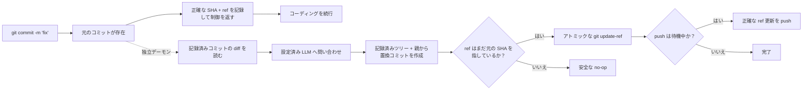

<p align="center">
  
</p>

<h1 align="center">Git AI — 非同期 AI コミットメッセージジェネレーター</h1>

<p align="center">
  <strong>今すぐコミット。そのままコーディング。メッセージの改善は AI にバックグラウンドで任せる。</strong>
  <br />
Git が作業内容を安全に記録した後で、短い下書きを明確な Conventional Commit に変換します。
</p>

<p align="center">
  <a href="https://github.com/daidi/git-ai/releases"></a>
  <a href="https://github.com/daidi/git-ai/actions/workflows/ci.yml"></a>
  <a href="LICENSE"></a>
  <a href="https://marketplace.visualstudio.com/items?itemName=git-ai-async-commit-polisher.git-ai"></a>
  <a href="https://plugins.jetbrains.com/plugin/31221-git-ai"></a>
</p>

<p align="center">
  <a href="https://codegg.org/git-ai/"><strong>Web サイト</strong></a>
  &nbsp;·&nbsp;
  <a href="#インストール">インストール</a>
  &nbsp;·&nbsp;
  <a href="#クイックスタート">クイックスタート</a>
  &nbsp;·&nbsp;
  <a href="#仕組み">仕組み</a>
  &nbsp;·&nbsp;
  <a href="https://github.com/daidi/git-ai/issues">サポート</a>
</p>

<p align="center">
  <sub>
    <a href="README.md">English</a> ·
    <a href="README_zh-CN.md">简体中文</a> ·
    <a href="README_zh-TW.md">繁體中文</a> ·
    <a href="README_fr.md">Français</a> ·
    <a href="README_de.md">Deutsch</a> ·
    <a href="README_es.md">Español</a> ·
    <a href="README_it.md">Italiano</a> ·
    日本語 ·
    <a href="README_ko.md">한국어</a> ·
    <a href="README_pt.md">Português</a> ·
    <a href="README_ru.md">Русский</a> ·
    <a href="README_ar.md">العربية</a> ·
    <a href="README_vi.md">Tiếng Việt</a> ·
    <a href="README_th.md">ไทย</a> ·
    <a href="README_id.md">Bahasa Indonesia</a> ·
    <a href="README_ms.md">Bahasa Melayu</a>
  </sub>
</p>

<p align="center">
  
</p>

Git AI は、ターミナル、VS Code、JetBrains IDE で使える無料・オープンソースの **AI コミットメッセージジェネレーター**です。`fix auth` のような短い下書きを、LLM の応答待ちで開発を止めることなく、有用な Git 履歴へ変換します。

一般的なプレコミット型ジェネレーターとは異なり、Git AI は `post-commit` フックで動きます。まず元のコミットが作成され、その後に独立したデーモンがそのコミットだけを読み、設定済みモデルへ問い合わせ、同じツリーと親を持つ置換コミットを作成します。ブランチは安全が確認できた場合にだけ進みます。

> Git AI 自身もこのワークフローを利用しています。[このリポジトリのコミット履歴](https://github.com/daidi/git-ai/commits/main)で結果を確認できます。

## 違いを確認

```console
$ git commit -m "fix auth"
[main 1a2b3c4] fix auth
✨ Git AI: polishing in background (PID 2418)

# ターミナルはすぐに操作できます。改善が完了したら：
$ git log -1 --pretty=%s
fix(auth): prevent expired sessions on mobile
```

Git はすぐに制御を返します。モデルの処理中も編集、テスト、別ツールへの切り替え、さらには `git push` まで行えます。結果の整合性は Git AI がバックグラウンドで管理します。

## Git AI を選ぶ理由

多くの AI コミットツールは生成処理を必須の待ち時間にします。Git AI は意図的に、その処理をコミットの後へ移します。

| | 一般的な AI コミットジェネレーター | Git AI |
|:--|:--|:--|
| **ワークフロー** | 生成 → 待機 → 確認 → コミット | コミット → 作業継続 → バックグラウンドで改善 |
| **操作** | 専用コマンド、ボタン、ダイアログ | いつもの `git commit` |
| **AI が失敗した場合** | コミットできないことがある | 元のコミットがそのまま残る |
| **後続の作業** | 無条件の amend が別の状態を取り込む可能性 | 記録済みのツリーと親だけを使用 |
| **ブランチの安全性** | ツール次第 | アトミックな compare-and-swap。ref が移動済みなら安全な no-op |
| **直後の push** | 待つか自分で調整 | 正確な push をキューに入れるか、厳格にブロック |
| **利用場所** | CLI またはエディター一つだけの場合が多い | ターミナル、VS Code、JetBrains、その他の Git クライアント |

**先にコミット、考えるのは後**。AI が入る前にコードのスナップショットが作られます。

## インストール

普段使う環境を選んでください。IDE 連携は対応する Git AI CLI を自動で導入・更新し、公開済み SHA-256 を検証します。

| 利用環境 | インストール | 主な機能 |
|:--|:--|:--|
| **VS Code / 対応エディター** | [Visual Studio Marketplace](https://marketplace.visualstudio.com/items?itemName=git-ai-async-commit-polisher.git-ai) · [Open VSX](https://open-vsx.org/extension/git-ai-async-commit-polisher/git-ai) | Activity Bar、状態、履歴、設定、統計、ログ、復旧操作 |
| **JetBrains IDE** | [JetBrains Marketplace](https://plugins.jetbrains.com/plugin/31221-git-ai) | ネイティブ Tool Window、状態ウィジェット、設定、履歴、統計、ログ、VCS 操作 |
| **ターミナル / 任意の Git クライアント** | [GitHub Releases](https://github.com/daidi/git-ai/releases) · 下記パッケージマネージャー | 単体 Go バイナリと共存可能な Git フック |

### 単体 CLI

**Homebrew — macOS / Linux**

```bash
brew install daidi/tap/git-ai
```

**Scoop — Windows**

```powershell
scoop bucket add daidi https://github.com/daidi/scoop-bucket.git
scoop install daidi/git-ai
```

**検証付きインストーラー — macOS / Linux**

```bash
curl -fsSL https://raw.githubusercontent.com/daidi/git-ai/main/install.sh | bash
```

**検証付きインストーラー — Windows PowerShell**

```powershell
iwr https://raw.githubusercontent.com/daidi/git-ai/main/install.ps1 -useb | iex
```

**Go install**

```bash
go install github.com/daidi/git-ai/cli/cmd/git-ai@latest
```

ソースからのインストールには Go 1.26.6 以降が必要です。[GitHub Releases](https://github.com/daidi/git-ai/releases) では、macOS・Linux・Windows 向け AMD64 / ARM64 バイナリ、チェックサム、`.deb`、`.rpm` を提供しています。

## クイックスタート

IDE では Git AI の設定を開き、モデルを接続して、リポジトリ初回初期化の案内を承認します。単体 CLI の場合：

```bash
# 各リポジトリで一度だけ実行し、共存可能なフックを導入
cd your-project
git-ai init

# 既定のエンドポイントは DeepSeek。プレースホルダーを自分のキーに置換
git-ai config set api_key "sk-..." --global
git-ai config test

# 以後はいつもどおり Git を使う
git commit -m "fix login"
```

日常操作はこれだけです。状況を確認したいときは `git-ai status` を使い、それ以外は Git AI を意識する必要はありません。

ローカルモデルを使う場合、Ollama に API キーは不要です：

```bash
git-ai config set provider ollama --global
git-ai config set model llama3 --global
git-ai config set base_url http://localhost:11434 --global
git-ai config test
```

## 主な機能

- **真の非同期改善** — `post-commit` フックは対象を記録してすぐ戻り、独立デーモンがモデル要求を処理します。
- **Git に安全な置換** — 後からステージされた内容ではなく、記録済みコミットだけを基に作成します。
- **push 対応ワークフロー** — `queue` は改善後に正確な ref 更新を再実行し、`block` は手動 push を維持します。
- **4 種類の形式** — [Conventional Commits](https://www.conventionalcommits.org/)、[Gitmoji](https://gitmoji.dev/)、単純な件名、件名＋本文。
- **モデルを自由に選択** — OpenAI 互換 API、Anthropic Claude、Google Gemini、DeepSeek、Qwen、ローカル Ollama。
- **リポジトリを考慮した出力** — 上限付きスマート diff 短縮、静的 Commitlint JSON ルール、出力言語、カスタムプロンプト、任意の説明。
- **検証済みの標準契約** — 空、長すぎる、無効、形式違反の応答を拒否し、元の Git trailer を正確に保持します。
- **Smart skip** — すでに有効な新規メッセージは維持し、粗い・繰り返しの下書きだけを改善します。
- **復旧操作** — 状態確認、再試行、元に戻す、キャンセル、次回スキップ、中断した処理の復旧。
- **ローカル可観測性** — AI 履歴、生成時間、生産性の推定、上限付きログ、OS 通知。
- **ネイティブ IDE 連携** — [VS Code](vscode-extension/README.md) と [JetBrains IDE](idea-plugin/README.md) 向けの管理された導入と視覚的操作。
- **16 言語の UI** — 英語、アラビア語、簡体字中国語、繁体字中国語、フランス語、ドイツ語、インドネシア語、イタリア語、日本語、韓国語、マレー語、ポルトガル語、ロシア語、スペイン語、タイ語、ベトナム語。
- **再現可能な品質評価** — [公開コミット評価ハーネス](cli/eval/README.md)が形式、意味、trailer 保持、diff 文脈、レイテンシを採点します。

## 仕組み



### 安全性を前提に設計

Git AI は、バックグラウンドで無条件の `git commit --amend` を**実行しません**。

1. モデル処理より先に、Git が元のコミットを作成します。
2. フックは正確な SHA とブランチ ref を記録して終了します。
3. デーモンは現在の index や worktree ではなく、記録済みコミットを読みます。
4. 置換コミットは記録済みのツリーと親を再利用します。
5. `git update-ref <ref> <new> <expected>` は期待した SHA が一致するときだけブランチを進めます。
6. 新しいコミット、ブランチ移動、ネットワーク・認証・レート制限・不正応答・モデルの失敗が起きても、元のコミットと作業領域は変わりません。

メッセージはコミットオブジェクトの一部なので、改善成功時には新しい SHA が作られます。安全確認により、変更対象は最初に記録したコミットだけに限定されます。

### プライバシーとローカル所有権

- **Git AI の中継サーバーなし。** 上限付きの commit diff と下書きは、設定したモデルのエンドポイントへ直接送られます。
- **ローカル推論に対応。** コードを端末外へ出せない場合は Ollama を利用できます。
- **認証情報をリポジトリに保存しない。** 保存 API キーはユーザーレベルのみ。環境変数にも対応します。
- **ランタイム状態を worktree に置かない。** 状態、ログ、AI 履歴はユーザーキャッシュ、リポジトリ設定は `.git/config` に置かれます。
- **分析情報を送信しない。** 生産性統計とコミットメタデータはローカルに残ります。
- **機密情報を診断ログから除外。** API キー、プロンプト、diff、応答本文、認証情報を含む URL は記録しません。
- **ダウンロードを検証。** インストーラーと IDE 連携は、置換前に公開 SHA-256 と照合します。

リリース確認と管理されたダウンロードでは、GitHub または Git AI のリリースサービスへ接続する場合があります。

## プロバイダーと設定

| モード | 対応先 | API キー |
|:--|:--|:--|
| `openai` | DeepSeek、OpenAI、Qwen、互換ゲートウェイなど OpenAI 互換エンドポイント | 必要 |
| `anthropic` | Anthropic Claude ネイティブ API | 必要 |
| `gemini` | Google Gemini ネイティブ API | 必要 |
| `ollama` | ローカル Ollama サーバー | 不要 |

```bash
git-ai config set provider openai --global
git-ai config set base_url https://api.example.com/v1 --global
git-ai config set model your-model --global
git-ai config set api_key "sk-..." --global
git-ai config test
```

| 設定 | 既定値 | 用途 |
|:--|:--|:--|
| `message_format` | `conventional` | `plain`、`conventional`、`gitmoji`、`subject-body` |
| `commit_attribution` | `off` | 任意の `Polished-by` フッター：`off` または `compact` |
| `language` | `en` | 生成するコミットメッセージの言語 |
| `smart_skip` | `true` | 有効な新規メッセージならモデルを呼ばず維持 |
| `push_policy` | `queue` | 安全な push を待機、または `block` で手動制御 |
| `max_diff_tokens` | `8000` | モデルへ送る diff 文脈の上限 |
| `explain` | `false` | 変更理由の短い本文を追加 |
| `prompt_template` | 空 | `{{.Diff}}`、`{{.Hint}}`、`{{.Language}}` でカスタマイズ |

優先順位は `GIT_AI_*` 環境変数 → `.git/config` のリポジトリ設定 → OS のユーザー設定 → 既定値です。API キーはユーザーレベルのみ。クローンしたリポジトリが認証情報の送信先を変更できないよう、worktree 内の旧 `.git-ai.json` は無視されます。

## よく使うコマンド

| コマンド | 動作 |
|:--|:--|
| `git-ai status` | `idle`、`polishing`、`pushing`、`failed` の状態を表示 |
| `git-ai retry` | 現在のコミットを安全にバックグラウンドで再試行 |
| `git-ai undo` | 元の下書きメッセージに戻す |
| `git-ai cancel` | Git を変更せず処理を停止 |
| `git-ai skip-next` | 次のコミットを変更しない |
| `git-ai push` | 保留中の push を再開、または現在のブランチを push |
| `git-ai log` | Git 履歴とローカル AI メタデータを表示 |
| `git-ai stats` | ローカルの生産性統計を表示 |
| `git-ai config list` | シークレットを伏せて有効な設定を表示 |
| `git-ai update` | 検証済みの最新 CLI をインストール |
| `git-ai uninstall` | Git AI フックを削除し、保存したフックを復元 |

完全なリファレンスは `git-ai --help` または `git-ai <command> --help` で確認できます。

## IDE 連携

### VS Code

[VS Code 拡張](vscode-extension/README.md)は VS Code 1.85+ と Open VSX 対応エディターをサポートします。Activity Bar のコントロールセンター、リアルタイム状態、AI 履歴、グローバル・プロジェクト設定、ローカル統計、ログ、ワンクリック復旧を提供します。制限付きワークスペースでは、バイナリ実行、更新のダウンロード、フックの導入を行いません。

```bash
code --install-extension git-ai-async-commit-polisher.git-ai
```

### JetBrains IDE

[JetBrains プラグイン](idea-plugin/README.md)は IntelliJ Platform 2024.1+ の IntelliJ IDEA、WebStorm、PyCharm、GoLand、PhpStorm、CLion、DataGrip、RubyMine をサポートします。ネイティブ Tool Window、状態ウィジェット、設定、VCS 操作、履歴、統計、上限付きログ表示を提供します。

[JetBrains Marketplace から Git AI をインストール →](https://plugins.jetbrains.com/plugin/31221-git-ai)

## よくある質問

<details>
<summary><strong>Git AI はソースファイル、index、ステージ済み変更を書き換えますか？</strong></summary>
<br />
いいえ。置換コミットは、記録済みコミットの正確なツリーと親から作られます。ステージ済み、未ステージ、後続の変更を取り込むことはありません。
</details>

<details>
<summary><strong>AI の処理中に別のコミットを作るとどうなりますか？</strong></summary>
<br />
ブランチが記録済み SHA を指さなくなるため、アトミック更新は安全な no-op になります。新しいコミットを書き換えることはありません。
</details>

<details>
<summary><strong>直後に push するとどうなりますか？</strong></summary>
<br />
`queue` では pre-push フックが正確な ref 更新を保存し、安全な改善後に再実行します。バックグラウンド認証が使えない場合、初期化は `block` を選び、手動 push に切り替えます。
</details>

<details>
<summary><strong>生成メッセージの確認、再試行、取り消しはできますか？</strong></summary>
<br />
はい。`git-ai log`、`git-ai retry`、`git-ai undo`、または IDE の対応操作を利用できます。
</details>

<details>
<summary><strong>リポジトリ全体がモデルへ送られますか？</strong></summary>
<br />
いいえ。記録済み commit diff の上限付き表現と下書きだけが設定先へ送られます。ローカル推論には Ollama を選べます。
</details>

<details>
<summary><strong>IDE 外からコミットしても動きますか？</strong></summary>
<br />
はい。初期化後は、ターミナル、IDE、その他の Git クライアントで同じフックベースの仕組みが働きます。
</details>

<details>
<summary><strong>Git AI は無料ですか？</strong></summary>
<br />
Git AI は MIT ライセンスで無料です。クラウド API キーまたはローカル Ollama モデルは利用者が用意し、クラウド事業者の利用料が発生する場合があります。
</details>

## 開発

モノレポでは永続化と Git 操作を一つのエンジンへ集約しています：

- [`cli/`](cli/) — Go CLI、フック、デーモン、プロバイダー、状態、安全な ref 更新
- [`vscode-extension/`](vscode-extension/) — CLI に処理を委譲する TypeScript 連携
- [`idea-plugin/`](idea-plugin/) — CLI に処理を委譲する Kotlin IntelliJ 連携

```bash
cd cli
make build
make test
make lint
make eval

cd ../vscode-extension
npm ci
npm test

cd ../idea-plugin
./gradlew test buildPlugin
```

ローカライズ済み UI 文言を変更する前にリポジトリの指示を読み、ルートで `bash scripts/check-i18n-coverage.sh` を実行してください。

## Git AI を応援する

Git AI が集中を保つのに役立ったら、[リポジトリに Star を付けてください](https://github.com/daidi/git-ai)。ほかの開発者がプロジェクトを見つけやすくなります。バグ報告、具体的な機能提案、ドキュメント修正、Pull Request は [GitHub Issues](https://github.com/daidi/git-ai/issues) で歓迎します。

## ライセンス

Git AI は [MIT ライセンス](LICENSE)で提供されています。

---

<p align="center">
  <strong>より良いコミット履歴。待ち時間ゼロ。</strong>
  <br />
  <a href="#インストール">Git AI をインストール</a>
  &nbsp;·&nbsp;
  <a href="https://github.com/daidi/git-ai">GitHub で Star</a>
  &nbsp;·&nbsp;
  <a href="https://github.com/daidi/git-ai/issues">問題を報告</a>
</p>
