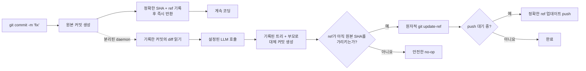

<p align="center">
  
</p>

<h1 align="center">Git AI — 비동기 AI 커밋 메시지 생성기</h1>

<p align="center">
  <strong>지금 커밋하고 계속 코딩하세요. 메시지는 AI가 백그라운드에서 다듬습니다.</strong>
  <br />
  Git이 작업을 안전하게 기록한 뒤 짧은 초안을 명확한 Conventional Commit으로 바꿉니다.
</p>

<p align="center">
  <a href="https://github.com/daidi/git-ai/releases"></a>
  <a href="https://github.com/daidi/git-ai/actions/workflows/ci.yml"></a>
  <a href="LICENSE"></a>
  <a href="https://marketplace.visualstudio.com/items?itemName=git-ai-async-commit-polisher.git-ai"></a>
  <a href="https://plugins.jetbrains.com/plugin/31221-git-ai"></a>
</p>

<p align="center">
  <a href="https://codegg.org/git-ai/"><strong>웹사이트</strong></a>
  &nbsp;·&nbsp;
  <a href="#설치">설치</a>
  &nbsp;·&nbsp;
  <a href="#빠른-시작">빠른 시작</a>
  &nbsp;·&nbsp;
  <a href="#작동-방식">작동 방식</a>
  &nbsp;·&nbsp;
  <a href="https://github.com/daidi/git-ai/issues">지원</a>
</p>

<p align="center">
  <sub>
    <a href="README.md">English</a> ·
    <a href="README_zh-CN.md">简体中文</a> ·
    <a href="README_zh-TW.md">繁體中文</a> ·
    <a href="README_fr.md">Français</a> ·
    <a href="README_de.md">Deutsch</a> ·
    <a href="README_es.md">Español</a> ·
    <a href="README_it.md">Italiano</a> ·
    <a href="README_ja.md">日本語</a> ·
    한국어 ·
    <a href="README_pt.md">Português</a> ·
    <a href="README_ru.md">Русский</a> ·
    <a href="README_ar.md">العربية</a> ·
    <a href="README_vi.md">Tiếng Việt</a> ·
    <a href="README_th.md">ไทย</a> ·
    <a href="README_id.md">Bahasa Indonesia</a> ·
    <a href="README_ms.md">Bahasa Melayu</a>
  </sub>
</p>

<p align="center">
  
</p>

Git AI는 터미널, VS Code, JetBrains IDE에서 사용할 수 있는 무료 오픈 소스 **AI 커밋 메시지 생성기**입니다. `fix auth` 같은 짧은 초안을 유용한 Git 기록으로 바꾸면서 LLM 응답을 기다리느라 다음 코드 작성을 멈추지 않게 합니다.

커밋 전에 실행되는 생성기와 달리 Git AI는 `post-commit` 훅으로 동작합니다. 원본 커밋이 먼저 만들어지고, 분리된 daemon이 바로 그 커밋을 읽어 설정한 모델에 요청한 뒤 같은 트리와 부모를 가진 대체 커밋을 만듭니다. 브랜치가 여전히 안전한 경우에만 이동합니다.

> Git AI도 자체 워크플로를 사용합니다. [이 저장소의 커밋 기록](https://github.com/daidi/git-ai/commits/main)에서 결과를 확인하세요.

## 차이를 확인하세요

```console
$ git commit -m "fix auth"
[main 1a2b3c4] fix auth
✨ Git AI: polishing in background (PID 2418)

# 터미널은 즉시 사용할 수 있습니다. 작업이 끝나면:
$ git log -1 --pretty=%s
fix(auth): prevent expired sessions on mobile
```

Git은 즉시 제어권을 돌려줍니다. 모델이 작업하는 동안 편집, 테스트, 도구 전환은 물론 `git push`도 할 수 있으며, Git AI가 백그라운드에서 결과를 조율합니다.

## Git AI를 선택하는 이유

대부분의 AI 커밋 도구는 생성 과정을 필수 대기 구간에 둡니다. Git AI는 의도적으로 이를 커밋 뒤로 옮깁니다.

| | 일반적인 AI 커밋 생성기 | Git AI |
|:--|:--|:--|
| **워크플로** | 생성 → 대기 → 검토 → 커밋 | 커밋 → 계속 코딩 → 백그라운드에서 개선 |
| **명령** | 전용 명령, 버튼 또는 대화상자 | 평소의 `git commit` |
| **AI 실패 시** | 커밋이 만들어지지 않을 수 있음 | 원본 커밋이 그대로 유지됨 |
| **후속 작업** | 무조건 amend하면 잘못된 상태를 담을 수 있음 | 기록된 트리와 부모만 사용 |
| **브랜치 안전성** | 도구에 따라 다름 | 원자적 compare-and-swap, ref가 이동했으면 안전한 no-op |
| **즉시 push** | 기다리거나 직접 조율 | 정확한 push를 대기열에 넣거나 엄격하게 차단 |
| **사용 환경** | 보통 하나의 CLI 또는 편집기 | 터미널, VS Code, JetBrains 및 기타 Git 클라이언트 |

**먼저 커밋하고 나중에 생각하기**란 AI가 개입하기 전에 코드의 스냅샷을 만든다는 뜻입니다.

## 설치

이미 사용 중인 환경을 선택하세요. IDE 통합은 알맞은 Git AI CLI를 자동으로 설치·업데이트하고 공개된 SHA-256을 검증합니다.

| Git AI 사용 환경 | 설치 | 제공 기능 |
|:--|:--|:--|
| **VS Code / 호환 편집기** | [Visual Studio Marketplace](https://marketplace.visualstudio.com/items?itemName=git-ai-async-commit-polisher.git-ai) · [Open VSX](https://open-vsx.org/extension/git-ai-async-commit-polisher/git-ai) | Activity Bar, 상태, 기록, 설정, 통계, 로그, 복구 작업 |
| **JetBrains IDE** | [JetBrains Marketplace](https://plugins.jetbrains.com/plugin/31221-git-ai) | 네이티브 Tool Window, 상태 위젯, 설정, 기록, 통계, 로그, VCS 작업 |
| **터미널 / 모든 Git 클라이언트** | [GitHub Releases](https://github.com/daidi/git-ai/releases) · 아래 패키지 관리자 | 독립형 Go 바이너리와 조합 가능한 Git 훅 |

### 독립형 CLI

**Homebrew — macOS 또는 Linux**

```bash
brew install daidi/tap/git-ai
```

**Scoop — Windows**

```powershell
scoop bucket add daidi https://github.com/daidi/scoop-bucket.git
scoop install daidi/git-ai
```

**검증된 설치 프로그램 — macOS 또는 Linux**

```bash
curl -fsSL https://raw.githubusercontent.com/daidi/git-ai/main/install.sh | bash
```

**검증된 설치 프로그램 — Windows PowerShell**

```powershell
iwr https://raw.githubusercontent.com/daidi/git-ai/main/install.ps1 -useb | iex
```

**Go install**

```bash
go install github.com/daidi/git-ai/cli/cmd/git-ai@latest
```

소스 설치에는 Go 1.26.9 이상이 필요합니다. [GitHub Releases](https://github.com/daidi/git-ai/releases)에서 macOS, Linux, Windows용 AMD64/ARM64 바이너리와 체크섬, `.deb`, `.rpm` 패키지를 제공합니다.

## 빠른 시작

IDE에서는 Git AI 설정을 열어 모델을 연결하고 저장소 초기화 안내를 한 번 승인하세요. 독립형 CLI는 다음과 같습니다.

```bash
# 각 저장소에서 한 번 실행해 조합 가능한 훅 설치
cd your-project
git-ai init

# 기본 endpoint는 DeepSeek입니다. 자리 표시자를 자신의 키로 교체하세요
git-ai config set api_key "sk-..." --global
git-ai config test

# 이후에는 평소처럼 Git 사용
git commit -m "fix login"
```

일상적인 절차는 이것이 전부입니다. 확인이 필요할 때만 `git-ai status`를 사용하면 됩니다.

로컬 모델을 선호한다면 Ollama에는 API 키가 필요하지 않습니다.

```bash
git-ai config set provider ollama --global
git-ai config set model llama3 --global
git-ai config set base_url http://localhost:11434 --global
git-ai config test
```

## 주요 기능

- **진정한 비동기 개선** — `post-commit` 훅은 대상을 기록하고 즉시 반환하며, 분리된 daemon이 모델 요청을 처리합니다.
- **Git에 안전한 교체** — 나중에 stage된 내용이 아니라 기록된 커밋만을 기반으로 합니다.
- **push 인식 워크플로** — `queue`는 개선 후 정확한 ref 업데이트를 재실행하고, `block`은 수동 push를 유지합니다.
- **네 가지 메시지 형식** — [Conventional Commits](https://www.conventionalcommits.org/), [Gitmoji](https://gitmoji.dev/), 단순 제목, 제목과 본문.
- **원하는 모델 사용** — OpenAI 호환 API, Anthropic Claude, Google Gemini, DeepSeek, Qwen, 로컬 Ollama.
- **저장소를 고려한 출력** — 한도가 있는 스마트 diff 축소, 정적 Commitlint JSON 규칙, 출력 언어, 사용자 prompt, 선택적 설명.
- **검증된 내장 계약** — 비어 있거나 너무 길거나 잘못된 응답을 거부하고 기존 Git trailer를 정확히 보존합니다.
- **Smart skip** — 이미 유효한 새 메시지는 유지하고, 거칠거나 반복된 초안만 개선합니다.
- **복구 제어** — 상태 확인, 재시도, 되돌리기, 취소, 다음 커밋 건너뛰기, 중단 작업 복구.
- **로컬 관찰 기능** — AI 기록, 생성 지연, 생산성 추정, 제한된 로그, 시스템 알림.
- **네이티브 IDE 통합** — [VS Code](vscode-extension/README.md)와 [JetBrains IDE](idea-plugin/README.md)를 위한 관리형 설치 및 시각적 제어.
- **16개 UI 언어** — 영어, 아랍어, 중국어 간체, 중국어 번체, 프랑스어, 독일어, 인도네시아어, 이탈리아어, 일본어, 한국어, 말레이어, 포르투갈어, 러시아어, 스페인어, 태국어, 베트남어.
- **재현 가능한 품질 평가** — [공개 커밋 평가 harness](cli/eval/README.md)가 형식, 의미, trailer 보존, diff 맥락, 지연 시간을 평가합니다.

## 작동 방식



### 안전을 기본으로 설계

Git AI는 백그라운드에서 무조건적인 `git commit --amend`를 **실행하지 않습니다**.

1. 모델 작업보다 먼저 Git이 원본 커밋을 만듭니다.
2. 훅이 정확한 커밋 SHA와 브랜치 ref를 기록한 뒤 종료됩니다.
3. daemon은 현재 index나 worktree가 아니라 기록된 커밋을 읽습니다.
4. 대체 커밋은 기록된 트리와 부모를 그대로 사용합니다.
5. `git update-ref <ref> <new> <expected>`는 예상 SHA가 여전히 일치할 때만 브랜치를 전진시킵니다.
6. 새 커밋, 브랜치 이동, 네트워크·인증·요청 제한·잘못된 응답·모델 오류가 발생해도 원본 커밋과 작업 공간은 변하지 않습니다.

메시지는 커밋 객체의 일부이므로 개선 성공 시 새 SHA가 생깁니다. 안전 검사는 Git AI가 처음 기록한 커밋만 변경하도록 제한합니다.

### 개인정보 보호와 로컬 소유권

- **Git AI 모델 중계 서버 없음.** 제한된 commit diff, 초안, 저장소 힌트(브랜치, 작업 번호, 자주 쓰는 scope)가 설정한 모델 endpoint로 직접 전송됩니다. 과거 메시지 원문은 전송하지 않습니다.
- **로컬 추론 지원.** 코드가 컴퓨터 밖으로 나가면 안 될 때 Ollama를 사용할 수 있습니다.
- **저장소에 자격 증명 없음.** 저장되는 API 키는 사용자 범위뿐이며 환경 변수도 지원합니다.
- **worktree 밖의 실행 상태.** 상태, 로그, AI 기록은 사용자 캐시에 있고 저장소별 설정은 `.git/config`를 사용합니다.
- **분석 데이터 업로드 없음.** 생산성 통계와 커밋 메타데이터는 로컬에 남습니다.
- **민감한 진단 데이터 제외.** 로그에 API 키, prompt, diff, 응답 본문, 자격 증명 포함 URL을 남기지 않습니다.
- **검증된 다운로드.** 설치 프로그램과 IDE 통합은 교체 전에 공개된 SHA-256을 검증합니다.

릴리스 확인과 관리형 다운로드는 GitHub 또는 Git AI 릴리스 서비스에 연결할 수 있습니다.

## 제공자와 설정

| 모드 | 지원 대상 | API 키 |
|:--|:--|:--|
| `openai` | DeepSeek, OpenAI, Qwen 및 호환 gateway를 포함한 OpenAI 호환 endpoint | 필요 |
| `anthropic` | Anthropic Claude 네이티브 API | 필요 |
| `gemini` | Google Gemini 네이티브 API | 필요 |
| `ollama` | 로컬 Ollama 서버 | 불필요 |

```bash
git-ai config set provider openai --global
git-ai config set base_url https://api.example.com/v1 --global
git-ai config set model your-model --global
git-ai config set api_key "sk-..." --global
git-ai config test
```

| 설정 | 기본값 | 용도 |
|:--|:--|:--|
| `message_format` | `conventional` | `plain`, `conventional`, `gitmoji`, `subject-body` |
| `commit_attribution` | `off` | 선택적 `Polished-by` 트레일러: `off` 또는 `compact` |
| `language` | `en` | 생성되는 커밋 메시지 언어 |
| `smart_skip` | `true` | 유효한 새 메시지는 모델 호출 없이 유지 |
| `push_policy` | `queue` | 안전한 push를 대기열에 넣거나 `block`으로 수동 제어 |
| `max_diff_tokens` | `8000` | 모델에 보내는 diff 맥락 제한 |
| `explain` | `false` | 변경 이유를 설명하는 짧은 본문 추가 |
| `prompt_template` | 비어 있음 | `{{.Diff}}`, `{{.Hint}}`, `{{.Language}}`로 사용자 지정 |

우선순위는 `GIT_AI_*` 환경 변수 → `.git/config`의 저장소별 설정 → OS 사용자 설정 → 기본값입니다. API 키는 사용자 범위에만 저장됩니다. 복제한 저장소가 자격 증명 전송 위치를 바꿀 수 없도록 worktree의 기존 `.git-ai.json`은 무시됩니다.

## 자주 쓰는 명령

| 명령 | 기능 |
|:--|:--|
| `git-ai status` | `idle`, `polishing`, `pushing`, `failed` 상태 표시 |
| `git-ai retry` | 현재 커밋을 백그라운드에서 안전하게 재시도 |
| `git-ai undo` | 원래 초안 메시지 복원 |
| `git-ai cancel` | Git을 바꾸지 않고 진행 중인 개선 중지 |
| `git-ai skip-next` | 다음 커밋을 그대로 유지 |
| `git-ai push` | 보류된 push를 재개하거나 현재 브랜치를 push |
| `git-ai log` | 로컬 AI 메타데이터와 Git 기록 표시 |
| `git-ai stats` | 로컬 생산성 통계 표시 |
| `git-ai config list` | 비밀값을 가린 유효 설정 표시 |
| `git-ai update` | 검증된 최신 CLI 설치 |
| `git-ai uninstall` | Git AI 훅 제거 및 보존된 훅 복원 |

전체 사용법은 `git-ai --help` 또는 `git-ai <command> --help`에서 확인하세요.

## IDE 통합

### VS Code

[VS Code 확장](vscode-extension/README.md)은 VS Code 1.85+와 호환 Open VSX 편집기를 지원합니다. Activity Bar 제어 센터, 실시간 상태, AI 기록, 전역·프로젝트 설정, 로컬 통계, 로그, 원클릭 복구를 제공합니다. 제한된 workspace에서는 바이너리 실행, 업데이트 다운로드, 훅 설치를 하지 않습니다.

```bash
code --install-extension git-ai-async-commit-polisher.git-ai
```

### JetBrains IDE

[JetBrains 플러그인](idea-plugin/README.md)은 IntelliJ Platform 2024.1+의 IntelliJ IDEA, WebStorm, PyCharm, GoLand, PhpStorm, CLion, DataGrip, RubyMine을 지원합니다. 네이티브 Tool Window, 상태 위젯, 설정, VCS 작업, 기록, 통계, 제한된 로그 보기를 제공합니다.

[JetBrains Marketplace에서 Git AI 설치 →](https://plugins.jetbrains.com/plugin/31221-git-ai)

## 자주 묻는 질문

<details>
<summary><strong>Git AI가 소스 파일, index 또는 stage된 작업을 바꾸나요?</strong></summary>
<br />
아니요. 대체 커밋은 기록된 커밋의 정확한 트리와 부모로 만듭니다. stage된 변경, stage되지 않은 변경, 이후 작업은 절대 포함하지 않습니다.
</details>

<details>
<summary><strong>AI가 작업하는 동안 다른 커밋을 만들면 어떻게 되나요?</strong></summary>
<br />
브랜치가 기록된 SHA를 더 이상 가리키지 않아 원자적 업데이트가 안전한 no-op이 됩니다. Git AI는 새 커밋을 다시 쓰지 않습니다.
</details>

<details>
<summary><strong>바로 push하면 어떻게 되나요?</strong></summary>
<br />
`queue`에서는 pre-push 훅이 정확한 ref 업데이트를 저장하고 안전한 개선 후 다시 실행합니다. 백그라운드 인증을 쓸 수 없으면 초기화 과정에서 `block`을 선택해 수동 push로 전환합니다.
</details>

<details>
<summary><strong>생성된 메시지를 검토, 재시도 또는 되돌릴 수 있나요?</strong></summary>
<br />
네. `git-ai log`, `git-ai retry`, `git-ai undo` 또는 IDE의 해당 제어 기능을 사용하세요.
</details>

<details>
<summary><strong>Git AI가 저장소 전체를 모델에 보내나요?</strong></summary>
<br />
아니요. 기록된 commit diff의 제한된 표현, 초안, 저장소 힌트(브랜치, 작업 번호, 자주 쓰는 scope)를 설정한 endpoint로 보내며 과거 메시지 원문은 보내지 않습니다. 로컬 추론에는 Ollama를 사용하세요.
</details>

<details>
<summary><strong>IDE 밖에서 커밋해도 작동하나요?</strong></summary>
<br />
네. 저장소 초기화 후에는 터미널, IDE 및 기타 Git 클라이언트에서 같은 훅 기반 흐름이 작동합니다.
</details>

<details>
<summary><strong>Git AI는 무료인가요?</strong></summary>
<br />
Git AI는 MIT 라이선스의 무료 소프트웨어입니다. 클라우드 API 키 또는 로컬 Ollama 모델은 사용자가 준비하며 클라우드 제공자가 사용료를 청구할 수 있습니다.
</details>

## 개발

모노레포는 영속성과 Git 작업을 하나의 엔진에 모읍니다.

- [`cli/`](cli/) — Go CLI, 훅, daemon, 제공자, 상태, 안전한 ref 업데이트
- [`vscode-extension/`](vscode-extension/) — CLI에 작업을 위임하는 TypeScript 통합
- [`idea-plugin/`](idea-plugin/) — CLI에 작업을 위임하는 Kotlin IntelliJ 통합

```bash
cd cli
make build
make test
make lint
make eval

cd ../vscode-extension
npm ci
npm test

cd ../idea-plugin
./gradlew test buildPlugin
```

현지화된 UI 문구를 변경하기 전에 저장소 지침을 읽고 루트에서 `bash scripts/check-i18n-coverage.sh`를 실행하세요.

## Git AI의 성장을 도와주세요

Git AI가 몰입을 유지하는 데 도움이 된다면 [저장소에 Star를 남겨 주세요](https://github.com/daidi/git-ai). 다른 개발자가 프로젝트를 발견하는 데 도움이 됩니다. 버그 보고, 구체적인 기능 제안, 문서 수정, pull request는 [GitHub Issues](https://github.com/daidi/git-ai/issues)에서 환영합니다.

## 라이선스

Git AI는 [MIT 라이선스](LICENSE)로 제공됩니다.

---

<p align="center">
  <strong>더 나은 커밋 기록. 대기 시간 0.</strong>
  <br />
  <a href="#설치">Git AI 설치</a>
  &nbsp;·&nbsp;
  <a href="https://github.com/daidi/git-ai">GitHub에서 Star</a>
  &nbsp;·&nbsp;
  <a href="https://github.com/daidi/git-ai/issues">문제 보고</a>
</p>
