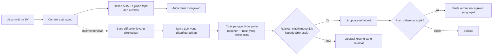

<p align="center">
  
</p>

<h1 align="center">Git AI — Penjana Mesej Commit AI Tak Segerak</h1>

<p align="center">
  <strong>Commit sekarang. Teruskan mengekod. Biarkan AI menggilap mesej di latar belakang.</strong>
  <br />
  Tukarkan mesej commit Git yang ringkas kepada Conventional Commits yang jelas—selepas Git merekodkan kerja anda dengan selamat.
</p>

<p align="center">
  <a href="https://github.com/daidi/git-ai/releases"></a>
  <a href="https://github.com/daidi/git-ai/actions/workflows/ci.yml"></a>
  <a href="LICENSE"></a>
  <a href="https://marketplace.visualstudio.com/items?itemName=git-ai-async-commit-polisher.git-ai"></a>
  <a href="https://plugins.jetbrains.com/plugin/31221-git-ai"></a>
</p>

<p align="center">
  <a href="https://codegg.org/git-ai/"><strong>Laman web</strong></a>
  &nbsp;·&nbsp;
  <a href="#pemasangan">Pemasangan</a>
  &nbsp;·&nbsp;
  <a href="#mula-pantas">Mula pantas</a>
  &nbsp;·&nbsp;
  <a href="#cara-ia-berfungsi">Cara ia berfungsi</a>
  &nbsp;·&nbsp;
  <a href="https://github.com/daidi/git-ai/issues">Sokongan</a>
</p>

<p align="center">
  <sub>
    <a href="README.md">English</a> ·
    <a href="README_zh-CN.md">简体中文</a> ·
    <a href="README_zh-TW.md">繁體中文</a> ·
    <a href="README_fr.md">Français</a> ·
    <a href="README_de.md">Deutsch</a> ·
    <a href="README_es.md">Español</a> ·
    <a href="README_it.md">Italiano</a> ·
    <a href="README_ja.md">日本語</a> ·
    <a href="README_ko.md">한국어</a> ·
    <a href="README_pt.md">Português</a> ·
    <a href="README_ru.md">Русский</a> ·
    <a href="README_ar.md">العربية</a> ·
    <a href="README_vi.md">Tiếng Việt</a> ·
    <a href="README_th.md">ไทย</a> ·
    <a href="README_id.md">Bahasa Indonesia</a> ·
    Bahasa Melayu
  </sub>
</p>

<p align="center">
  
</p>

<!-- Sumber vektor boleh sunting: assets/readme-hero.svg -->

Git AI ialah **penjana mesej commit AI** percuma dan sumber terbuka untuk terminal, VS Code dan IDE JetBrains. Ia menukar draf ringkas seperti `fix auth` kepada sejarah commit yang berguna tanpa memaksa anda menunggu respons LLM sebelum menulis baris kod seterusnya.

Tidak seperti penjana pra-commit, Git AI berjalan melalui hook `post-commit`. Commit asal anda diwujudkan terlebih dahulu; daemon terpisah kemudian membaca commit itu sahaja, menghantar permintaan kepada model yang anda konfigurasikan, mencipta pengganti dengan pepohon dan induk yang sama, serta mengemas kini cabang hanya apabila masih selamat.

> Git AI menggunakan aliran kerjanya sendiri. [Lihat sejarah commit repositori ini](https://github.com/daidi/git-ai/commits/main) untuk melihat hasilnya.

## Lihat perbezaannya

```console
$ git commit -m "fix auth"
[main 1a2b3c4] fix auth
✨ Git AI: polishing in background (PID 2418)

# Terminal anda tersedia semula serta-merta. Selepas penggilapan selesai:
$ git log -1 --pretty=%s
fix(auth): prevent expired sessions on mobile
```

Git kembali serta-merta. Semasa model bekerja, anda boleh terus menyunting, menguji, bertukar alat atau menjalankan `git push`; Git AI menyelaraskan hasilnya di latar belakang.

## Mengapa Git AI

Kebanyakan alat commit AI menjadikan penjanaan sebahagian daripada laluan kritikal. Git AI sengaja memindahkannya selepas commit.

| | Penjana commit AI biasa | Git AI |
|:--|:--|:--|
| **Aliran kerja** | Jana → tunggu → semak → commit | Commit → terus mengekod → gilap di latar belakang |
| **Perintah** | Perintah, butang atau dialog khas | `git commit` biasa anda |
| **Jika AI gagal** | Commit mungkin tidak pernah diwujudkan | Commit asal kekal utuh |
| **Kerja lebih baharu** | Amend secara membuta tuli boleh menangkap keadaan yang salah | Pengganti menggunakan pepohon dan induk yang direkodkan |
| **Keselamatan cabang** | Bergantung pada alat | Banding-dan-tukar atomik; rujukan yang telah bergerak menjadi operasi kosong yang selamat |
| **Push segera** | Tunggu atau selaraskannya sendiri | Masukkan push yang tepat ke dalam baris gilir atau pilih sekatan ketat |
| **Tempat ia berfungsi** | Biasanya satu CLI atau editor | Terminal, VS Code, JetBrains dan klien Git lain |

**Commit dahulu, fikir kemudian** bermakna kod anda dirakam sebagai syot kilat sebelum AI memasuki aliran kerja.

## Pemasangan

Pilih pengalaman yang sudah anda gunakan. Integrasi IDE menyediakan dan mengemas kini Git AI CLI yang sepadan secara automatik, dengan pengesahan SHA-256 yang diterbitkan.

| Gunakan Git AI dalam | Pasang | Pengalaman yang disertakan |
|:--|:--|:--|
| **VS Code / editor serasi** | [Visual Studio Marketplace](https://marketplace.visualstudio.com/items?itemName=git-ai-async-commit-polisher.git-ai) · [Open VSX](https://open-vsx.org/extension/git-ai-async-commit-polisher/git-ai) | Bar Aktiviti, status, sejarah, tetapan, statistik, log dan tindakan pemulihan |
| **IDE JetBrains** | [JetBrains Marketplace](https://plugins.jetbrains.com/plugin/31221-git-ai) | Tetingkap Alat natif, widget status, tetapan, sejarah, statistik, log dan tindakan VCS |
| **Terminal / mana-mana klien Git** | [GitHub Releases](https://github.com/daidi/git-ai/releases) · pengurus pakej di bawah | Fail binari Go kendiri dan hook Git boleh gubah |

### CLI kendiri

**Homebrew — macOS atau Linux**

```bash
brew install daidi/tap/git-ai
```

**Scoop — Windows**

```powershell
scoop bucket add daidi https://github.com/daidi/scoop-bucket.git
scoop install daidi/git-ai
```

**Pemasang disahkan — macOS atau Linux**

```bash
curl -fsSL https://raw.githubusercontent.com/daidi/git-ai/main/install.sh | bash
```

**Pemasang disahkan — Windows PowerShell**

```powershell
iwr https://raw.githubusercontent.com/daidi/git-ai/main/install.ps1 -useb | iex
```

**Go install**

```bash
go install github.com/daidi/git-ai/cli/cmd/git-ai@latest
```

Pemasangan daripada sumber memerlukan Go 1.26.9 atau lebih baharu.

Fail binari prabina tersedia untuk macOS, Linux dan Windows pada AMD64 serta ARM64. Lihat [GitHub Releases](https://github.com/daidi/git-ai/releases) untuk arkib, jumlah semak, pakej `.deb` dan `.rpm`.

## Mula pantas

Pengguna IDE boleh membuka tetapan Git AI, menyambungkan model dan menerima gesaan penyediaan repositori sekali sahaja. Untuk CLI kendiri:

```bash
# Jalankan sekali dalam setiap repositori untuk memasang hook boleh gubah
cd your-project
git-ai init

# Titik akhir lalai ialah DeepSeek; gantikan ruang letak dengan kunci anda
git-ai config set api_key "sk-..." --global
git-ai config test

# Terus gunakan Git seperti biasa
git commit -m "fix login"
```

Itulah keseluruhan aliran kerja harian. Gunakan `git-ai status` apabila anda mahu melihat keadaannya; jika tidak, Git AI tidak mengganggu kerja anda.

Lebih suka model setempat? Ollama tidak memerlukan kunci API:

```bash
git-ai config set provider ollama --global
git-ai config set model llama3 --global
git-ai config set base_url http://localhost:11434 --global
git-ai config test
```

## Apa yang anda peroleh

- **Penggilapan benar-benar tak segerak** — hook `post-commit` merekodkan sasaran dan kembali sementara daemon terpisah mengendalikan permintaan model.
- **Penggantian selamat untuk Git** — Git AI membina daripada commit yang direkodkan, bukan daripada apa-apa yang kebetulan telah distage kemudian.
- **Aliran kerja peka push** — dasar `queue` lalai boleh memainkan semula kemas kini rujukan yang tepat selepas penggilapan; `block` mengekalkan push secara manual.
- **Empat gaya mesej** — [Conventional Commits](https://www.conventionalcommits.org/), [Gitmoji](https://gitmoji.dev/), subjek biasa dan subjek berstruktur bersama isi.
- **Bawa model anda sendiri** — API serasi OpenAI, Anthropic Claude, Google Gemini, DeepSeek, Qwen dan Ollama setempat.
- **Output peka repositori** — pemangkasan diff pintar yang terhad, peraturan JSON Commitlint statik, bahasa output, prompt tersuai dan penerangan pilihan.
- **Kontrak terbina dalam yang disahkan** — respons model yang kosong, terlalu besar, tidak sah atau salah format ditolak; trailer Git asal dikekalkan tepat.
- **Langkau pintar** — mesej baharu yang sah boleh dikekalkan sementara draf kasar atau berulang digilap.
- **Kawalan pemulihan** — periksa status, cuba semula, buat asal, batal, langkau commit seterusnya atau pulih daripada operasi yang terganggu.
- **Kebolehcerapan setempat** — sejarah AI, kependaman penjanaan, anggaran produktiviti, log terhad dan pemberitahuan sistem natif.
- **Integrasi IDE natif** — pemasangan terurus dan kawalan visual untuk [VS Code](vscode-extension/README.md) serta [IDE JetBrains](idea-plugin/README.md).
- **16 bahasa antara muka** — Bahasa Inggeris serta penyetempatan bahasa Arab, Cina Ringkas, Cina Tradisional, Perancis, Jerman, Indonesia, Itali, Jepun, Korea, Melayu, Portugis, Rusia, Sepanyol, Thai dan Vietnam.
- **Pemeriksaan kualiti boleh dihasilkan semula** — [rangka kerja penilaian commit awam](cli/eval/README.md) menilai format, semantik, pengekalan trailer, konteks diff dan kependaman.

## Cara ia berfungsi



### Selamat sejak reka bentuk

Git AI **tidak** menjalankan `git commit --amend` latar belakang secara membuta tuli.

1. Git mencipta commit asal sebelum Git AI memulakan kerja model.
2. Hook merekodkan SHA commit dan rujukan cabang yang tepat, kemudian tamat.
3. Daemon membaca commit yang direkodkan—bukan indeks atau pepohon kerja semasa.
4. Pengganti menggunakan semula pepohon dan induk yang direkodkan.
5. Cabang bergerak dengan `git update-ref <ref> <new> <expected>` hanya jika SHA yang dijangka masih sepadan.
6. Commit yang lebih baharu, cabang yang bergerak, ralat rangkaian, kelayakan tidak sah, had kadar, respons rosak atau kegagalan model membiarkan commit asal dan ruang kerja tidak berubah.

Oleh sebab mesej commit Git ialah sebahagian daripada objek commit, penggilapan yang berjaya menghasilkan SHA commit baharu. Pemeriksaan keselamatan memastikan Git AI hanya mengubah commit yang direkodkannya pada asalnya.

### Privasi dan pemilikan setempat

- **Tiada geganti model Git AI.** Diff commit terhad, draf dan petunjuk repositori (cabang, rujukan tugasan dan scope lazim) dihantar terus ke titik akhir model anda, tanpa teks asal mesej sejarah.
- **Inferens setempat disokong.** Gunakan Ollama apabila kod tidak boleh meninggalkan mesin anda.
- **Kelayakan kekal di luar repositori.** Kunci API tersimpan hanya pada aras pengguna; pemboleh ubah persekitaran turut disokong.
- **Keadaan masa jalan kekal di luar pepohon kerja.** Keadaan, log dan sejarah AI berada dalam cache pengguna; penggantian repositori menggunakan `.git/config`.
- **Tiada analitik dimuat naik.** Statistik produktiviti dan metadata commit kekal setempat.
- **Diagnostik sensitif dikecualikan.** Log tidak mengandungi kunci API, prompt, diff, isi respons atau URL remote yang mengandungi kelayakan.
- **Muat turun disahkan.** Pemasang dan integrasi IDE mengesahkan perduaan keluaran dengan jumlah semak SHA-256 yang diterbitkan sebelum penggantian.

Pemeriksaan keluaran dan muat turun terurus mungkin menghubungi GitHub atau perkhidmatan keluaran Git AI.

## Penyedia dan konfigurasi

| Mod penyedia | Berfungsi dengan | Kunci API |
|:--|:--|:--|
| `openai` | Titik akhir serasi OpenAI termasuk DeepSeek, OpenAI, Qwen dan gerbang serasi | Diperlukan |
| `anthropic` | API natif Anthropic Claude | Diperlukan |
| `gemini` | API natif Google Gemini | Diperlukan |
| `ollama` | Pelayan Ollama setempat | Tidak diperlukan |

Contoh untuk titik akhir serasi OpenAI:

```bash
git-ai config set provider openai --global
git-ai config set base_url https://api.example.com/v1 --global
git-ai config set model your-model --global
git-ai config set api_key "sk-..." --global
git-ai config test
```

Pilihan tingkah laku dan output yang berguna:

| Tetapan | Lalai | Tujuan |
|:--|:--|:--|
| `message_format` | `conventional` | `plain`, `conventional`, `gitmoji` atau `subject-body` |
| `commit_attribution` | `off` | Treler `Polished-by` pilihan: `off` atau `compact` |
| `language` | `en` | Bahasa yang digunakan untuk mesej commit yang dijana |
| `smart_skip` | `true` | Kekalkan mesej baharu yang sah tanpa memanggil model |
| `push_policy` | `queue` | Baris-gilirkan push latar belakang yang selamat atau tetapkan `block` untuk kawalan manual |
| `max_diff_tokens` | `8000` | Hadkan konteks diff yang dihantar kepada model |
| `explain` | `false` | Tambahkan isi ringkas yang menerangkan sebab perubahan dibuat |
| `prompt_template` | kosong | Sesuaikan penjanaan dengan `{{.Diff}}`, `{{.Hint}}` dan `{{.Language}}` |

Konfigurasi diselesaikan mengikut turutan ini:

```text
Pemboleh ubah persekitaran GIT_AI_*
        ↓
tetapan ganti repositori dalam .git/config
        ↓
konfigurasi pengguna dalam direktori konfigurasi aplikasi OS
        ↓
lalai
```

Kunci API hanya pada aras pengguna. Fail `.git-ai.json` lama dalam pepohon kerja diabaikan supaya repositori yang diklon tidak boleh mengubah hala kelayakan anda ke titik akhir yang tidak dipercayai.

## Perintah harian

| Perintah | Fungsinya |
|:--|:--|
| `git-ai status` | Tunjukkan keadaan `idle`, `polishing`, `pushing` atau `failed` |
| `git-ai retry` | Cuba semula commit semasa dengan selamat di latar belakang |
| `git-ai undo` | Pulihkan mesej draf asal |
| `git-ai cancel` | Hentikan penggilapan aktif tanpa mengubah Git |
| `git-ai skip-next` | Biarkan commit seterusnya tidak berubah |
| `git-ai push` | Sambung semula push tertunda atau push cabang semasa |
| `git-ai log` | Tunjukkan sejarah Git dengan metadata AI setempat |
| `git-ai stats` | Tunjukkan statistik produktiviti setempat |
| `git-ai config list` | Periksa konfigurasi berkesan dengan rahsia disamarkan |
| `git-ai update` | Pasang keluaran CLI disahkan yang terkini |
| `git-ai uninstall` | Buang hook Git AI dan pulihkan hook yang dipelihara |

Jalankan `git-ai --help` atau `git-ai <command> --help` untuk rujukan CLI lengkap.

## Integrasi IDE

### VS Code

[Sambungan VS Code](vscode-extension/README.md) menyokong VS Code 1.85+ dan editor serasi Open VSX. Ia menambah pusat kawalan Bar Aktiviti, status langsung, sejarah AI, tetapan visual global/projek, statistik produktiviti setempat, log dan tindakan pemulihan satu klik. Ruang kerja terhad tidak pernah menjalankan fail binari, memuat turun kemas kini atau memasang hook.

```bash
code --install-extension git-ai-async-commit-polisher.git-ai
```

### IDE JetBrains

[Pemalam JetBrains](idea-plugin/README.md) menyokong IDE IntelliJ Platform 2024.1+, termasuk IntelliJ IDEA, WebStorm, PyCharm, GoLand, PhpStorm, CLion, DataGrip dan RubyMine. Ia menyediakan Tetingkap Alat natif, widget status, halaman tetapan, tindakan VCS, sejarah, statistik serta paparan log terhad.

[Pasang Git AI daripada JetBrains Marketplace →](https://plugins.jetbrains.com/plugin/31221-git-ai)

## Soalan lazim

<details>
<summary><strong>Adakah Git AI mengubah fail sumber, indeks atau kerja yang telah distage?</strong></summary>
<br />
Tidak. Commit pengganti dibina daripada pepohon dan induk commit yang direkodkan dengan tepat. Perubahan distage, tidak distage dan yang lebih baharu tidak pernah ditangkap.
</details>

<details>
<summary><strong>Apakah yang berlaku jika saya membuat commit lain semasa AI masih bekerja?</strong></summary>
<br />
Cabang tidak lagi menunjuk kepada SHA yang direkodkan oleh Git AI, jadi kemas kini atomik menjadi operasi kosong yang selamat. Git AI tidak pernah menulis semula commit yang lebih baharu.
</details>

<details>
<summary><strong>Apakah yang berlaku jika saya terus melakukan push?</strong></summary>
<br />
Dengan dasar <code>queue</code> lalai, hook pra-push merekodkan kemas kini rujukan yang tepat dan memainkannya semula selepas penggilapan yang selamat. Jika pengesahan latar belakang tidak tersedia, penyediaan memilih <code>block</code> supaya anda boleh melakukan push secara manual.
</details>

<details>
<summary><strong>Bolehkah saya menyemak, mencuba semula atau membalikkan mesej yang dijana?</strong></summary>
<br />
Ya. Gunakan <code>git-ai log</code>, <code>git-ai retry</code> dan <code>git-ai undo</code>, atau kawalan yang sepadan dalam mana-mana integrasi IDE.
</details>

<details>
<summary><strong>Adakah Git AI menghantar seluruh repositori saya kepada model?</strong></summary>
<br />
Tidak. Ia menghantar diff commit terhad, draf dan petunjuk repositori (cabang, rujukan tugasan dan scope lazim), bukan teks asal mesej sejarah. Pilih Ollama untuk inferens setempat apabila kod tidak boleh meninggalkan mesin anda.
</details>

<details>
<summary><strong>Adakah ia berfungsi apabila saya membuat commit di luar IDE?</strong></summary>
<br />
Ya. Git AI berasaskan hook. Setelah repositori disediakan, commit daripada terminal, IDE atau klien Git lain menggunakan aliran kerja yang sama.
</details>

<details>
<summary><strong>Adakah Git AI percuma?</strong></summary>
<br />
Git AI dilesenkan di bawah MIT dan percuma untuk digunakan. Anda menggunakan kunci API awan atau model Ollama setempat sendiri; penyedia awan mungkin mengenakan caj untuk penggunaannya.
</details>

## Pembangunan

Monorepo mengekalkan penyimpanan keadaan dan operasi Git dalam satu enjin:

- [`cli/`](cli/) — CLI Go, hook, daemon terpisah, penyedia, keadaan dan kemas kini rujukan yang selamat
- [`vscode-extension/`](vscode-extension/) — integrasi TypeScript yang menyerahkan operasi kepada CLI
- [`idea-plugin/`](idea-plugin/) — integrasi Kotlin IntelliJ Platform yang menyerahkan operasi kepada CLI

```bash
# CLI
cd cli
make build
make test
make lint
make eval

# Sambungan VS Code
cd ../vscode-extension
npm ci
npm test

# Pemalam JetBrains
cd ../idea-plugin
./gradlew test buildPlugin
```

Sebelum mengubah teks UI setempat, baca arahan repositori dan jalankan `bash scripts/check-i18n-coverage.sh` dari akar projek.

## Bantu Git AI berkembang

Jika Git AI membantu anda kekal fokus, [berikan bintang kepada repositori](https://github.com/daidi/git-ai)—ia membantu pembangun lain menemuinya. Laporan pepijat, permintaan ciri terarah, pembetulan dokumentasi dan pull request dialu-alukan dalam [GitHub Issues](https://github.com/daidi/git-ai/issues).

## Lesen

Git AI tersedia di bawah [Lesen MIT](LICENSE).

---

<p align="center">
  <strong>Sejarah commit yang lebih baik. Tanpa menunggu.</strong>
  <br />
  <a href="#pemasangan">Pasang Git AI</a>
  &nbsp;·&nbsp;
  <a href="https://github.com/daidi/git-ai">Beri Bintang di GitHub</a>
  &nbsp;·&nbsp;
  <a href="https://github.com/daidi/git-ai/issues">Laporkan isu</a>
</p>
