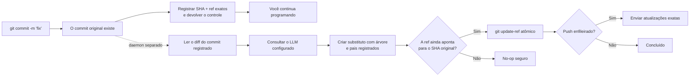

<p align="center">
  
</p>

<h1 align="center">Git AI — Gerador assíncrono de mensagens de commit com IA</h1>

<p align="center">
  <strong>Faça o commit agora. Continue programando. Deixe a IA melhorar a mensagem em segundo plano.</strong>
  <br />
  Transforme rascunhos rápidos em Conventional Commits claros depois que o Git salvar seu trabalho com segurança.
</p>

<p align="center">
  <a href="https://github.com/daidi/git-ai/releases"></a>
  <a href="https://github.com/daidi/git-ai/actions/workflows/ci.yml"></a>
  <a href="LICENSE"></a>
  <a href="https://marketplace.visualstudio.com/items?itemName=git-ai-async-commit-polisher.git-ai"></a>
  <a href="https://plugins.jetbrains.com/plugin/31221-git-ai"></a>
</p>

<p align="center">
  <a href="https://codegg.org/git-ai/"><strong>Site</strong></a>
  &nbsp;·&nbsp;
  <a href="#instalação">Instalação</a>
  &nbsp;·&nbsp;
  <a href="#início-rápido">Início rápido</a>
  &nbsp;·&nbsp;
  <a href="#como-funciona">Como funciona</a>
  &nbsp;·&nbsp;
  <a href="https://github.com/daidi/git-ai/issues">Suporte</a>
</p>

<p align="center">
  <sub>
    <a href="README.md">English</a> ·
    <a href="README_zh-CN.md">简体中文</a> ·
    <a href="README_zh-TW.md">繁體中文</a> ·
    <a href="README_fr.md">Français</a> ·
    <a href="README_de.md">Deutsch</a> ·
    <a href="README_es.md">Español</a> ·
    <a href="README_it.md">Italiano</a> ·
    <a href="README_ja.md">日本語</a> ·
    <a href="README_ko.md">한국어</a> ·
    Português ·
    <a href="README_ru.md">Русский</a> ·
    <a href="README_ar.md">العربية</a> ·
    <a href="README_vi.md">Tiếng Việt</a> ·
    <a href="README_th.md">ไทย</a> ·
    <a href="README_id.md">Bahasa Indonesia</a> ·
    <a href="README_ms.md">Bahasa Melayu</a>
  </sub>
</p>

<p align="center">
  
</p>

Git AI é um **gerador de mensagens de commit com IA** gratuito e de código aberto para terminal, VS Code e IDEs JetBrains. Ele transforma rascunhos como `fix auth` em um histórico Git útil, sem colocar a espera por um LLM entre você e a próxima linha de código.

Ao contrário de geradores pré-commit, o Git AI roda por um hook `post-commit`. O commit original existe primeiro; depois, um daemon separado lê exatamente esse commit, consulta o modelo configurado, cria um substituto com a mesma árvore e os mesmos pais e só avança o branch quando ainda é seguro.

> O Git AI usa o próprio fluxo de trabalho. [Veja o histórico de commits deste repositório](https://github.com/daidi/git-ai/commits/main).

## Veja a diferença

```console
$ git commit -m "fix auth"
[main 1a2b3c4] fix auth
✨ Git AI: polishing in background (PID 2418)

# O terminal fica livre imediatamente. Quando terminar:
$ git log -1 --pretty=%s
fix(auth): prevent expired sessions on mobile
```

O Git devolve o controle na hora. Enquanto o modelo trabalha, você pode editar, testar, mudar de ferramenta ou até executar `git push`; o Git AI coordena o resultado em segundo plano.

## Por que Git AI

A maioria das ferramentas de commit com IA coloca a geração no caminho crítico. O Git AI a move de propósito para depois do commit.

| | Gerador de commit com IA comum | Git AI |
|:--|:--|:--|
| **Fluxo** | Gerar → esperar → revisar → commitar | Commitar → continuar programando → melhorar em segundo plano |
| **Comando** | Comando, botão ou diálogo especial | Seu `git commit` normal |
| **Se a IA falhar** | O commit pode nem acontecer | O commit original permanece intacto |
| **Trabalho mais recente** | Um amend cego pode capturar o estado errado | O substituto usa árvore e pais registrados |
| **Segurança do branch** | Depende da ferramenta | Compare-and-swap atômico; uma ref movida vira um no-op seguro |
| **Push imediato** | Esperar ou coordenar manualmente | Enfileirar o push exato ou escolher bloqueio estrito |
| **Onde funciona** | Geralmente uma CLI ou editor | Terminal, VS Code, JetBrains e outros clientes Git |

**Commite primeiro, pense depois** significa que seu código fica registrado antes de a IA entrar no fluxo.

## Instalação

Escolha a experiência que você já usa. As integrações de IDE instalam e atualizam automaticamente a CLI correta, verificando o SHA-256 publicado.

| Use Git AI em | Instalação | Experiência incluída |
|:--|:--|:--|
| **VS Code / editores compatíveis** | [Visual Studio Marketplace](https://marketplace.visualstudio.com/items?itemName=git-ai-async-commit-polisher.git-ai) · [Open VSX](https://open-vsx.org/extension/git-ai-async-commit-polisher/git-ai) | Activity Bar, status, histórico, configurações, estatísticas, logs e recuperação |
| **IDEs JetBrains** | [JetBrains Marketplace](https://plugins.jetbrains.com/plugin/31221-git-ai) | Tool Window nativa, widget de status, configurações, histórico, estatísticas, logs e ações VCS |
| **Terminal / qualquer cliente Git** | [GitHub Releases](https://github.com/daidi/git-ai/releases) · gerenciadores abaixo | Binário Go independente e hooks Git combináveis |

### CLI independente

**Homebrew — macOS ou Linux**

```bash
brew install daidi/tap/git-ai
```

**Scoop — Windows**

```powershell
scoop bucket add daidi https://github.com/daidi/scoop-bucket.git
scoop install daidi/git-ai
```

**Instalador verificado — macOS ou Linux**

```bash
curl -fsSL https://raw.githubusercontent.com/daidi/git-ai/main/install.sh | bash
```

**Instalador verificado — Windows PowerShell**

```powershell
iwr https://raw.githubusercontent.com/daidi/git-ai/main/install.ps1 -useb | iex
```

**Go install**

```bash
go install github.com/daidi/git-ai/cli/cmd/git-ai@latest
```

Instalar pelo código-fonte exige Go 1.26.6 ou mais recente. Em [GitHub Releases](https://github.com/daidi/git-ai/releases) há binários para macOS, Linux e Windows em AMD64 e ARM64, checksums e pacotes `.deb` e `.rpm`.

## Início rápido

No IDE, abra as configurações do Git AI, conecte um modelo e aceite a inicialização única do repositório. Para a CLI independente:

```bash
# Execute uma vez em cada repositório para instalar os hooks combináveis
cd your-project
git-ai init

# O endpoint padrão é DeepSeek; substitua o marcador pela sua chave
git-ai config set api_key "sk-..." --global
git-ai config test

# Continue usando o Git normalmente
git commit -m "fix login"
```

Esse é todo o fluxo diário. Use `git-ai status` quando quiser visibilidade; no restante do tempo, o Git AI não atrapalha.

Prefere um modelo local? O Ollama não exige chave de API:

```bash
git-ai config set provider ollama --global
git-ai config set model llama3 --global
git-ai config set base_url http://localhost:11434 --global
git-ai config test
```

## O que você recebe

- **Melhoria realmente assíncrona** — o hook `post-commit` registra o alvo e retorna enquanto um daemon separado cuida do modelo.
- **Substituição segura para Git** — o Git AI parte do commit registrado, nunca do que for adicionado ao stage depois.
- **Fluxo ciente do push** — `queue` reproduz as atualizações exatas após a melhoria; `block` mantém o push manual.
- **Quatro estilos** — [Conventional Commits](https://www.conventionalcommits.org/), [Gitmoji](https://gitmoji.dev/), assunto simples e assunto estruturado com corpo.
- **Use seu próprio modelo** — APIs compatíveis com OpenAI, Anthropic Claude, Google Gemini, DeepSeek, Qwen e Ollama local.
- **Saída consciente do repositório** — corte inteligente e limitado do diff, regras Commitlint JSON estáticas, idioma, prompts personalizados e explicações opcionais.
- **Contratos integrados validados** — respostas vazias, excessivas, inválidas ou no formato errado são rejeitadas; trailers Git originais são preservados exatamente.
- **Smart skip** — mantém uma mensagem nova válida e melhora rascunhos vagos ou repetidos.
- **Controles de recuperação** — status, nova tentativa, desfazer, cancelar, pular o próximo commit e recuperar operações interrompidas.
- **Observabilidade local** — histórico de IA, latência, estimativas de produtividade, logs limitados e notificações do sistema.
- **Integrações nativas** — instalação gerenciada e controles visuais para [VS Code](vscode-extension/README.md) e [JetBrains](idea-plugin/README.md).
- **16 idiomas de interface** — inglês, árabe, chinês simplificado, chinês tradicional, francês, alemão, indonésio, italiano, japonês, coreano, malaio, português, russo, espanhol, tailandês e vietnamita.
- **Qualidade reproduzível** — um [harness de avaliação com commits públicos](cli/eval/README.md) mede formato, semântica, trailers, contexto do diff e latência.

## Como funciona



### Seguro desde o projeto

O Git AI **não** executa um `git commit --amend` cego em segundo plano.

1. O Git cria o commit original antes de o Git AI chamar o modelo.
2. O hook registra SHA e ref exatos e termina.
3. O daemon lê o commit registrado, não o índice ou a árvore de trabalho atuais.
4. O substituto reutiliza a árvore e os pais registrados.
5. `git update-ref <ref> <new> <expected>` só avança o branch se o SHA esperado ainda corresponder.
6. Commit novo, branch movido, erro de rede, autenticação, limite, resposta ou modelo deixa o commit original e o workspace inalterados.

Como a mensagem faz parte do objeto commit, uma melhoria bem-sucedida cria um SHA novo. A verificação restringe a alteração ao commit originalmente registrado.

### Privacidade e controle local

- **Sem servidor intermediário do Git AI.** O diff limitado e o rascunho vão direto para o endpoint configurado.
- **Inferência local.** Use Ollama quando o código precisar ficar no seu computador.
- **Credenciais fora dos repositórios.** Chaves persistidas existem apenas no nível do usuário; variáveis de ambiente também são aceitas.
- **Estado fora da árvore de trabalho.** Status, logs e histórico de IA ficam no cache do usuário; ajustes do repositório usam `.git/config`.
- **Sem análise enviada.** Estatísticas e metadados de commits permanecem locais.
- **Diagnósticos sem dados sensíveis.** Logs não contêm chaves, prompts, diffs, corpos de respostas ou URLs com credenciais.
- **Downloads verificados.** Instaladores e IDEs validam o SHA-256 publicado antes de substituir o binário.

As verificações de versão e os downloads gerenciados podem contatar o GitHub ou o serviço de releases do Git AI.

## Provedores e configuração

| Modo | Funciona com | Chave API |
|:--|:--|:--|
| `openai` | Endpoints compatíveis com OpenAI: DeepSeek, OpenAI, Qwen e gateways | Obrigatória |
| `anthropic` | API nativa Anthropic Claude | Obrigatória |
| `gemini` | API nativa Google Gemini | Obrigatória |
| `ollama` | Servidor Ollama local | Não obrigatória |

```bash
git-ai config set provider openai --global
git-ai config set base_url https://api.example.com/v1 --global
git-ai config set model your-model --global
git-ai config set api_key "sk-..." --global
git-ai config test
```

| Configuração | Padrão | Finalidade |
|:--|:--|:--|
| `message_format` | `conventional` | `plain`, `conventional`, `gitmoji` ou `subject-body` |
| `commit_attribution` | `off` | Trailer `Polished-by` opcional: `off` ou `compact` |
| `language` | `en` | Idioma das mensagens geradas |
| `smart_skip` | `true` | Manter uma mensagem válida sem chamar o modelo |
| `push_policy` | `queue` | Enfileirar um push seguro ou usar `block` para controle manual |
| `max_diff_tokens` | `8000` | Limitar o contexto do diff enviado ao modelo |
| `explain` | `false` | Adicionar um corpo curto explicando a mudança |
| `prompt_template` | vazio | Personalizar com `{{.Diff}}`, `{{.Hint}}` e `{{.Language}}` |

Prioridade: variáveis `GIT_AI_*` → ajustes do repositório em `.git/config` → configuração do usuário no sistema → padrões. Chaves API são apenas do usuário. Arquivos antigos `.git-ai.json` na árvore de trabalho são ignorados para que um repositório clonado não possa redirecionar suas credenciais.

## Comandos do dia a dia

| Comando | Ação |
|:--|:--|
| `git-ai status` | Mostrar `idle`, `polishing`, `pushing` ou `failed` |
| `git-ai retry` | Tentar novamente o commit atual com segurança |
| `git-ai undo` | Restaurar o rascunho original |
| `git-ai cancel` | Parar a melhoria sem alterar o Git |
| `git-ai skip-next` | Deixar o próximo commit intacto |
| `git-ai push` | Retomar um push adiado ou enviar o branch atual |
| `git-ai log` | Mostrar histórico Git com metadados de IA locais |
| `git-ai stats` | Mostrar estatísticas de produtividade locais |
| `git-ai config list` | Ver a configuração efetiva com segredos ocultos |
| `git-ai update` | Instalar a CLI verificada mais recente |
| `git-ai uninstall` | Remover hooks do Git AI e restaurar os preservados |

Use `git-ai --help` ou `git-ai <command> --help` para a referência completa.

## Integrações com IDE

### VS Code

A [extensão para VS Code](vscode-extension/README.md) oferece suporte ao VS Code 1.85+ e editores Open VSX compatíveis. Inclui centro na Activity Bar, status ao vivo, histórico de IA, configurações globais e do projeto, estatísticas, logs e recuperação em um clique. Workspaces restritos não executam binários, baixam atualizações nem instalam hooks.

```bash
code --install-extension git-ai-async-commit-polisher.git-ai
```

### IDEs JetBrains

O [plugin JetBrains](idea-plugin/README.md) oferece suporte aos IDEs IntelliJ Platform 2024.1+, incluindo IntelliJ IDEA, WebStorm, PyCharm, GoLand, PhpStorm, CLion, DataGrip e RubyMine. Ele traz Tool Window nativa, widget de status, configurações, ações VCS, histórico, estatísticas e visualização limitada de logs.

[Instale o Git AI pelo JetBrains Marketplace →](https://plugins.jetbrains.com/plugin/31221-git-ai)

## Perguntas frequentes

<details>
<summary><strong>O Git AI altera meus arquivos, índice ou mudanças em stage?</strong></summary>
<br />
Não. O substituto usa a árvore e os pais exatos do commit registrado. Mudanças em stage, fora dele ou posteriores nunca são capturadas.
</details>

<details>
<summary><strong>O que acontece se eu fizer outro commit enquanto a IA trabalha?</strong></summary>
<br />
O branch deixa de apontar para o SHA registrado e a atualização atômica vira um no-op seguro. O Git AI nunca reescreve o commit mais novo.
</details>

<details>
<summary><strong>O que acontece se eu fizer push imediatamente?</strong></summary>
<br />
Com `queue`, o hook pre-push registra as refs exatas e as reproduz depois de uma melhoria segura. Sem autenticação em segundo plano, a inicialização usa `block` para você fazer push manualmente.
</details>

<details>
<summary><strong>Posso revisar, tentar novamente ou desfazer a mensagem?</strong></summary>
<br />
Sim. Use `git-ai log`, `git-ai retry` e `git-ai undo`, ou os controles equivalentes do IDE.
</details>

<details>
<summary><strong>O Git AI envia meu repositório inteiro a um modelo?</strong></summary>
<br />
Não. Ele envia uma representação limitada do diff registrado e o rascunho ao endpoint escolhido. Use Ollama para inferência local.
</details>

<details>
<summary><strong>Funciona quando faço commit fora do IDE?</strong></summary>
<br />
Sim. Depois da inicialização, o mesmo fluxo baseado em hooks funciona no terminal, IDE e outros clientes Git.
</details>

<details>
<summary><strong>O Git AI é gratuito?</strong></summary>
<br />
O Git AI é gratuito sob licença MIT. Você usa sua chave de API na nuvem ou um modelo Ollama local; o provedor pode cobrar pelo uso.
</details>

## Desenvolvimento

O monorepo centraliza persistência e operações Git em um só mecanismo:

- [`cli/`](cli/) — CLI Go, hooks, daemon, provedores, estado e atualizações seguras de refs
- [`vscode-extension/`](vscode-extension/) — integração TypeScript que delega à CLI
- [`idea-plugin/`](idea-plugin/) — integração Kotlin IntelliJ que delega à CLI

```bash
cd cli
make build
make test
make lint
make eval

cd ../vscode-extension
npm ci
npm test

cd ../idea-plugin
./gradlew test buildPlugin
```

Antes de alterar textos localizados da interface, leia as instruções do repositório e execute `bash scripts/check-i18n-coverage.sh` na raiz.

## Ajude o Git AI a crescer

Se o Git AI ajuda você a manter o foco, [dê uma estrela ao repositório](https://github.com/daidi/git-ai); isso ajuda outros desenvolvedores a descobri-lo. Relatos de bugs, pedidos específicos, correções de documentação e pull requests são bem-vindos nas [GitHub Issues](https://github.com/daidi/git-ai/issues).

## Licença

O Git AI está disponível sob a [licença MIT](LICENSE).

---

<p align="center">
  <strong>Histórico de commits melhor. Zero espera.</strong>
  <br />
  <a href="#instalação">Instalar Git AI</a>
  &nbsp;·&nbsp;
  <a href="https://github.com/daidi/git-ai">Dar uma estrela no GitHub</a>
  &nbsp;·&nbsp;
  <a href="https://github.com/daidi/git-ai/issues">Relatar um problema</a>
</p>
