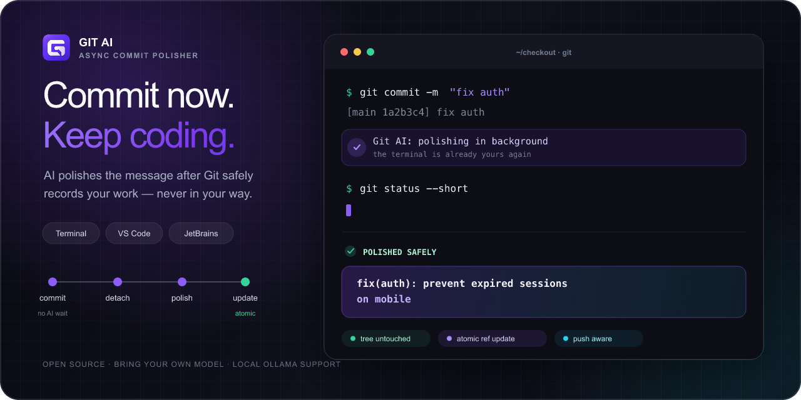
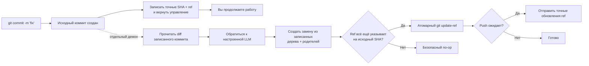

<p align="center">
  
</p>

<h1 align="center">Git AI — Асинхронный ИИ-генератор сообщений коммитов</h1>

<p align="center">
  <strong>Коммитьте сейчас. Продолжайте писать код. ИИ улучшит сообщение в фоне.</strong>
  <br />
  Превращайте короткие черновики в понятные Conventional Commits после того, как Git надёжно сохранит вашу работу.
</p>

<p align="center">
  <a href="https://github.com/daidi/git-ai/releases"></a>
  <a href="https://github.com/daidi/git-ai/actions/workflows/ci.yml"></a>
  <a href="LICENSE"></a>
  <a href="https://marketplace.visualstudio.com/items?itemName=git-ai-async-commit-polisher.git-ai"></a>
  <a href="https://plugins.jetbrains.com/plugin/31221-git-ai"></a>
</p>

<p align="center">
  <a href="https://codegg.org/git-ai/"><strong>Сайт</strong></a>
  &nbsp;·&nbsp;
  <a href="#установка">Установка</a>
  &nbsp;·&nbsp;
  <a href="#быстрый-старт">Быстрый старт</a>
  &nbsp;·&nbsp;
  <a href="#как-это-работает">Как это работает</a>
  &nbsp;·&nbsp;
  <a href="https://github.com/daidi/git-ai/issues">Поддержка</a>
</p>

<p align="center">
  <sub>
    <a href="README.md">English</a> ·
    <a href="README_zh-CN.md">简体中文</a> ·
    <a href="README_zh-TW.md">繁體中文</a> ·
    <a href="README_fr.md">Français</a> ·
    <a href="README_de.md">Deutsch</a> ·
    <a href="README_es.md">Español</a> ·
    <a href="README_it.md">Italiano</a> ·
    <a href="README_ja.md">日本語</a> ·
    <a href="README_ko.md">한국어</a> ·
    <a href="README_pt.md">Português</a> ·
    Русский ·
    <a href="README_ar.md">العربية</a> ·
    <a href="README_vi.md">Tiếng Việt</a> ·
    <a href="README_th.md">ไทย</a> ·
    <a href="README_id.md">Bahasa Indonesia</a> ·
    <a href="README_ms.md">Bahasa Melayu</a>
  </sub>
</p>

<p align="center">
  
</p>

Git AI — бесплатный проект с открытым исходным кодом и **ИИ-генератор сообщений коммитов** для терминала, VS Code и IDE JetBrains. Он превращает черновики вроде `fix auth` в полезную историю Git, не заставляя ждать ответ LLM перед следующей строкой кода.

В отличие от генераторов до коммита, Git AI запускается через хук `post-commit`. Сначала появляется исходный коммит; затем отдельный демон читает именно его, обращается к настроенной модели, создаёт замену с тем же деревом и теми же родителями и передвигает ветку только тогда, когда это по-прежнему безопасно.

> Git AI применяет этот процесс к собственному коду. [Посмотрите историю коммитов репозитория](https://github.com/daidi/git-ai/commits/main).

## Посмотрите на разницу

```console
$ git commit -m "fix auth"
[main 1a2b3c4] fix auth
✨ Git AI: polishing in background (PID 2418)

# Терминал сразу свободен. Когда обработка завершится:
$ git log -1 --pretty=%s
fix(auth): prevent expired sessions on mobile
```

Git мгновенно возвращает управление. Пока модель работает, можно редактировать, тестировать, переключать инструменты и даже выполнять `git push`; Git AI согласует результат в фоне.

## Почему Git AI

Большинство ИИ-инструментов делает генерацию обязательной паузой. Git AI намеренно переносит её на этап после коммита.

| | Обычный ИИ-генератор коммитов | Git AI |
|:--|:--|:--|
| **Процесс** | Создать → ждать → проверить → закоммитить | Закоммитить → продолжить работу → улучшить в фоне |
| **Команда** | Специальная команда, кнопка или окно | Обычный `git commit` |
| **Если ИИ недоступен** | Коммит может не появиться | Исходный коммит остаётся целым |
| **Новые изменения** | Слепой amend может захватить неверное состояние | Замена использует записанные дерево и родителей |
| **Безопасность ветки** | Зависит от инструмента | Атомарный compare-and-swap; сдвинутая ref даёт безопасный no-op |
| **Немедленный push** | Ждать или координировать вручную | Поставить точный push в очередь или строго заблокировать |
| **Где работает** | Обычно одна CLI или редактор | Терминал, VS Code, JetBrains и другие Git-клиенты |

**Сначала коммит, потом размышления**: снимок кода создаётся до подключения ИИ.

## Установка

Выберите привычную среду. IDE-интеграции автоматически устанавливают и обновляют подходящую CLI Git AI, проверяя опубликованную контрольную сумму SHA-256.

| Где использовать | Установка | Возможности |
|:--|:--|:--|
| **VS Code / совместимые редакторы** | [Visual Studio Marketplace](https://marketplace.visualstudio.com/items?itemName=git-ai-async-commit-polisher.git-ai) · [Open VSX](https://open-vsx.org/extension/git-ai-async-commit-polisher/git-ai) | Activity Bar, статус, история, настройки, статистика, журналы и восстановление |
| **IDE JetBrains** | [JetBrains Marketplace](https://plugins.jetbrains.com/plugin/31221-git-ai) | Нативное Tool Window, виджет статуса, настройки, история, статистика, журналы и VCS-действия |
| **Терминал / любой Git-клиент** | [GitHub Releases](https://github.com/daidi/git-ai/releases) · менеджеры пакетов ниже | Автономный Go-бинарник и совместимые Git-хуки |

### Автономная CLI

**Homebrew — macOS или Linux**

```bash
brew install daidi/tap/git-ai
```

**Scoop — Windows**

```powershell
scoop bucket add daidi https://github.com/daidi/scoop-bucket.git
scoop install daidi/git-ai
```

**Проверенный установщик — macOS или Linux**

```bash
curl -fsSL https://raw.githubusercontent.com/daidi/git-ai/main/install.sh | bash
```

**Проверенный установщик — Windows PowerShell**

```powershell
iwr https://raw.githubusercontent.com/daidi/git-ai/main/install.ps1 -useb | iex
```

**Go install**

```bash
go install github.com/daidi/git-ai/cli/cmd/git-ai@latest
```

Для установки из исходного кода требуется Go 1.26.6 или новее. В [GitHub Releases](https://github.com/daidi/git-ai/releases) доступны бинарники для macOS, Linux и Windows на AMD64 и ARM64, контрольные суммы и пакеты `.deb` и `.rpm`.

## Быстрый старт

В IDE откройте настройки Git AI, подключите модель и один раз подтвердите инициализацию репозитория. Для автономной CLI:

```bash
# Один раз выполните в каждом репозитории для установки совместимых хуков
cd your-project
git-ai init

# По умолчанию используется DeepSeek; замените заполнитель своим ключом
git-ai config set api_key "sk-..." --global
git-ai config test

# Продолжайте пользоваться Git как обычно
git commit -m "fix login"
```

Это весь ежедневный процесс. Используйте `git-ai status`, когда нужна видимость; в остальное время Git AI не мешает.

Предпочитаете локальную модель? Для Ollama ключ API не нужен:

```bash
git-ai config set provider ollama --global
git-ai config set model llama3 --global
git-ai config set base_url http://localhost:11434 --global
git-ai config test
```

## Возможности

- **Настоящая асинхронная обработка** — хук `post-commit` записывает цель и завершается, пока отдельный демон обращается к модели.
- **Безопасная для Git замена** — Git AI исходит из записанного коммита, а не из изменений, добавленных в индекс позднее.
- **Учет push** — `queue` воспроизводит точные обновления ref после обработки; `block` оставляет push ручным.
- **Четыре формата** — [Conventional Commits](https://www.conventionalcommits.org/), [Gitmoji](https://gitmoji.dev/), простая тема и тема с телом.
- **Любая подходящая модель** — OpenAI-совместимые API, Anthropic Claude, Google Gemini, DeepSeek, Qwen и локальная Ollama.
- **Учёт контекста репозитория** — ограниченное умное сокращение diff, статические правила Commitlint JSON, язык, свои промпты и необязательные пояснения.
- **Проверяемые встроенные контракты** — пустые, слишком длинные, неверные или неправильно оформленные ответы отклоняются; исходные Git-трейлеры сохраняются точно.
- **Smart skip** — корректное новое сообщение можно сохранить, улучшив только грубый или повторяющийся черновик.
- **Средства восстановления** — статус, повтор, отмена, остановка, пропуск следующего коммита и восстановление прерванной операции.
- **Локальная наблюдаемость** — история ИИ, задержка, оценка продуктивности, ограниченные журналы и системные уведомления.
- **Нативные IDE-интеграции** — управляемая установка и визуальные элементы для [VS Code](vscode-extension/README.md) и [JetBrains](idea-plugin/README.md).
- **16 языков интерфейса** — английский, арабский, упрощённый китайский, традиционный китайский, французский, немецкий, индонезийский, итальянский, японский, корейский, малайский, португальский, русский, испанский, тайский и вьетнамский.
- **Воспроизводимая проверка качества** — [стенд с публичными коммитами](cli/eval/README.md) оценивает формат, смысл, сохранение трейлеров, контекст diff и задержку.

## Как это работает



### Безопасность заложена в архитектуре

Git AI **не выполняет** слепой `git commit --amend` в фоне.

1. Git создаёт исходный коммит до обращения к модели.
2. Хук записывает точные SHA и ref ветки, затем завершается.
3. Демон читает записанный коммит, а не текущий индекс или рабочее дерево.
4. Замена повторно использует его дерево и родителей.
5. `git update-ref <ref> <new> <expected>` передвигает ветку, только если ожидаемый SHA ещё совпадает.
6. Новый коммит, сдвинутая ветка, ошибка сети, авторизации, лимита, ответа или модели оставляет исходный коммит и рабочую область без изменений.

Сообщение входит в объект коммита, поэтому успешная обработка создаёт новый SHA. Проверка безопасности ограничивает изменение первоначально записанным коммитом.

### Конфиденциальность и локальный контроль

- **Нет промежуточного сервера Git AI.** Ограниченный commit diff и черновик идут прямо на настроенный endpoint модели.
- **Поддерживается локальный инференс.** Используйте Ollama, если код должен оставаться на компьютере.
- **Учётные данные вне репозиториев.** Сохранённые API-ключи существуют только на уровне пользователя; также поддерживаются переменные среды.
- **Состояние вне рабочего дерева.** Статус, журналы и история ИИ хранятся в пользовательском кэше; настройки репозитория — в `.git/config`.
- **Аналитика не отправляется.** Статистика и метаданные коммитов остаются локальными.
- **Конфиденциальные данные исключены из диагностики.** В журналах нет ключей, промптов, diff, тел ответов или URL с учётными данными.
- **Загрузки проверяются.** Установщики и IDE сверяют опубликованный SHA-256 перед заменой бинарника.

Проверка версий и управляемые загрузки могут обращаться к GitHub или сервису релизов Git AI.

## Провайдеры и конфигурация

| Режим | Совместимость | Ключ API |
|:--|:--|:--|
| `openai` | OpenAI-совместимые endpoints: DeepSeek, OpenAI, Qwen и шлюзы | Нужен |
| `anthropic` | Нативный API Anthropic Claude | Нужен |
| `gemini` | Нативный API Google Gemini | Нужен |
| `ollama` | Локальный сервер Ollama | Не нужен |

```bash
git-ai config set provider openai --global
git-ai config set base_url https://api.example.com/v1 --global
git-ai config set model your-model --global
git-ai config set api_key "sk-..." --global
git-ai config test
```

| Параметр | По умолчанию | Назначение |
|:--|:--|:--|
| `message_format` | `conventional` | `plain`, `conventional`, `gitmoji` или `subject-body` |
| `commit_attribution` | `off` | Необязательный трейлер `Polished-by`: `off` или `compact` |
| `language` | `en` | Язык создаваемых сообщений |
| `smart_skip` | `true` | Сохранить корректное сообщение без вызова модели |
| `push_policy` | `queue` | Поставить безопасный push в очередь или использовать `block` |
| `max_diff_tokens` | `8000` | Ограничить контекст diff для модели |
| `explain` | `false` | Добавить краткое поясняющее тело |
| `prompt_template` | пусто | Настроить через `{{.Diff}}`, `{{.Hint}}` и `{{.Language}}` |

Приоритет: переменные `GIT_AI_*` → настройки репозитория в `.git/config` → пользовательская конфигурация ОС → значения по умолчанию. API-ключи хранятся только на уровне пользователя. Старые `.git-ai.json` в рабочем дереве игнорируются, чтобы клонированный репозиторий не мог перенаправить ваши учётные данные.

## Повседневные команды

| Команда | Действие |
|:--|:--|
| `git-ai status` | Показать состояние `idle`, `polishing`, `pushing` или `failed` |
| `git-ai retry` | Безопасно повторить обработку текущего коммита |
| `git-ai undo` | Восстановить исходный черновик |
| `git-ai cancel` | Остановить обработку, не изменяя Git |
| `git-ai skip-next` | Оставить следующий коммит без изменений |
| `git-ai push` | Возобновить отложенный push или отправить текущую ветку |
| `git-ai log` | Показать историю Git с локальными ИИ-метаданными |
| `git-ai stats` | Показать локальную статистику продуктивности |
| `git-ai config list` | Показать итоговую конфигурацию со скрытыми секретами |
| `git-ai update` | Установить последнюю проверенную CLI |
| `git-ai uninstall` | Удалить хуки Git AI и восстановить сохранённые |

Полная справка: `git-ai --help` или `git-ai <command> --help`.

## Интеграции с IDE

### VS Code

[Расширение VS Code](vscode-extension/README.md) поддерживает VS Code 1.85+ и совместимые редакторы Open VSX. Оно добавляет центр управления в Activity Bar, живой статус, историю ИИ, глобальные и проектные настройки, локальную статистику, журналы и восстановление в один клик. В ограниченных рабочих областях бинарники не запускаются, обновления не загружаются, хуки не устанавливаются.

```bash
code --install-extension git-ai-async-commit-polisher.git-ai
```

### IDE JetBrains

[Плагин JetBrains](idea-plugin/README.md) поддерживает IDE на IntelliJ Platform 2024.1+, включая IntelliJ IDEA, WebStorm, PyCharm, GoLand, PhpStorm, CLion, DataGrip и RubyMine. Он предоставляет нативное Tool Window, виджет статуса, настройки, VCS-действия, историю, статистику и ограниченный просмотр журналов.

[Установить Git AI из JetBrains Marketplace →](https://plugins.jetbrains.com/plugin/31221-git-ai)

## Частые вопросы

<details>
<summary><strong>Изменяет ли Git AI исходные файлы, индекс или подготовленные изменения?</strong></summary>
<br />
Нет. Замена строится из точных дерева и родителей записанного коммита. Подготовленные, неподготовленные и более новые изменения никогда не захватываются.
</details>

<details>
<summary><strong>Что будет, если создать ещё один коммит, пока ИИ работает?</strong></summary>
<br />
Ветка перестанет указывать на записанный SHA, и атомарное обновление станет безопасным no-op. Git AI не переписывает новый коммит.
</details>

<details>
<summary><strong>Что будет, если сразу выполнить push?</strong></summary>
<br />
При `queue` хук pre-push сохраняет точные обновления ref и повторяет их после безопасной обработки. Если фоновая авторизация недоступна, инициализация выбирает `block`, чтобы push выполнялся вручную.
</details>

<details>
<summary><strong>Можно проверить, повторить или отменить созданное сообщение?</strong></summary>
<br />
Да. Используйте `git-ai log`, `git-ai retry`, `git-ai undo` или соответствующие действия в IDE.
</details>

<details>
<summary><strong>Git AI отправляет модели весь репозиторий?</strong></summary>
<br />
Нет. Отправляются ограниченное представление diff записанного коммита и черновик. Для локального инференса выберите Ollama.
</details>

<details>
<summary><strong>Работает ли Git AI при коммите вне IDE?</strong></summary>
<br />
Да. После инициализации один и тот же процесс на основе хуков работает в терминале, IDE и других Git-клиентах.
</details>

<details>
<summary><strong>Git AI бесплатен?</strong></summary>
<br />
Git AI бесплатен и распространяется по лицензии MIT. Вы используете свой облачный API-ключ или локальную модель Ollama; облачный провайдер может взимать плату.
</details>

## Разработка

Монорепозиторий объединяет хранение состояния и операции Git в одном движке:

- [`cli/`](cli/) — Go CLI, хуки, демон, провайдеры, состояние и безопасные обновления ref
- [`vscode-extension/`](vscode-extension/) — TypeScript-интеграция, делегирующая операции CLI
- [`idea-plugin/`](idea-plugin/) — Kotlin-интеграция IntelliJ, делегирующая операции CLI

```bash
cd cli
make build
make test
make lint
make eval

cd ../vscode-extension
npm ci
npm test

cd ../idea-plugin
./gradlew test buildPlugin
```

Перед изменением локализованных строк интерфейса прочитайте инструкции репозитория и выполните `bash scripts/check-i18n-coverage.sh` из корня проекта.

## Помогите Git AI расти

Если Git AI помогает сохранять концентрацию, [поставьте репозиторию звезду](https://github.com/daidi/git-ai): так проект увидит больше разработчиков. Сообщения об ошибках, конкретные предложения, исправления документации и pull request приветствуются в [GitHub Issues](https://github.com/daidi/git-ai/issues).

## Лицензия

Git AI доступен по [лицензии MIT](LICENSE).

---

<p align="center">
  <strong>История коммитов лучше. Ожидания нет.</strong>
  <br />
  <a href="#установка">Установить Git AI</a>
  &nbsp;·&nbsp;
  <a href="https://github.com/daidi/git-ai">Поставить звезду на GitHub</a>
  &nbsp;·&nbsp;
  <a href="https://github.com/daidi/git-ai/issues">Сообщить о проблеме</a>
</p>
