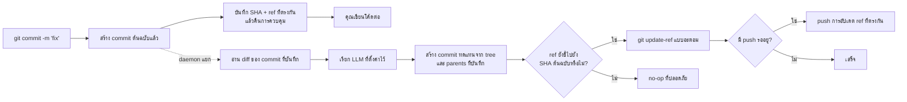

<p align="center">
  
</p>

<h1 align="center">Git AI — เครื่องมือ AI สร้างข้อความ commit แบบอะซิงโครนัส</h1>

<p align="center">
  <strong>Commit ตอนนี้ แล้วเขียนโค้ดต่อ ให้ AI ปรับข้อความในเบื้องหลัง</strong>
  <br />
  เปลี่ยนข้อความร่างสั้น ๆ ให้เป็น Conventional Commit ที่ชัดเจน หลังจาก Git บันทึกงานของคุณอย่างปลอดภัยแล้ว
</p>

<p align="center">
  <a href="https://github.com/daidi/git-ai/releases"></a>
  <a href="https://github.com/daidi/git-ai/actions/workflows/ci.yml"></a>
  <a href="LICENSE"></a>
  <a href="https://marketplace.visualstudio.com/items?itemName=git-ai-async-commit-polisher.git-ai"></a>
  <a href="https://plugins.jetbrains.com/plugin/31221-git-ai"></a>
</p>

<p align="center">
  <a href="https://codegg.org/git-ai/"><strong>เว็บไซต์</strong></a>
  &nbsp;·&nbsp;
  <a href="#การติดตั้ง">การติดตั้ง</a>
  &nbsp;·&nbsp;
  <a href="#เริ่มต้นอย่างรวดเร็ว">เริ่มต้นอย่างรวดเร็ว</a>
  &nbsp;·&nbsp;
  <a href="#การทำงาน">การทำงาน</a>
  &nbsp;·&nbsp;
  <a href="https://github.com/daidi/git-ai/issues">ช่วยเหลือ</a>
</p>

<p align="center">
  <sub>
    <a href="README.md">English</a> ·
    <a href="README_zh-CN.md">简体中文</a> ·
    <a href="README_zh-TW.md">繁體中文</a> ·
    <a href="README_fr.md">Français</a> ·
    <a href="README_de.md">Deutsch</a> ·
    <a href="README_es.md">Español</a> ·
    <a href="README_it.md">Italiano</a> ·
    <a href="README_ja.md">日本語</a> ·
    <a href="README_ko.md">한국어</a> ·
    <a href="README_pt.md">Português</a> ·
    <a href="README_ru.md">Русский</a> ·
    <a href="README_ar.md">العربية</a> ·
    <a href="README_vi.md">Tiếng Việt</a> ·
    ไทย ·
    <a href="README_id.md">Bahasa Indonesia</a> ·
    <a href="README_ms.md">Bahasa Melayu</a>
  </sub>
</p>

<p align="center">
  
</p>

Git AI เป็น **เครื่องมือ AI สร้างข้อความ commit** แบบโอเพนซอร์สและใช้งานฟรีสำหรับ terminal, VS Code และ JetBrains IDE เปลี่ยนข้อความร่างอย่าง `fix auth` ให้เป็นประวัติ Git ที่มีความหมาย โดยไม่ต้องหยุดรอคำตอบจาก LLM ก่อนเขียนโค้ดบรรทัดถัดไป

ต่างจากเครื่องมือที่สร้างข้อความก่อน commit, Git AI ทำงานผ่าน hook `post-commit` โดย commit ต้นฉบับจะเกิดขึ้นก่อน จากนั้น daemon ที่แยกจาก terminal จะอ่าน commit นั้นโดยตรง เรียกโมเดลที่ตั้งค่าไว้ สร้าง commit ทดแทนด้วย tree และ parents เดิม และเลื่อน branch เฉพาะเมื่อยังปลอดภัยเท่านั้น

> Git AI ใช้ขั้นตอนนี้กับโครงการของตัวเองด้วย [ดูประวัติ commit ของ repository นี้](https://github.com/daidi/git-ai/commits/main) เพื่อดูผลลัพธ์

## ดูความแตกต่าง

```console
$ git commit -m "fix auth"
[main 1a2b3c4] fix auth
✨ Git AI: polishing in background (PID 2418)

# Terminal พร้อมใช้ทันที เมื่อปรับเสร็จแล้ว:
$ git log -1 --pretty=%s
fix(auth): prevent expired sessions on mobile
```

Git คืนการควบคุมทันที ระหว่างที่โมเดลทำงาน คุณยังแก้ไข ทดสอบ สลับเครื่องมือ หรือแม้แต่เรียก `git push` ได้ โดย Git AI จะประสานผลลัพธ์ในเบื้องหลัง

## ทำไมต้อง Git AI

เครื่องมือ AI สำหรับ commit ส่วนใหญ่วางการสร้างข้อความไว้ในขั้นตอนที่ต้องรอ Git AI ตั้งใจย้ายขั้นตอนนั้นไปไว้หลัง commit

| | เครื่องมือ AI สร้าง commit ทั่วไป | Git AI |
|:--|:--|:--|
| **ขั้นตอน** | สร้าง → รอ → ตรวจ → commit | commit → เขียนโค้ดต่อ → ปรับในเบื้องหลัง |
| **คำสั่ง** | คำสั่ง ปุ่ม หรือหน้าต่างเฉพาะ | `git commit` ตามปกติ |
| **หาก AI ล้มเหลว** | commit อาจไม่ถูกสร้าง | commit ต้นฉบับยังอยู่ครบ |
| **งานที่ใหม่กว่า** | amend แบบไม่ตรวจอาจดึงสถานะผิด | commit ทดแทนใช้ tree และ parents ที่บันทึกไว้ |
| **ความปลอดภัยของ branch** | ขึ้นกับเครื่องมือ | compare-and-swap แบบอะตอม; หาก ref เปลี่ยนจะเป็น no-op ที่ปลอดภัย |
| **push ทันที** | รอหรือจัดการเอง | เข้าคิว push ที่ตรงกัน หรือเลือกบล็อกแบบเข้มงวด |
| **ใช้งานที่ใด** | มักจำกัดที่ CLI หรือ editor เดียว | Terminal, VS Code, JetBrains และ Git client อื่น |

แนวคิด **commit ก่อน ค่อยคิดทีหลัง** หมายถึงโค้ดถูกบันทึกเป็น snapshot ก่อนที่ AI จะเข้ามาในขั้นตอน

## การติดตั้ง

เลือกสภาพแวดล้อมที่คุณใช้อยู่แล้ว ส่วนเสริม IDE จะติดตั้งและอัปเดต Git AI CLI ที่ตรงกับระบบโดยอัตโนมัติ พร้อมตรวจสอบ SHA-256 ที่เผยแพร่

| ใช้ Git AI ใน | ติดตั้ง | สิ่งที่ได้รับ |
|:--|:--|:--|
| **VS Code / editor ที่รองรับ** | [Visual Studio Marketplace](https://marketplace.visualstudio.com/items?itemName=git-ai-async-commit-polisher.git-ai) · [Open VSX](https://open-vsx.org/extension/git-ai-async-commit-polisher/git-ai) | Activity Bar, สถานะ, ประวัติ, การตั้งค่า, สถิติ, log และการกู้คืน |
| **JetBrains IDE** | [JetBrains Marketplace](https://plugins.jetbrains.com/plugin/31221-git-ai) | Tool Window แบบ native, widget สถานะ, การตั้งค่า, ประวัติ, สถิติ, log และคำสั่ง VCS |
| **Terminal / Git client ใด ๆ** | [GitHub Releases](https://github.com/daidi/git-ai/releases) · package manager ด้านล่าง | Go binary แบบเดี่ยวและ Git hook ที่ใช้ร่วมกับ hook อื่นได้ |

### CLI แบบเดี่ยว

**Homebrew — macOS หรือ Linux**

```bash
brew install daidi/tap/git-ai
```

**Scoop — Windows**

```powershell
scoop bucket add daidi https://github.com/daidi/scoop-bucket.git
scoop install daidi/git-ai
```

**ตัวติดตั้งที่ตรวจสอบแล้ว — macOS หรือ Linux**

```bash
curl -fsSL https://raw.githubusercontent.com/daidi/git-ai/main/install.sh | bash
```

**ตัวติดตั้งที่ตรวจสอบแล้ว — Windows PowerShell**

```powershell
iwr https://raw.githubusercontent.com/daidi/git-ai/main/install.ps1 -useb | iex
```

**Go install**

```bash
go install github.com/daidi/git-ai/cli/cmd/git-ai@latest
```

การติดตั้งจาก source ต้องใช้ Go 1.26.6 ขึ้นไป [GitHub Releases](https://github.com/daidi/git-ai/releases) มี binary สำหรับ macOS, Linux และ Windows บน AMD64/ARM64 พร้อม checksum และแพ็กเกจ `.deb` กับ `.rpm`

## เริ่มต้นอย่างรวดเร็ว

ใน IDE ให้เปิดการตั้งค่า Git AI เชื่อมต่อโมเดล และยืนยันการเริ่มต้น repository ครั้งเดียว สำหรับ CLI แบบเดี่ยว:

```bash
# เรียกหนึ่งครั้งในแต่ละ repository เพื่อติดตั้ง hook ที่ทำงานร่วมกันได้
cd your-project
git-ai init

# Endpoint เริ่มต้นคือ DeepSeek; แทนที่ข้อความตัวอย่างด้วย key ของคุณ
git-ai config set api_key "sk-..." --global
git-ai config test

# ใช้ Git ตามปกติต่อไป
git commit -m "fix login"
```

นี่คือขั้นตอนประจำวันที่ต้องใช้ทั้งหมด เรียก `git-ai status` เมื่ออยากดูสถานะ นอกนั้น Git AI จะไม่รบกวนการทำงาน

ต้องการโมเดลในเครื่องหรือไม่? Ollama ไม่ต้องใช้ API key:

```bash
git-ai config set provider ollama --global
git-ai config set model llama3 --global
git-ai config set base_url http://localhost:11434 --global
git-ai config test
```

## สิ่งที่คุณได้รับ

- **ปรับข้อความแบบอะซิงโครนัสจริง** — hook `post-commit` บันทึกเป้าหมายและคืนการควบคุม ขณะที่ daemon แยกทำคำขอโมเดล
- **แทนที่อย่างปลอดภัยสำหรับ Git** — Git AI สร้างจาก commit ที่บันทึกไว้ ไม่ใช่สิ่งที่ถูก stage ภายหลัง
- **ขั้นตอนที่เข้าใจ push** — `queue` เรียกอัปเดต ref ที่ตรงกันซ้ำหลังปรับเสร็จ ส่วน `block` ให้ push ด้วยตนเอง
- **รูปแบบข้อความ 4 แบบ** — [Conventional Commits](https://www.conventionalcommits.org/), [Gitmoji](https://gitmoji.dev/), subject อย่างเดียว และ subject พร้อม body
- **เลือกโมเดลของคุณ** — API ที่เข้ากันได้กับ OpenAI, Anthropic Claude, Google Gemini, DeepSeek, Qwen และ Ollama ในเครื่อง
- **ผลลัพธ์ที่เข้าใจ repository** — ตัด diff อย่างชาญฉลาดและมีขอบเขต, กฎ Commitlint JSON แบบคงที่, ภาษา, prompt กำหนดเอง และคำอธิบายเสริม
- **สัญญาผลลัพธ์ในตัวที่ตรวจสอบได้** — ปฏิเสธคำตอบว่าง ยาวเกิน ไม่ถูกต้อง หรือผิดรูปแบบ และเก็บ Git trailers เดิมอย่างครบถ้วน
- **Smart skip** — คงข้อความใหม่ที่ใช้ได้ไว้ และปรับเฉพาะร่างที่คลุมเครือหรือซ้ำ
- **เครื่องมือกู้คืน** — ดูสถานะ ลองใหม่ ย้อนกลับ ยกเลิก ข้าม commit ถัดไป หรือกู้การทำงานที่หยุดกลางคัน
- **การสังเกตในเครื่อง** — ประวัติ AI, เวลาในการสร้าง, ค่าประมาณประสิทธิภาพ, log แบบจำกัด และการแจ้งเตือนระบบ
- **การเชื่อมต่อ IDE แบบ native** — ติดตั้งแบบจัดการและควบคุมผ่าน UI สำหรับ [VS Code](vscode-extension/README.md) และ [JetBrains](idea-plugin/README.md)
- **ภาษา UI 16 ภาษา** — อังกฤษ อาหรับ จีนตัวย่อ จีนตัวเต็ม ฝรั่งเศส เยอรมัน อินโดนีเซีย อิตาลี ญี่ปุ่น เกาหลี มลายู โปรตุเกส รัสเซีย สเปน ไทย และเวียดนาม
- **การประเมินคุณภาพที่ทำซ้ำได้** — [ชุดทดสอบด้วย public commits](cli/eval/README.md) วัดรูปแบบ ความหมาย การคง trailers บริบท diff และเวลา

## การทำงาน



### ออกแบบมาให้ปลอดภัย

Git AI **ไม่** เรียก `git commit --amend` แบบไม่ตรวจสอบในเบื้องหลัง

1. Git สร้าง commit ต้นฉบับก่อนที่ Git AI จะเรียกโมเดล
2. Hook บันทึก SHA และ branch ref ที่ตรงกันแล้วจบการทำงาน
3. Daemon อ่าน commit ที่บันทึก ไม่อ่าน index หรือ worktree ปัจจุบัน
4. Commit ทดแทนใช้ tree และ parents ที่บันทึกไว้
5. `git update-ref <ref> <new> <expected>` เลื่อน branch เมื่อ SHA ที่คาดไว้ยังตรงเท่านั้น
6. Commit ใหม่ branch ที่ย้าย หรือข้อผิดพลาดเครือข่าย การยืนยันตัวตน rate limit คำตอบ หรือโมเดล จะไม่เปลี่ยน commit ต้นฉบับและ workspace

ข้อความ commit เป็นส่วนหนึ่งของวัตถุ commit ดังนั้นการปรับสำเร็จจะได้ SHA ใหม่ การตรวจสอบความปลอดภัยจำกัดการเปลี่ยนไว้ที่ commit ที่บันทึกตั้งแต่แรก

### ความเป็นส่วนตัวและการควบคุมในเครื่อง

- **ไม่มีเซิร์ฟเวอร์ตัวกลางของ Git AI** Commit diff ที่จำกัดและข้อความร่างส่งตรงไปยัง endpoint ที่คุณตั้งค่า
- **รองรับการประมวลผลในเครื่อง** ใช้ Ollama เมื่อต้องเก็บโค้ดไว้บนเครื่อง
- **ข้อมูลลับไม่อยู่ใน repository** API key ที่บันทึกจะอยู่ระดับผู้ใช้เท่านั้น และรองรับ environment variable
- **สถานะอยู่นอก worktree** สถานะ log และประวัติ AI อยู่ใน cache ผู้ใช้ ส่วนค่าของ repository ใช้ `.git/config`
- **ไม่อัปโหลด analytics** สถิติและ metadata ของ commit อยู่ในเครื่อง
- **ตัดข้อมูลอ่อนไหวออกจากการวินิจฉัย** Log ไม่มี API key, prompt, diff, เนื้อหาคำตอบ หรือ URL ที่มีข้อมูลลับ
- **ตรวจสอบไฟล์ดาวน์โหลด** ตัวติดตั้งและ IDE ตรวจ SHA-256 ที่เผยแพร่ก่อนแทน binary

การตรวจรุ่นและการดาวน์โหลดแบบจัดการอาจเชื่อมต่อ GitHub หรือบริการ release ของ Git AI

## ผู้ให้บริการและการตั้งค่า

| โหมด | ใช้งานกับ | API key |
|:--|:--|:--|
| `openai` | Endpoint ที่เข้ากันได้กับ OpenAI เช่น DeepSeek, OpenAI, Qwen และ gateway | ต้องใช้ |
| `anthropic` | Anthropic Claude API แบบ native | ต้องใช้ |
| `gemini` | Google Gemini API แบบ native | ต้องใช้ |
| `ollama` | เซิร์ฟเวอร์ Ollama ในเครื่อง | ไม่ต้องใช้ |

```bash
git-ai config set provider openai --global
git-ai config set base_url https://api.example.com/v1 --global
git-ai config set model your-model --global
git-ai config set api_key "sk-..." --global
git-ai config test
```

| ค่า | ค่าเริ่มต้น | จุดประสงค์ |
|:--|:--|:--|
| `message_format` | `conventional` | `plain`, `conventional`, `gitmoji` หรือ `subject-body` |
| `commit_attribution` | `off` | ส่วนท้าย `Polished-by` แบบเลือกเปิด: `off` หรือ `compact` |
| `language` | `en` | ภาษาของข้อความ commit ที่สร้าง |
| `smart_skip` | `true` | คงข้อความใหม่ที่ถูกต้องโดยไม่เรียกโมเดล |
| `push_policy` | `queue` | เข้าคิว push ที่ปลอดภัย หรือใช้ `block` เพื่อควบคุมเอง |
| `max_diff_tokens` | `8000` | จำกัดบริบท diff ที่ส่งให้โมเดล |
| `explain` | `false` | เพิ่ม body สั้น ๆ อธิบายเหตุผลของการเปลี่ยน |
| `prompt_template` | ว่าง | ปรับแต่งด้วย `{{.Diff}}`, `{{.Hint}}` และ `{{.Language}}` |

ลำดับความสำคัญ: environment variable `GIT_AI_*` → ค่าของ repository ใน `.git/config` → การตั้งค่าผู้ใช้ของระบบ → ค่าเริ่มต้น API key อยู่ระดับผู้ใช้เท่านั้น และจะละเว้น `.git-ai.json` เก่าใน worktree เพื่อไม่ให้ repository ที่ clone มาเปลี่ยนปลายทางข้อมูลลับได้

## คำสั่งที่ใช้ประจำ

| คำสั่ง | การทำงาน |
|:--|:--|
| `git-ai status` | แสดงสถานะ `idle`, `polishing`, `pushing` หรือ `failed` |
| `git-ai retry` | ลองปรับ commit ปัจจุบันใหม่อย่างปลอดภัย |
| `git-ai undo` | คืนข้อความร่างต้นฉบับ |
| `git-ai cancel` | หยุดการปรับโดยไม่เปลี่ยน Git |
| `git-ai skip-next` | ไม่แก้ commit ถัดไป |
| `git-ai push` | ทำ push ที่เลื่อนไว้ต่อ หรือ push branch ปัจจุบัน |
| `git-ai log` | แสดงประวัติ Git พร้อม AI metadata ในเครื่อง |
| `git-ai stats` | แสดงสถิติประสิทธิภาพในเครื่อง |
| `git-ai config list` | ดูค่าที่ใช้งานจริงโดยซ่อนข้อมูลลับ |
| `git-ai update` | ติดตั้ง CLI ล่าสุดที่ตรวจสอบแล้ว |
| `git-ai uninstall` | ลบ hook ของ Git AI และคืน hook ที่เก็บไว้ |

เรียก `git-ai --help` หรือ `git-ai <command> --help` เพื่อดูคำสั่งทั้งหมด

## การเชื่อมต่อ IDE

### VS Code

[ส่วนเสริม VS Code](vscode-extension/README.md) รองรับ VS Code 1.85+ และ editor ที่ใช้ Open VSX เพิ่มศูนย์ควบคุมใน Activity Bar, สถานะแบบสด, ประวัติ AI, การตั้งค่าระดับ global และ project, สถิติ, log และการกู้คืนในคลิกเดียว Restricted workspace จะไม่เรียก binary ดาวน์โหลดอัปเดต หรือติดตั้ง hook

```bash
code --install-extension git-ai-async-commit-polisher.git-ai
```

### JetBrains IDE

[ปลั๊กอิน JetBrains](idea-plugin/README.md) รองรับ IntelliJ Platform 2024.1+ รวมถึง IntelliJ IDEA, WebStorm, PyCharm, GoLand, PhpStorm, CLion, DataGrip และ RubyMine มี Tool Window แบบ native, widget สถานะ, การตั้งค่า, คำสั่ง VCS, ประวัติ, สถิติ และการแสดง log แบบจำกัด

[ติดตั้ง Git AI จาก JetBrains Marketplace →](https://plugins.jetbrains.com/plugin/31221-git-ai)

## คำถามที่พบบ่อย

<details>
<summary><strong>Git AI แก้ source file, index หรืองานที่ stage ไว้หรือไม่?</strong></summary>
<br />
ไม่ Commit ทดแทนสร้างจาก tree และ parents ที่ตรงกับ commit ที่บันทึกไว้ การเปลี่ยนที่ stage, ยังไม่ stage หรือใหม่กว่าจะไม่ถูกดึงเข้าไป
</details>

<details>
<summary><strong>ถ้าสร้าง commit อื่นขณะ AI ทำงานจะเกิดอะไรขึ้น?</strong></summary>
<br />
Branch จะไม่ชี้ SHA ที่บันทึกอีก การอัปเดตแบบอะตอมจึงกลายเป็น no-op ที่ปลอดภัย Git AI จะไม่เขียน commit ใหม่ทับ
</details>

<details>
<summary><strong>ถ้า push ทันทีจะเกิดอะไรขึ้น?</strong></summary>
<br />
เมื่อใช้ `queue` hook pre-push จะบันทึกการอัปเดต ref ที่ตรงกันและเรียกซ้ำหลังปรับอย่างปลอดภัย หากยืนยันตัวตนในเบื้องหลังไม่ได้ การเริ่มต้นจะเลือก `block` เพื่อให้ push เอง
</details>

<details>
<summary><strong>ตรวจ ลองใหม่ หรือย้อนข้อความที่สร้างได้หรือไม่?</strong></summary>
<br />
ได้ ใช้ `git-ai log`, `git-ai retry`, `git-ai undo` หรือปุ่มที่ตรงกันใน IDE
</details>

<details>
<summary><strong>Git AI ส่งทั้ง repository ให้โมเดลหรือไม่?</strong></summary>
<br />
ไม่ ส่งเฉพาะตัวแทนแบบจำกัดของ commit diff ที่บันทึกพร้อมข้อความร่างไปยัง endpoint ที่เลือก ใช้ Ollama สำหรับการประมวลผลในเครื่อง
</details>

<details>
<summary><strong>ทำงานเมื่อ commit นอก IDE หรือไม่?</strong></summary>
<br />
ได้ หลังเริ่มต้น repository แล้ว ขั้นตอนผ่าน hook เดียวกันทำงานทั้ง terminal, IDE และ Git client อื่น
</details>

<details>
<summary><strong>Git AI ใช้ฟรีหรือไม่?</strong></summary>
<br />
Git AI ใช้ฟรีภายใต้สัญญาอนุญาต MIT คุณใช้ cloud API key ของตนเองหรือโมเดล Ollama ในเครื่อง โดยผู้ให้บริการ cloud อาจคิดค่าใช้งาน
</details>

## การพัฒนา

Monorepo รวมการจัดเก็บสถานะและการทำงาน Git ไว้ใน engine เดียว:

- [`cli/`](cli/) — Go CLI, hook, daemon, ผู้ให้บริการ, สถานะ และการอัปเดต ref ที่ปลอดภัย
- [`vscode-extension/`](vscode-extension/) — การเชื่อมต่อ TypeScript ที่ส่งงานให้ CLI
- [`idea-plugin/`](idea-plugin/) — การเชื่อมต่อ Kotlin IntelliJ ที่ส่งงานให้ CLI

```bash
cd cli
make build
make test
make lint
make eval

cd ../vscode-extension
npm ci
npm test

cd ../idea-plugin
./gradlew test buildPlugin
```

ก่อนแก้ข้อความ UI ที่แปลแล้ว ให้อ่านข้อกำหนด repository และเรียก `bash scripts/check-i18n-coverage.sh` จาก root

## ช่วยให้ Git AI เติบโต

หาก Git AI ช่วยให้คุณทำงานต่อเนื่อง โปรด [กด Star ให้ repository](https://github.com/daidi/git-ai) เพื่อให้นักพัฒนาคนอื่นค้นพบโครงการได้ง่ายขึ้น ยินดีรับรายงาน bug ข้อเสนอที่เจาะจง การแก้เอกสาร และ pull request ผ่าน [GitHub Issues](https://github.com/daidi/git-ai/issues)

## สัญญาอนุญาต

Git AI เผยแพร่ภายใต้ [สัญญาอนุญาต MIT](LICENSE)

---

<p align="center">
  <strong>ประวัติ commit ที่ดีกว่า ไม่ต้องรอ</strong>
  <br />
  <a href="#การติดตั้ง">ติดตั้ง Git AI</a>
  &nbsp;·&nbsp;
  <a href="https://github.com/daidi/git-ai">กด Star บน GitHub</a>
  &nbsp;·&nbsp;
  <a href="https://github.com/daidi/git-ai/issues">รายงานปัญหา</a>
</p>
