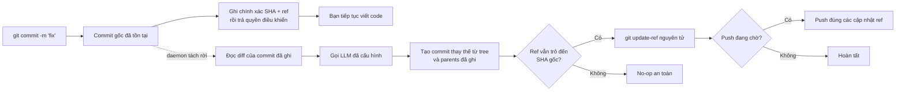

<p align="center">
  
</p>

<h1 align="center">Git AI — Trình tạo thông điệp commit bất đồng bộ bằng AI</h1>

<p align="center">
  <strong>Commit ngay. Tiếp tục viết code. Để AI hoàn thiện thông điệp trong nền.</strong>
  <br />
  Biến bản nháp ngắn thành Conventional Commit rõ ràng sau khi Git đã lưu công việc của bạn một cách an toàn.
</p>

<p align="center">
  <a href="https://github.com/daidi/git-ai/releases"></a>
  <a href="https://github.com/daidi/git-ai/actions/workflows/ci.yml"></a>
  <a href="LICENSE"></a>
  <a href="https://marketplace.visualstudio.com/items?itemName=git-ai-async-commit-polisher.git-ai"></a>
  <a href="https://plugins.jetbrains.com/plugin/31221-git-ai"></a>
</p>

<p align="center">
  <a href="https://codegg.org/git-ai/"><strong>Trang web</strong></a>
  &nbsp;·&nbsp;
  <a href="#cài-đặt">Cài đặt</a>
  &nbsp;·&nbsp;
  <a href="#bắt-đầu-nhanh">Bắt đầu nhanh</a>
  &nbsp;·&nbsp;
  <a href="#cách-hoạt-động">Cách hoạt động</a>
  &nbsp;·&nbsp;
  <a href="https://github.com/daidi/git-ai/issues">Hỗ trợ</a>
</p>

<p align="center">
  <sub>
    <a href="README.md">English</a> ·
    <a href="README_zh-CN.md">简体中文</a> ·
    <a href="README_zh-TW.md">繁體中文</a> ·
    <a href="README_fr.md">Français</a> ·
    <a href="README_de.md">Deutsch</a> ·
    <a href="README_es.md">Español</a> ·
    <a href="README_it.md">Italiano</a> ·
    <a href="README_ja.md">日本語</a> ·
    <a href="README_ko.md">한국어</a> ·
    <a href="README_pt.md">Português</a> ·
    <a href="README_ru.md">Русский</a> ·
    <a href="README_ar.md">العربية</a> ·
    Tiếng Việt ·
    <a href="README_th.md">ไทย</a> ·
    <a href="README_id.md">Bahasa Indonesia</a> ·
    <a href="README_ms.md">Bahasa Melayu</a>
  </sub>
</p>

<p align="center">
  
</p>

Git AI là **trình tạo thông điệp commit bằng AI** miễn phí, mã nguồn mở cho terminal, VS Code và IDE JetBrains. Công cụ biến bản nháp như `fix auth` thành lịch sử Git hữu ích mà không bắt bạn chờ phản hồi LLM trước dòng code tiếp theo.

Khác với trình tạo chạy trước commit, Git AI dùng hook `post-commit`. Commit gốc được tạo trước; sau đó một daemon tách rời đọc đúng commit đó, gọi mô hình đã cấu hình, tạo commit thay thế với cùng tree và parents, rồi chỉ di chuyển branch khi việc đó vẫn an toàn.

> Git AI dùng chính quy trình này cho dự án. [Xem lịch sử commit của repository](https://github.com/daidi/git-ai/commits/main) để thấy kết quả.

## Xem sự khác biệt

```console
$ git commit -m "fix auth"
[main 1a2b3c4] fix auth
✨ Git AI: polishing in background (PID 2418)

# Terminal sẵn sàng ngay lập tức. Khi hoàn tất:
$ git log -1 --pretty=%s
fix(auth): prevent expired sessions on mobile
```

Git trả quyền điều khiển ngay. Trong lúc mô hình làm việc, bạn có thể chỉnh sửa, kiểm thử, đổi công cụ hoặc thậm chí chạy `git push`; Git AI điều phối kết quả trong nền.

## Vì sao chọn Git AI

Phần lớn công cụ commit bằng AI đặt bước tạo nội dung trên đường xử lý bắt buộc. Git AI chủ động chuyển bước đó sang sau commit.

| | Trình tạo commit bằng AI thông thường | Git AI |
|:--|:--|:--|
| **Quy trình** | Tạo → chờ → duyệt → commit | Commit → tiếp tục code → hoàn thiện trong nền |
| **Lệnh** | Lệnh, nút hoặc hộp thoại riêng | `git commit` quen thuộc |
| **Khi AI lỗi** | Commit có thể không được tạo | Commit gốc vẫn nguyên vẹn |
| **Thay đổi mới hơn** | Amend mù có thể lấy nhầm trạng thái | Commit thay thế dùng tree và parents đã ghi |
| **An toàn branch** | Tùy công cụ | Compare-and-swap nguyên tử; ref đã đổi trở thành no-op an toàn |
| **Push ngay** | Chờ hoặc tự điều phối | Xếp đúng push vào hàng đợi hoặc chặn nghiêm ngặt |
| **Nơi sử dụng** | Thường chỉ một CLI hoặc editor | Terminal, VS Code, JetBrains và client Git khác |

**Commit trước, suy nghĩ sau** nghĩa là code được chụp lại trước khi AI tham gia quy trình.

## Cài đặt

Chọn môi trường bạn đã dùng. Các tích hợp IDE tự cài và cập nhật Git AI CLI phù hợp, đồng thời xác minh SHA-256 đã công bố.

| Dùng Git AI trong | Cài đặt | Trải nghiệm đi kèm |
|:--|:--|:--|
| **VS Code / editor tương thích** | [Visual Studio Marketplace](https://marketplace.visualstudio.com/items?itemName=git-ai-async-commit-polisher.git-ai) · [Open VSX](https://open-vsx.org/extension/git-ai-async-commit-polisher/git-ai) | Activity Bar, trạng thái, lịch sử, cài đặt, thống kê, log và khôi phục |
| **IDE JetBrains** | [JetBrains Marketplace](https://plugins.jetbrains.com/plugin/31221-git-ai) | Tool Window gốc, widget trạng thái, cài đặt, lịch sử, thống kê, log và thao tác VCS |
| **Terminal / mọi client Git** | [GitHub Releases](https://github.com/daidi/git-ai/releases) · trình quản lý gói bên dưới | Binary Go độc lập và Git hook có thể kết hợp |

### CLI độc lập

**Homebrew — macOS hoặc Linux**

```bash
brew install daidi/tap/git-ai
```

**Scoop — Windows**

```powershell
scoop bucket add daidi https://github.com/daidi/scoop-bucket.git
scoop install daidi/git-ai
```

**Trình cài đã xác minh — macOS hoặc Linux**

```bash
curl -fsSL https://raw.githubusercontent.com/daidi/git-ai/main/install.sh | bash
```

**Trình cài đã xác minh — Windows PowerShell**

```powershell
iwr https://raw.githubusercontent.com/daidi/git-ai/main/install.ps1 -useb | iex
```

**Go install**

```bash
go install github.com/daidi/git-ai/cli/cmd/git-ai@latest
```

Cài từ mã nguồn cần Go 1.26.6 trở lên. [GitHub Releases](https://github.com/daidi/git-ai/releases) cung cấp binary macOS, Linux và Windows cho AMD64/ARM64, checksum cùng gói `.deb` và `.rpm`.

## Bắt đầu nhanh

Trong IDE, mở cài đặt Git AI, kết nối mô hình và chấp nhận lời nhắc khởi tạo repository một lần. Với CLI độc lập:

```bash
# Chạy một lần trong mỗi repository để cài các hook có thể kết hợp
cd your-project
git-ai init

# Endpoint mặc định là DeepSeek; thay phần giữ chỗ bằng khóa của bạn
git-ai config set api_key "sk-..." --global
git-ai config test

# Tiếp tục dùng Git như bình thường
git commit -m "fix login"
```

Đó là toàn bộ quy trình hằng ngày. Dùng `git-ai status` khi cần quan sát; ngoài ra Git AI sẽ không làm gián đoạn bạn.

Muốn dùng mô hình cục bộ? Ollama không cần khóa API:

```bash
git-ai config set provider ollama --global
git-ai config set model llama3 --global
git-ai config set base_url http://localhost:11434 --global
git-ai config test
```

## Những gì bạn nhận được

- **Hoàn thiện thực sự bất đồng bộ** — hook `post-commit` ghi mục tiêu rồi trả ngay; daemon tách rời xử lý yêu cầu mô hình.
- **Thay thế an toàn với Git** — Git AI xây dựng từ commit đã ghi, không lấy nội dung được stage sau đó.
- **Quy trình hiểu push** — `queue` phát lại đúng các cập nhật ref sau khi hoàn thiện; `block` giữ push thủ công.
- **Bốn kiểu thông điệp** — [Conventional Commits](https://www.conventionalcommits.org/), [Gitmoji](https://gitmoji.dev/), subject đơn giản và subject kèm body.
- **Dùng mô hình của bạn** — API tương thích OpenAI, Anthropic Claude, Google Gemini, DeepSeek, Qwen và Ollama cục bộ.
- **Đầu ra hiểu repository** — cắt diff thông minh có giới hạn, quy tắc Commitlint JSON tĩnh, ngôn ngữ, prompt tùy chỉnh và giải thích tùy chọn.
- **Hợp đồng tích hợp được kiểm tra** — từ chối phản hồi rỗng, quá dài, không hợp lệ hoặc sai định dạng; giữ nguyên chính xác Git trailers gốc.
- **Smart skip** — giữ thông điệp mới đã hợp lệ, chỉ cải thiện bản nháp sơ sài hoặc lặp lại.
- **Điều khiển khôi phục** — xem trạng thái, thử lại, hoàn tác, hủy, bỏ qua commit kế tiếp hoặc khôi phục tác vụ gián đoạn.
- **Khả năng quan sát cục bộ** — lịch sử AI, độ trễ, ước tính năng suất, log giới hạn và thông báo hệ thống.
- **Tích hợp IDE gốc** — cài đặt được quản lý và điều khiển trực quan cho [VS Code](vscode-extension/README.md) và [JetBrains](idea-plugin/README.md).
- **16 ngôn ngữ giao diện** — tiếng Anh, Ả Rập, Trung giản thể, Trung phồn thể, Pháp, Đức, Indonesia, Ý, Nhật, Hàn, Mã Lai, Bồ Đào Nha, Nga, Tây Ban Nha, Thái và Việt.
- **Đánh giá chất lượng tái lập** — [bộ đánh giá bằng commit công khai](cli/eval/README.md) chấm định dạng, ngữ nghĩa, trailers, ngữ cảnh diff và độ trễ.

## Cách hoạt động



### An toàn ngay từ thiết kế

Git AI **không** chạy `git commit --amend` mù trong nền.

1. Git tạo commit gốc trước khi Git AI gọi mô hình.
2. Hook ghi chính xác SHA và branch ref rồi thoát.
3. Daemon đọc commit đã ghi, không đọc index hay worktree hiện tại.
4. Commit thay thế dùng lại tree và parents đã ghi.
5. `git update-ref <ref> <new> <expected>` chỉ tiến branch khi SHA dự kiến vẫn khớp.
6. Commit mới, branch di chuyển, lỗi mạng, xác thực, giới hạn, phản hồi hoặc mô hình đều để commit gốc và workspace nguyên vẹn.

Vì thông điệp là một phần của đối tượng commit, lần hoàn thiện thành công tạo SHA mới. Kiểm tra an toàn giới hạn thay đổi ở đúng commit được ghi ban đầu.

### Quyền riêng tư và quyền sở hữu cục bộ

- **Không có máy chủ chuyển tiếp Git AI.** Commit diff có giới hạn và bản nháp đi thẳng đến endpoint mô hình bạn cấu hình.
- **Hỗ trợ suy luận cục bộ.** Dùng Ollama khi code phải ở lại trên máy.
- **Thông tin xác thực không nằm trong repository.** Khóa API lưu bền chỉ ở cấp người dùng; biến môi trường cũng được hỗ trợ.
- **Trạng thái nằm ngoài worktree.** Trạng thái, log và lịch sử AI ở cache người dùng; tùy chỉnh repository dùng `.git/config`.
- **Không tải dữ liệu phân tích lên.** Thống kê năng suất và metadata commit vẫn ở cục bộ.
- **Loại dữ liệu nhạy cảm khỏi chẩn đoán.** Log không chứa khóa, prompt, diff, body phản hồi hoặc URL có thông tin xác thực.
- **Xác minh bản tải xuống.** Trình cài và IDE kiểm tra SHA-256 đã công bố trước khi thay binary.

Kiểm tra phiên bản và tải xuống được quản lý có thể kết nối GitHub hoặc dịch vụ phát hành Git AI.

## Nhà cung cấp và cấu hình

| Chế độ | Hoạt động với | Khóa API |
|:--|:--|:--|
| `openai` | Endpoint tương thích OpenAI gồm DeepSeek, OpenAI, Qwen và gateway | Cần |
| `anthropic` | API gốc Anthropic Claude | Cần |
| `gemini` | API gốc Google Gemini | Cần |
| `ollama` | Máy chủ Ollama cục bộ | Không cần |

```bash
git-ai config set provider openai --global
git-ai config set base_url https://api.example.com/v1 --global
git-ai config set model your-model --global
git-ai config set api_key "sk-..." --global
git-ai config test
```

| Thiết lập | Mặc định | Mục đích |
|:--|:--|:--|
| `message_format` | `conventional` | `plain`, `conventional`, `gitmoji` hoặc `subject-body` |
| `commit_attribution` | `off` | Dòng cuối `Polished-by` tùy chọn: `off` hoặc `compact` |
| `language` | `en` | Ngôn ngữ của thông điệp được tạo |
| `smart_skip` | `true` | Giữ thông điệp mới hợp lệ mà không gọi mô hình |
| `push_policy` | `queue` | Xếp push an toàn hoặc dùng `block` để điều khiển thủ công |
| `max_diff_tokens` | `8000` | Giới hạn ngữ cảnh diff gửi đến mô hình |
| `explain` | `false` | Thêm body ngắn giải thích lý do thay đổi |
| `prompt_template` | trống | Tùy chỉnh bằng `{{.Diff}}`, `{{.Hint}}` và `{{.Language}}` |

Thứ tự ưu tiên: biến môi trường `GIT_AI_*` → tùy chỉnh repository trong `.git/config` → cấu hình người dùng của hệ điều hành → mặc định. Khóa API chỉ ở cấp người dùng. Tệp `.git-ai.json` cũ trong worktree bị bỏ qua để repository được clone không thể chuyển hướng thông tin xác thực.

## Lệnh thường dùng

| Lệnh | Tác dụng |
|:--|:--|
| `git-ai status` | Hiển thị trạng thái `idle`, `polishing`, `pushing` hoặc `failed` |
| `git-ai retry` | Thử lại commit hiện tại an toàn trong nền |
| `git-ai undo` | Khôi phục thông điệp nháp gốc |
| `git-ai cancel` | Dừng hoàn thiện mà không thay đổi Git |
| `git-ai skip-next` | Giữ nguyên commit kế tiếp |
| `git-ai push` | Tiếp tục push bị hoãn hoặc push branch hiện tại |
| `git-ai log` | Hiển thị lịch sử Git cùng metadata AI cục bộ |
| `git-ai stats` | Hiển thị thống kê năng suất cục bộ |
| `git-ai config list` | Xem cấu hình có hiệu lực với secret đã che |
| `git-ai update` | Cài CLI mới nhất đã xác minh |
| `git-ai uninstall` | Gỡ hook Git AI và khôi phục hook được giữ lại |

Dùng `git-ai --help` hoặc `git-ai <command> --help` để xem tài liệu đầy đủ.

## Tích hợp IDE

### VS Code

[Extension VS Code](vscode-extension/README.md) hỗ trợ VS Code 1.85+ và editor Open VSX tương thích. Extension có trung tâm điều khiển ở Activity Bar, trạng thái trực tiếp, lịch sử AI, cài đặt toàn cục và dự án, thống kê, log và khôi phục một lần nhấp. Workspace bị hạn chế không chạy binary, tải cập nhật hoặc cài hook.

```bash
code --install-extension git-ai-async-commit-polisher.git-ai
```

### IDE JetBrains

[Plugin JetBrains](idea-plugin/README.md) hỗ trợ IDE IntelliJ Platform 2024.1+, gồm IntelliJ IDEA, WebStorm, PyCharm, GoLand, PhpStorm, CLion, DataGrip và RubyMine. Plugin cung cấp Tool Window gốc, widget trạng thái, cài đặt, thao tác VCS, lịch sử, thống kê và trình xem log có giới hạn.

[Cài Git AI từ JetBrains Marketplace →](https://plugins.jetbrains.com/plugin/31221-git-ai)

## Câu hỏi thường gặp

<details>
<summary><strong>Git AI có sửa tệp nguồn, index hoặc thay đổi đã stage không?</strong></summary>
<br />
Không. Commit thay thế dùng đúng tree và parents của commit đã ghi. Thay đổi đã stage, chưa stage hoặc mới hơn không bao giờ bị lấy vào.
</details>

<details>
<summary><strong>Điều gì xảy ra nếu tôi tạo commit khác khi AI đang làm việc?</strong></summary>
<br />
Branch không còn trỏ đến SHA đã ghi nên cập nhật nguyên tử trở thành no-op an toàn. Git AI không bao giờ viết lại commit mới hơn.
</details>

<details>
<summary><strong>Điều gì xảy ra nếu tôi push ngay?</strong></summary>
<br />
Với `queue`, hook pre-push ghi đúng các cập nhật ref và phát lại sau lần hoàn thiện an toàn. Nếu không có xác thực nền, quá trình khởi tạo chọn `block` để bạn push thủ công.
</details>

<details>
<summary><strong>Tôi có thể xem lại, thử lại hoặc hoàn tác thông điệp không?</strong></summary>
<br />
Có. Dùng `git-ai log`, `git-ai retry`, `git-ai undo` hoặc điều khiển tương ứng trong IDE.
</details>

<details>
<summary><strong>Git AI có gửi toàn bộ repository đến mô hình không?</strong></summary>
<br />
Không. Công cụ chỉ gửi biểu diễn có giới hạn của commit diff đã ghi và bản nháp đến endpoint đã chọn. Dùng Ollama để suy luận cục bộ.
</details>

<details>
<summary><strong>Công cụ có hoạt động khi commit ngoài IDE không?</strong></summary>
<br />
Có. Sau khi khởi tạo, cùng quy trình dựa trên hook hoạt động trong terminal, IDE và client Git khác.
</details>

<details>
<summary><strong>Git AI có miễn phí không?</strong></summary>
<br />
Git AI miễn phí theo giấy phép MIT. Bạn dùng khóa API cloud của mình hoặc mô hình Ollama cục bộ; nhà cung cấp cloud có thể tính phí sử dụng.
</details>

## Phát triển

Monorepo tập trung lưu trữ trạng thái và thao tác Git trong một engine:

- [`cli/`](cli/) — Go CLI, hook, daemon, nhà cung cấp, trạng thái và cập nhật ref an toàn
- [`vscode-extension/`](vscode-extension/) — tích hợp TypeScript ủy quyền thao tác cho CLI
- [`idea-plugin/`](idea-plugin/) — tích hợp Kotlin IntelliJ ủy quyền thao tác cho CLI

```bash
cd cli
make build
make test
make lint
make eval

cd ../vscode-extension
npm ci
npm test

cd ../idea-plugin
./gradlew test buildPlugin
```

Trước khi sửa văn bản giao diện đã bản địa hóa, hãy đọc hướng dẫn repository và chạy `bash scripts/check-i18n-coverage.sh` từ thư mục gốc.

## Giúp Git AI phát triển

Nếu Git AI giúp bạn giữ nhịp làm việc, hãy [tặng repository một Star](https://github.com/daidi/git-ai) để nhiều lập trình viên khác tìm thấy dự án. Báo lỗi, đề xuất cụ thể, sửa tài liệu và pull request đều được chào đón tại [GitHub Issues](https://github.com/daidi/git-ai/issues).

## Giấy phép

Git AI được phát hành theo [giấy phép MIT](LICENSE).

---

<p align="center">
  <strong>Lịch sử commit tốt hơn. Không phải chờ.</strong>
  <br />
  <a href="#cài-đặt">Cài Git AI</a>
  &nbsp;·&nbsp;
  <a href="https://github.com/daidi/git-ai">Tặng Star trên GitHub</a>
  &nbsp;·&nbsp;
  <a href="https://github.com/daidi/git-ai/issues">Báo lỗi</a>
</p>
