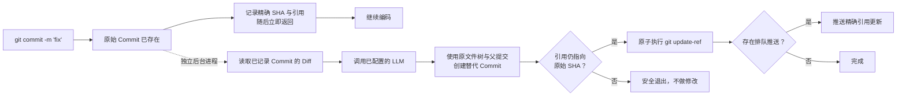

<p align="center">
  
</p>

<h1 align="center">Git AI — 异步 AI Git Commit Message 生成器</h1>

<p align="center">
  <strong>先提交，继续写代码。让 AI 在后台润色提交信息。</strong>
  <br />
  Git 安全记录工作之后，再把随手写下的 Commit Message 变成清晰的 Conventional Commits。
</p>

<p align="center">
  <a href="https://github.com/daidi/git-ai/releases"></a>
  <a href="https://github.com/daidi/git-ai/actions/workflows/ci.yml"></a>
  <a href="LICENSE"></a>
  <a href="https://marketplace.visualstudio.com/items?itemName=git-ai-async-commit-polisher.git-ai"></a>
  <a href="https://plugins.jetbrains.com/plugin/31221-git-ai"></a>
</p>

<p align="center">
  <a href="https://codegg.org/git-ai/"><strong>官网</strong></a>
  &nbsp;·&nbsp;
  <a href="#安装">安装</a>
  &nbsp;·&nbsp;
  <a href="#快速开始">快速开始</a>
  &nbsp;·&nbsp;
  <a href="#工作原理">工作原理</a>
  &nbsp;·&nbsp;
  <a href="https://github.com/daidi/git-ai/issues">支持</a>
</p>

<p align="center">
  <sub>
    <a href="README.md">English</a> ·
    简体中文 ·
    <a href="README_zh-TW.md">繁體中文</a> ·
    <a href="README_fr.md">Français</a> ·
    <a href="README_de.md">Deutsch</a> ·
    <a href="README_es.md">Español</a> ·
    <a href="README_it.md">Italiano</a> ·
    <a href="README_ja.md">日本語</a> ·
    <a href="README_ko.md">한국어</a> ·
    <a href="README_pt.md">Português</a> ·
    <a href="README_ru.md">Русский</a> ·
    <a href="README_ar.md">العربية</a> ·
    <a href="README_vi.md">Tiếng Việt</a> ·
    <a href="README_th.md">ไทย</a> ·
    <a href="README_id.md">Bahasa Indonesia</a> ·
    <a href="README_ms.md">Bahasa Melayu</a>
  </sub>
</p>

<p align="center">
  
</p>

Git AI 是一款免费开源的 **AI Commit Message 生成器**，支持终端、VS Code 和 JetBrains IDE。它能把 `fix auth` 这样的随手草稿变成有价值的提交历史，同时不会让你停下来等待 LLM 响应。

与提交前生成工具不同，Git AI 通过 `post-commit` Hook 工作。原始提交会先真实存在；随后，独立后台进程只读取这一次提交，调用你配置的模型，用相同的文件树与父提交创建替代 Commit，并且只在分支仍处于安全状态时才更新引用。

> Git AI 也在自己的仓库中使用这套工作流。可以直接[查看本项目的提交历史](https://github.com/daidi/git-ai/commits/main)验证效果。

## 看看有什么不同

```console
$ git commit -m "fix auth"
[main 1a2b3c4] fix auth
✨ Git AI: 正在后台润色（PID 2418）

# 终端已立即可用。润色完成后：
$ git log -1 --pretty=%s
fix(auth): prevent expired sessions on mobile
```

Git 会立即返回。模型工作期间，你可以继续编辑、测试、切换工具，甚至直接执行 `git push`；Git AI 会在后台协调后续流程。

## 为什么选择 Git AI

大多数 AI 提交工具把生成过程放在提交的关键路径上。Git AI 刻意把它移到了提交之后。

| | 常见 AI Commit 生成器 | Git AI |
|:--|:--|:--|
| **工作流** | 生成 → 等待 → 审阅 → 提交 | 提交 → 继续编码 → 后台润色 |
| **操作方式** | 专用命令、按钮或弹窗 | 原来的 `git commit` |
| **AI 失败时** | Commit 可能根本没有创建 | 原始 Commit 完整保留 |
| **后续改动** | 盲目 amend 可能捕获错误状态 | 只使用已记录 Commit 的文件树和父提交 |
| **分支安全** | 取决于具体工具 | 原子比较并交换；引用移动后安全退出 |
| **立即推送** | 需要等待或手动协调 | 精确推送排队，或选择严格阻止模式 |
| **使用位置** | 通常局限于某个 CLI 或编辑器 | 终端、VS Code、JetBrains 与其他 Git 客户端 |

**先提交，后思考**意味着在 AI 参与之前，你的代码已经被 Git 安全快照。

## 安装

选择你本来就在使用的入口。IDE 插件会自动安装并更新匹配版本的 Git AI CLI，并通过发布的 SHA-256 校验值验证二进制文件。

| 使用环境 | 安装入口 | 原生体验 |
|:--|:--|:--|
| **VS Code / 兼容编辑器** | [Visual Studio Marketplace](https://marketplace.visualstudio.com/items?itemName=git-ai-async-commit-polisher.git-ai) · [Open VSX](https://open-vsx.org/extension/git-ai-async-commit-polisher/git-ai) | Activity Bar、状态、历史、设置、统计、日志与恢复操作 |
| **JetBrains IDE** | [JetBrains Marketplace](https://plugins.jetbrains.com/plugin/31221-git-ai) | 原生工具窗口、状态栏组件、设置、历史、统计、日志与 VCS 操作 |
| **终端 / 任意 Git 客户端** | [GitHub Releases](https://github.com/daidi/git-ai/releases) · 下方包管理器 | 独立 Go 二进制文件与可组合 Git Hook |

### 独立 CLI

```bash
# Homebrew（macOS / Linux）
brew install daidi/tap/git-ai

# macOS / Linux 校验安装脚本
curl -fsSL https://raw.githubusercontent.com/daidi/git-ai/main/install.sh | bash

# 从源码安装（需要 Go 1.26.6+）
go install github.com/daidi/git-ai/cli/cmd/git-ai@latest
```

```powershell
# Scoop（Windows）
scoop bucket add daidi https://github.com/daidi/scoop-bucket.git
scoop install daidi/git-ai

# Windows PowerShell 校验安装脚本
iwr https://raw.githubusercontent.com/daidi/git-ai/main/install.ps1 -useb | iex
```

macOS、Linux 和 Windows 的 AMD64/ARM64 预编译文件、校验值、`.deb` 与 `.rpm` 包都可以在 [GitHub Releases](https://github.com/daidi/git-ai/releases) 下载。

## 快速开始

IDE 用户只需打开 Git AI 设置、连接模型，并接受一次性的仓库初始化提示。独立 CLI 用户可以执行：

```bash
# 交互配置 Provider、隐藏输入的密钥、模型、格式与语言
git-ai setup

# 每个仓库执行一次，安装可组合 Hook
cd your-project
git-ai init

# 之后继续使用原来的 Git 命令
git commit -m "fix login"
```

日常使用到这里就结束了。需要查看进度时运行 `git-ai status`；否则 Git AI 会安静地待在后台。

向导提供模型发现和连接测试，只有确认后才保存全局配置；取消或测试失败均不改配置。它不会安装 Hook 或修改仓库覆盖项。自动化脚本请继续使用 `git-ai config set`。

希望模型完全在本地运行？Ollama 不需要 API Key：

```bash
git-ai config set provider ollama --global
git-ai config set model llama3 --global
git-ai config set base_url http://localhost:11434 --global
git-ai config test
```

## 核心能力

- **真正异步的润色** — `post-commit` Hook 记录目标后立即返回，模型请求由独立后台进程处理。
- **Git 安全替换** — 只使用已记录的 Commit 创建新对象，绝不会读取之后暂存的内容。
- **推送感知** — 默认 `queue` 策略会在润色后重放精确引用更新；`block` 策略保留手动控制。
- **四种消息格式** — [Conventional Commits](https://www.conventionalcommits.org/)、[Gitmoji](https://gitmoji.dev/)、纯文本主题和结构化主题加正文。
- **自带模型** — 支持 OpenAI 兼容 API、Anthropic Claude、Google Gemini、DeepSeek、通义千问以及本地 Ollama。
- **理解仓库上下文** — 智能裁剪大型 Diff、安全读取静态 Commitlint JSON 规则、输出语言、自定义 Prompt 与可选原因说明。
- **内置输出契约校验** — 拒绝空白、过大、无效或格式错误的模型结果，并精确保留原始 Git Trailer。
- **智能跳过** — 合规的新消息可以保持不变，粗糙或重复的草稿才交给模型润色。
- **恢复控制** — 支持查看状态、重试、撤销、取消、跳过下一次提交和中断恢复。
- **本地可观测性** — AI 历史、生成耗时、效率统计、受限日志与原生系统通知都保存在本机。
- **原生 IDE 集成** — 为 [VS Code](vscode-extension/README.md) 和 [JetBrains IDE](idea-plugin/README.md) 提供可视化控制与托管安装。
- **16 种界面语言** — 英语，以及阿拉伯语、简体中文、繁体中文、法语、德语、印尼语、意大利语、日语、韩语、马来语、葡萄牙语、俄语、西班牙语、泰语和越南语本地化。
- **可复现质量评测** — [公开 Commit 评测工具](cli/eval/README.md)会衡量格式、语义、Trailer 保留、Diff 上下文与延迟。

## 工作原理



### 安全设计

Git AI **不会**在后台盲目执行 `git commit --amend`。

1. Git 先创建原始 Commit，Git AI 才开始模型工作。
2. Hook 记录精确的 Commit SHA 与分支引用，然后退出。
3. 后台进程读取已记录的 Commit，而不是当前 Index 或工作区。
4. 替代 Commit 复用原来的文件树与父提交。
5. 只有预期 SHA 仍匹配时，才通过 `git update-ref <ref> <new> <expected>` 推进分支。
6. 新 Commit、分支移动、网络异常、凭据错误、限流、无效响应或模型故障都会保留原始 Commit 和工作区。

Commit Message 是 Git Commit 对象的一部分，因此润色成功后会产生新的 SHA。安全检查确保 Git AI 只修改最初记录的那一次提交。

### 隐私与本地所有权

- **没有 Git AI 模型中转服务器。** 受限长度的 Commit Diff、草稿及仓库提示（记录的分支、任务编号、常用 scope）会直接发送到你配置的模型端点，不发送历史消息原文。
- **支持本地推理。** 不希望代码离开设备时可以使用 Ollama。
- **凭据不会进入仓库。** 持久化 API Key 只能保存在用户级配置中，也支持环境变量。
- **运行状态不会进入工作区。** 状态、日志与 AI 历史保存在用户缓存目录，仓库覆盖项使用 `.git/config`。
- **不上传分析数据。** 效率统计与 Commit 元数据只保存在本地。
- **诊断信息排除敏感内容。** 日志不会记录 API Key、Prompt、Diff、响应正文或包含凭据的远程 URL。
- **下载经过验证。** 安装脚本和 IDE 插件都会使用发布的 SHA-256 校验值验证二进制文件。

版本检查和托管下载可能会访问 GitHub 或 Git AI 发布服务。

## Provider 与配置

| Provider 模式 | 适用服务 | API Key |
|:--|:--|:--|
| `openai` | DeepSeek、OpenAI、通义千问及其他 OpenAI 兼容端点 | 需要 |
| `anthropic` | Anthropic Claude 原生 API | 需要 |
| `gemini` | Google Gemini 原生 API | 需要 |
| `ollama` | 本地 Ollama 服务 | 不需要 |

OpenAI 兼容端点示例：

```bash
git-ai config set provider openai --global
git-ai config set base_url https://api.example.com/v1 --global
git-ai config set model your-model --global
git-ai config set api_key "sk-..." --global
git-ai config test
```

| 配置项 | 默认值 | 用途 |
|:--|:--|:--|
| `message_format` | `conventional` | `plain`、`conventional`、`gitmoji` 或 `subject-body` |
| `commit_attribution` | `off` | 可选 `Polished-by` 尾注：`off` 关闭，`compact` 简洁署名 |
| `language` | `en` | 生成 Commit Message 使用的语言 |
| `smart_skip` | `true` | 合规新消息直接保留，不调用模型 |
| `push_policy` | `queue` | 安全排队后台推送；设为 `block` 可完全手动控制 |
| `max_diff_tokens` | `8000` | 限制发送给模型的 Diff 上下文 |
| `explain` | `false` | 增加一段简短正文说明改动原因 |
| `prompt_template` | 空 | 使用 `{{.Diff}}`、`{{.Hint}}` 与 `{{.Language}}` 自定义生成 |

### 仓库上下文

内置 Prompt 会参考记录的分支名、`PROJ-123` 或 `#123` 形式的任务编号，以及目标提交之前最近 20 个第一父链祖先中提取的最多 5 个常用 Conventional Commit scope。后续新提交、当前检出的分支和暂存文件不会影响这些提示。显式格式、语言、Commitlint 规则与实际 Diff 优先；这些提示不会授权自动关闭任务或新增 trailer。

已有自定义 Prompt 保持原样。需要上下文时，可主动使用 `{{.Branch}}`、`{{.Tickets}}`、`{{.CommonScopes}}` 或 `{{.RepositoryContext}}`；最后一个变量包含完整的受限提示块。任务编号与 scope 是列表，可用 Go 模板的 `range` 遍历。

### 模型列表缓存

```bash
git-ai config models                 # 优先使用七天内的缓存
git-ai config models --refresh       # 请求刷新列表
git-ai config models --offline       # 只读缓存，不访问网络
git-ai config models --offline --json
```

缓存位于操作系统用户缓存目录，按 Provider、端点和凭据哈希隔离，不在列表文件中保存原始端点或密钥。网络异常、超时、限流及服务端故障可回退旧列表，并标记过期；认证失败和无效响应不会被缓存掩盖。JSON 新增 `source`（`network`、`cache` 或 `stale-cache`）、`fetched_at` 及适用时的 `stale`，保留已有模型字段兼容性。`--refresh` 和 `--offline` 不能同时使用。

署名默认关闭。运行 `git-ai config set commit_attribution compact` 仅为当前仓库开启（加 `--global` 可全局开启），AI 润色成功后会在原有 trailer 末尾追加：

```text
Polished-by: Git AI <https://codegg.org/git-ai/>
```

原有 trailer 保留，已有相同署名不会重复追加。智能跳过、润色失败和已签名的提交不会被改动。设置为 `off` 后不再新增署名，但不会删除原有 trailer；`git-ai undo` 会恢复原始消息及其元数据。也可以用 `GIT_AI_COMMIT_ATTRIBUTION` 环境变量覆盖设置。

配置优先级为：`GIT_AI_*` 环境变量 → `.git/config` 仓库覆盖项 → 操作系统用户配置 → 默认值。API Key 只能存储在用户级配置中；工作区里的旧 `.git-ai.json` 会被忽略，避免克隆的仓库把用户凭据重定向到不可信端点。

## 常用命令

| 命令 | 作用 |
|:--|:--|
| `git-ai setup` | 交互配置全局模型设置，确认后保存 |
| `git-ai config models` | 获取模型列表，支持 `--refresh`、`--offline` 与 `--json` |
| `git-ai status` | 查看 `idle`、`polishing`、`pushing` 或 `failed` 状态 |
| `git-ai retry` | 在后台安全重试当前 Commit |
| `git-ai undo` | 恢复原始草稿消息 |
| `git-ai cancel` | 终止润色但不修改 Git |
| `git-ai skip-next` | 保持下一次提交不变 |
| `git-ai push` | 恢复延迟推送或推送当前分支 |
| `git-ai log` | 查看带本地 AI 元数据的 Git 历史 |
| `git-ai stats` | 查看本地效率统计 |
| `git-ai config list` | 查看已隐藏密钥的最终配置 |
| `git-ai update` | 安装最新且经过验证的 CLI 版本 |
| `git-ai uninstall` | 移除 Git AI Hook 并恢复原有 Hook |

运行 `git-ai --help` 或 `git-ai <command> --help` 查看完整 CLI 说明。

## IDE 集成

### VS Code

[VS Code 扩展](vscode-extension/README.md)支持 VS Code 1.85+ 及兼容 Open VSX 的编辑器，提供 Activity Bar 控制中心、实时状态、AI 历史、全局/项目可视化设置、本地效率统计、日志和一键恢复操作。受限工作区不会执行二进制文件、下载更新或安装 Hook。

```bash
code --install-extension git-ai-async-commit-polisher.git-ai
```

### JetBrains IDE

[JetBrains 插件](idea-plugin/README.md)支持 IntelliJ Platform 2024.1+，包括 IntelliJ IDEA、WebStorm、PyCharm、GoLand、PhpStorm、CLion、DataGrip 和 RubyMine，提供原生工具窗口、状态组件、设置、VCS 操作、历史、统计和受限日志查看。

[从 JetBrains Marketplace 安装 Git AI →](https://plugins.jetbrains.com/plugin/31221-git-ai)

## 常见问题

<details>
<summary><strong>Git AI 会修改源文件、Index 或已暂存内容吗？</strong></summary>
<br />
不会。替代 Commit 只使用精确记录的文件树与父提交；暂存、未暂存和之后产生的改动都不会被捕获。
</details>

<details>
<summary><strong>AI 工作期间又创建了一个 Commit，会发生什么？</strong></summary>
<br />
分支已经不再指向 Git AI 记录的 SHA，因此原子更新会安全退出。Git AI 绝不会改写新的 Commit。
</details>

<details>
<summary><strong>提交后立即 Push 会怎样？</strong></summary>
<br />
默认 <code>queue</code> 策略会记录精确引用更新，并在安全润色完成后重放。如果后台身份验证不可用，初始化会选择 <code>block</code>，让你之后手动推送。
</details>

<details>
<summary><strong>可以审阅、重试或撤销生成的消息吗？</strong></summary>
<br />
可以。使用 <code>git-ai log</code>、<code>git-ai retry</code> 和 <code>git-ai undo</code>，或在任一 IDE 插件中执行相应操作。
</details>

<details>
<summary><strong>Git AI 会把整个仓库发给模型吗？</strong></summary>
<br />
不会。它把已记录 Commit 的受限 Diff、草稿及仓库提示（分支、任务编号、常用 scope）发送到你配置的端点，不发送历史消息原文。不允许代码离开本机时请使用 Ollama。
</details>

<details>
<summary><strong>在 IDE 外提交也能工作吗？</strong></summary>
<br />
可以。Git AI 基于 Git Hook；仓库初始化后，终端、IDE 或其他 Git 客户端创建的 Commit 都使用同一套流程。
</details>

<details>
<summary><strong>Git AI 免费吗？</strong></summary>
<br />
Git AI 使用 MIT 协议，完全免费。你需要提供自己的云端 API Key 或本地 Ollama 模型；云服务商可能收取自己的使用费用。
</details>

## 开发

Monorepo 把持久化和 Git 操作统一交给一个引擎：

- [`cli/`](cli/) — Go CLI、Hook、后台进程、Provider、状态与安全引用更新
- [`vscode-extension/`](vscode-extension/) — 把所有操作委托给 CLI 的 TypeScript 集成
- [`idea-plugin/`](idea-plugin/) — 把所有操作委托给 CLI 的 Kotlin IntelliJ Platform 集成

```bash
cd cli
make build
make test
make lint
make eval

cd ../vscode-extension
npm ci
npm test

cd ../idea-plugin
./gradlew test buildPlugin
```

修改本地化 UI 文本前，请阅读仓库说明，并在项目根目录运行 `bash scripts/check-i18n-coverage.sh`。

## 帮助 Git AI 成长

如果 Git AI 让你保持了心流，请为[这个仓库点一个 Star](https://github.com/daidi/git-ai)，它能帮助更多开发者发现项目。欢迎通过 [GitHub Issues](https://github.com/daidi/git-ai/issues)提交 Bug、明确的功能建议、文档修复或 Pull Request。

## 开源协议

Git AI 使用 [MIT License](LICENSE)。

---

<p align="center">
  <strong>更好的提交历史，零等待。</strong>
  <br />
  <a href="#安装">安装 Git AI</a>
  &nbsp;·&nbsp;
  <a href="https://github.com/daidi/git-ai">在 GitHub 点 Star</a>
  &nbsp;·&nbsp;
  <a href="https://github.com/daidi/git-ai/issues">报告问题</a>
</p>
