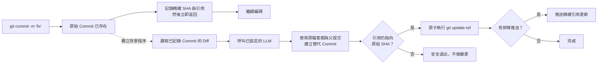

<p align="center">
  
</p>

<h1 align="center">Git AI — 非同步 AI Git Commit Message 產生器</h1>

<p align="center">
  <strong>先提交，繼續寫程式。讓 AI 在背景潤飾提交訊息。</strong>
  <br />
  Git 安全記錄工作之後，再把隨手寫下的 Commit Message 變成清楚的 Conventional Commits。
</p>

<p align="center">
  <a href="https://github.com/daidi/git-ai/releases"></a>
  <a href="https://github.com/daidi/git-ai/actions/workflows/ci.yml"></a>
  <a href="LICENSE"></a>
  <a href="https://marketplace.visualstudio.com/items?itemName=git-ai-async-commit-polisher.git-ai"></a>
  <a href="https://plugins.jetbrains.com/plugin/31221-git-ai"></a>
</p>

<p align="center">
  <a href="https://codegg.org/git-ai/"><strong>官方網站</strong></a>
  &nbsp;·&nbsp;
  <a href="#安裝">安裝</a>
  &nbsp;·&nbsp;
  <a href="#快速開始">快速開始</a>
  &nbsp;·&nbsp;
  <a href="#運作方式">運作方式</a>
  &nbsp;·&nbsp;
  <a href="https://github.com/daidi/git-ai/issues">支援</a>
</p>

<p align="center">
  <sub>
    <a href="README.md">English</a> ·
    <a href="README_zh-CN.md">简体中文</a> ·
    繁體中文 ·
    <a href="README_fr.md">Français</a> ·
    <a href="README_de.md">Deutsch</a> ·
    <a href="README_es.md">Español</a> ·
    <a href="README_it.md">Italiano</a> ·
    <a href="README_ja.md">日本語</a> ·
    <a href="README_ko.md">한국어</a> ·
    <a href="README_pt.md">Português</a> ·
    <a href="README_ru.md">Русский</a> ·
    <a href="README_ar.md">العربية</a> ·
    <a href="README_vi.md">Tiếng Việt</a> ·
    <a href="README_th.md">ไทย</a> ·
    <a href="README_id.md">Bahasa Indonesia</a> ·
    <a href="README_ms.md">Bahasa Melayu</a>
  </sub>
</p>

<p align="center">
  
</p>

Git AI 是免費開源的 **AI Commit Message 產生器**，支援終端機、VS Code 與 JetBrains IDE。它能把 `fix auth` 這樣的隨手草稿變成有價值的提交歷史，同時不會要求你停下來等待 LLM 回應。

與提交前產生工具不同，Git AI 透過 `post-commit` Hook 運作。原始 Commit 會先真正存在；接著，獨立背景程序只讀取這一次提交，呼叫你設定的模型，以相同的檔案樹與父提交建立替代 Commit，而且只在分支仍然安全時才更新引用。

> Git AI 也在自己的儲存庫使用這套工作流程。可以直接[查看本專案的提交歷史](https://github.com/daidi/git-ai/commits/main)驗證結果。

## 看看有什麼不同

```console
$ git commit -m "fix auth"
[main 1a2b3c4] fix auth
✨ Git AI: 正在背景潤飾（PID 2418）

# 終端機已立即可用。潤飾完成後：
$ git log -1 --pretty=%s
fix(auth): prevent expired sessions on mobile
```

Git 會立即返回。模型運作期間，你可以繼續編輯、測試、切換工具，甚至直接執行 `git push`；Git AI 會在背景協調後續流程。

## 為什麼選擇 Git AI

大多數 AI 提交工具把產生過程放在提交的關鍵路徑上。Git AI 刻意把它移到提交之後。

| | 一般 AI Commit 產生器 | Git AI |
|:--|:--|:--|
| **工作流程** | 產生 → 等待 → 審閱 → 提交 | 提交 → 繼續編碼 → 背景潤飾 |
| **操作方式** | 專用指令、按鈕或對話框 | 原本的 `git commit` |
| **AI 失敗時** | Commit 可能根本沒有建立 | 原始 Commit 完整保留 |
| **後續變更** | 盲目 amend 可能擷取錯誤狀態 | 只使用已記錄 Commit 的檔案樹與父提交 |
| **分支安全** | 視工具而定 | 原子比較並交換；引用移動後安全退出 |
| **立即推送** | 需要等待或手動協調 | 精確推送排入佇列，或選擇嚴格阻擋模式 |
| **使用位置** | 通常侷限於某個 CLI 或編輯器 | 終端機、VS Code、JetBrains 與其他 Git 用戶端 |

**先提交，後思考**代表在 AI 參與之前，你的程式碼已經被 Git 安全快照。

## 安裝

選擇你原本就在使用的入口。IDE 外掛會自動安裝並更新相符版本的 Git AI CLI，並以發佈的 SHA-256 校驗值驗證二進位檔案。

| 使用環境 | 安裝入口 | 原生體驗 |
|:--|:--|:--|
| **VS Code / 相容編輯器** | [Visual Studio Marketplace](https://marketplace.visualstudio.com/items?itemName=git-ai-async-commit-polisher.git-ai) · [Open VSX](https://open-vsx.org/extension/git-ai-async-commit-polisher/git-ai) | Activity Bar、狀態、歷史、設定、統計、日誌與復原操作 |
| **JetBrains IDE** | [JetBrains Marketplace](https://plugins.jetbrains.com/plugin/31221-git-ai) | 原生工具視窗、狀態列元件、設定、歷史、統計、日誌與 VCS 操作 |
| **終端機 / 任意 Git 用戶端** | [GitHub Releases](https://github.com/daidi/git-ai/releases) · 下方套件管理器 | 獨立 Go 二進位檔與可組合 Git Hook |

### 獨立 CLI

```bash
# Homebrew（macOS / Linux）
brew install daidi/tap/git-ai

# macOS / Linux 驗證安裝指令碼
curl -fsSL https://raw.githubusercontent.com/daidi/git-ai/main/install.sh | bash

# 從原始碼安裝（需要 Go 1.26.6+）
go install github.com/daidi/git-ai/cli/cmd/git-ai@latest
```

```powershell
# Scoop（Windows）
scoop bucket add daidi https://github.com/daidi/scoop-bucket.git
scoop install daidi/git-ai

# Windows PowerShell 驗證安裝指令碼
iwr https://raw.githubusercontent.com/daidi/git-ai/main/install.ps1 -useb | iex
```

macOS、Linux 與 Windows 的 AMD64/ARM64 預先編譯檔案、校驗值、`.deb` 與 `.rpm` 套件，都可以從 [GitHub Releases](https://github.com/daidi/git-ai/releases)下載。

## 快速開始

IDE 使用者只要開啟 Git AI 設定、連接模型，並接受一次性的儲存庫初始化提示。獨立 CLI 使用者可以執行：

```bash
# 每個儲存庫執行一次，安裝可組合 Hook
cd your-project
git-ai init

# 預設端點是 DeepSeek；請替換成自己的金鑰
git-ai config set api_key "sk-..." --global
git-ai config test

# 之後繼續使用原本的 Git 指令
git commit -m "fix login"
```

日常使用到這裡就完成了。需要查看進度時執行 `git-ai status`；否則 Git AI 會安靜地待在背景。

希望模型完全在本機執行？Ollama 不需要 API Key：

```bash
git-ai config set provider ollama --global
git-ai config set model llama3 --global
git-ai config set base_url http://localhost:11434 --global
git-ai config test
```

## 核心功能

- **真正非同步的潤飾** — `post-commit` Hook 記錄目標後立即返回，模型請求由獨立背景程序處理。
- **Git 安全替換** — 只使用已記錄的 Commit 建立新物件，絕不讀取之後暫存的內容。
- **推送感知** — 預設 `queue` 策略會在潤飾後重放精確引用更新；`block` 策略保留手動控制。
- **四種訊息格式** — [Conventional Commits](https://www.conventionalcommits.org/)、[Gitmoji](https://gitmoji.dev/)、純文字主旨與結構化主旨加正文。
- **自帶模型** — 支援 OpenAI 相容 API、Anthropic Claude、Google Gemini、DeepSeek、通義千問及本機 Ollama。
- **理解儲存庫內容** — 智慧裁剪大型 Diff、安全讀取靜態 Commitlint JSON 規則、輸出語言、自訂 Prompt 與可選原因說明。
- **內建輸出契約驗證** — 拒絕空白、過大、無效或格式錯誤的模型結果，並精確保留原始 Git Trailer。
- **智慧略過** — 合規的新訊息可以保持不變，粗略或重複的草稿才交給模型潤飾。
- **復原控制** — 支援檢視狀態、重試、還原、取消、略過下一次提交與中斷復原。
- **本機可觀測性** — AI 歷史、產生耗時、效率統計、受限日誌與原生系統通知都保存在本機。
- **原生 IDE 整合** — 為 [VS Code](vscode-extension/README.md) 與 [JetBrains IDE](idea-plugin/README.md)提供視覺化控制與託管安裝。
- **16 種介面語言** — 英語，以及阿拉伯語、簡體中文、繁體中文、法語、德語、印尼語、義大利語、日語、韓語、馬來語、葡萄牙語、俄語、西班牙語、泰語與越南語本地化。
- **可重現品質評測** — [公開 Commit 評測工具](cli/eval/README.md)會衡量格式、語意、Trailer 保留、Diff 內容與延遲。

## 運作方式



### 安全設計

Git AI **不會**在背景盲目執行 `git commit --amend`。

1. Git 先建立原始 Commit，Git AI 才開始模型工作。
2. Hook 記錄精確的 Commit SHA 與分支引用，然後退出。
3. 背景程序讀取已記錄的 Commit，而不是目前的 Index 或工作樹。
4. 替代 Commit 重複使用原本的檔案樹與父提交。
5. 只有預期 SHA 仍相符時，才透過 `git update-ref <ref> <new> <expected>` 推進分支。
6. 新 Commit、分支移動、網路錯誤、憑證錯誤、流量限制、無效回應或模型故障，都會保留原始 Commit 與工作樹。

Commit Message 是 Git Commit 物件的一部分，因此潤飾成功後會產生新的 SHA。安全檢查確保 Git AI 只修改最初記錄的那一次提交。

### 隱私與本機所有權

- **沒有 Git AI 中繼伺服器。** 受限長度的 Commit Diff 與草稿會直接傳送到你設定的模型端點。
- **支援本機推論。** 不希望程式碼離開裝置時可以使用 Ollama。
- **憑證不會進入儲存庫。** 持久化 API Key 僅限使用者層級，也支援環境變數。
- **執行狀態不會進入工作樹。** 狀態、日誌與 AI 歷史保存在使用者快取目錄，儲存庫覆寫項使用 `.git/config`。
- **不會上傳分析資料。** 效率統計與 Commit 中繼資料只保存在本機。
- **診斷資訊排除敏感內容。** 日誌不會記錄 API Key、Prompt、Diff、回應內容或含憑證的遠端 URL。
- **下載經過驗證。** 安裝指令碼與 IDE 外掛都會使用發佈的 SHA-256 校驗值驗證二進位檔案。

版本檢查與託管下載可能會存取 GitHub 或 Git AI 發佈服務。

## Provider 與設定

| Provider 模式 | 適用服務 | API Key |
|:--|:--|:--|
| `openai` | DeepSeek、OpenAI、通義千問與其他 OpenAI 相容端點 | 需要 |
| `anthropic` | Anthropic Claude 原生 API | 需要 |
| `gemini` | Google Gemini 原生 API | 需要 |
| `ollama` | 本機 Ollama 服務 | 不需要 |

OpenAI 相容端點範例：

```bash
git-ai config set provider openai --global
git-ai config set base_url https://api.example.com/v1 --global
git-ai config set model your-model --global
git-ai config set api_key "sk-..." --global
git-ai config test
```

| 設定項目 | 預設值 | 用途 |
|:--|:--|:--|
| `message_format` | `conventional` | `plain`、`conventional`、`gitmoji` 或 `subject-body` |
| `language` | `en` | 產生 Commit Message 使用的語言 |
| `smart_skip` | `true` | 合規新訊息直接保留，不呼叫模型 |
| `push_policy` | `queue` | 安全排入背景推送；設為 `block` 可完全手動控制 |
| `max_diff_tokens` | `8000` | 限制傳送給模型的 Diff 內容 |
| `explain` | `false` | 增加簡短正文說明變更原因 |
| `prompt_template` | 空 | 使用 `{{.Diff}}`、`{{.Hint}}` 與 `{{.Language}}` 自訂產生內容 |

設定優先順序為：`GIT_AI_*` 環境變數 → `.git/config` 儲存庫覆寫項 → 作業系統使用者設定 → 預設值。API Key 只能儲存在使用者層級；工作樹中的舊 `.git-ai.json` 會被忽略，避免複製的儲存庫把使用者憑證重新導向不可信端點。

## 常用指令

| 指令 | 作用 |
|:--|:--|
| `git-ai status` | 檢視 `idle`、`polishing`、`pushing` 或 `failed` 狀態 |
| `git-ai retry` | 在背景安全重試目前的 Commit |
| `git-ai undo` | 還原原始草稿訊息 |
| `git-ai cancel` | 終止潤飾但不變更 Git |
| `git-ai skip-next` | 保持下一次提交不變 |
| `git-ai push` | 恢復延遲推送或推送目前分支 |
| `git-ai log` | 檢視帶本機 AI 中繼資料的 Git 歷史 |
| `git-ai stats` | 檢視本機效率統計 |
| `git-ai config list` | 檢視已隱藏金鑰的最終設定 |
| `git-ai update` | 安裝最新且經過驗證的 CLI 版本 |
| `git-ai uninstall` | 移除 Git AI Hook 並恢復原有 Hook |

執行 `git-ai --help` 或 `git-ai <command> --help` 查看完整 CLI 說明。

## IDE 整合

### VS Code

[VS Code 擴充功能](vscode-extension/README.md)支援 VS Code 1.85+ 與相容 Open VSX 的編輯器，提供 Activity Bar 控制中心、即時狀態、AI 歷史、全域/專案視覺化設定、本機效率統計、日誌與一鍵復原操作。受限工作區不會執行二進位檔、下載更新或安裝 Hook。

```bash
code --install-extension git-ai-async-commit-polisher.git-ai
```

### JetBrains IDE

[JetBrains 外掛](idea-plugin/README.md)支援 IntelliJ Platform 2024.1+，包括 IntelliJ IDEA、WebStorm、PyCharm、GoLand、PhpStorm、CLion、DataGrip 與 RubyMine，提供原生工具視窗、狀態元件、設定、VCS 操作、歷史、統計與受限日誌檢視。

[從 JetBrains Marketplace 安裝 Git AI →](https://plugins.jetbrains.com/plugin/31221-git-ai)

## 常見問題

<details>
<summary><strong>Git AI 會修改原始碼、Index 或已暫存內容嗎？</strong></summary>
<br />
不會。替代 Commit 只使用精確記錄的檔案樹與父提交；暫存、未暫存與之後產生的變更都不會被擷取。
</details>

<details>
<summary><strong>AI 工作期間又建立一個 Commit，會發生什麼？</strong></summary>
<br />
分支已不再指向 Git AI 記錄的 SHA，因此原子更新會安全退出。Git AI 絕不會改寫新的 Commit。
</details>

<details>
<summary><strong>提交後立即 Push 會怎樣？</strong></summary>
<br />
預設 <code>queue</code> 策略會記錄精確引用更新，並在安全潤飾完成後重放。如果背景驗證不可用，初始化會選擇 <code>block</code>，讓你之後手動推送。
</details>

<details>
<summary><strong>可以審閱、重試或還原產生的訊息嗎？</strong></summary>
<br />
可以。使用 <code>git-ai log</code>、<code>git-ai retry</code> 與 <code>git-ai undo</code>，或在任一 IDE 外掛執行對應操作。
</details>

<details>
<summary><strong>Git AI 會把整個儲存庫傳給模型嗎？</strong></summary>
<br />
不會。它只把已記錄 Commit 的受限 Diff 與草稿傳送到你設定的端點。不允許程式碼離開本機時請使用 Ollama。
</details>

<details>
<summary><strong>在 IDE 外提交也能運作嗎？</strong></summary>
<br />
可以。Git AI 以 Git Hook 為基礎；儲存庫初始化後，終端機、IDE 或其他 Git 用戶端建立的 Commit 都使用同一套流程。
</details>

<details>
<summary><strong>Git AI 免費嗎？</strong></summary>
<br />
Git AI 採用 MIT 授權，完全免費。你需要提供自己的雲端 API Key 或本機 Ollama 模型；雲端服務商可能收取自己的使用費用。
</details>

## 開發

Monorepo 將持久化與 Git 操作統一交給一個引擎：

- [`cli/`](cli/) — Go CLI、Hook、背景程序、Provider、狀態與安全引用更新
- [`vscode-extension/`](vscode-extension/) — 將所有操作委派給 CLI 的 TypeScript 整合
- [`idea-plugin/`](idea-plugin/) — 將所有操作委派給 CLI 的 Kotlin IntelliJ Platform 整合

```bash
cd cli
make build
make test
make lint
make eval

cd ../vscode-extension
npm ci
npm test

cd ../idea-plugin
./gradlew test buildPlugin
```

修改本地化 UI 文字前，請閱讀儲存庫說明，並在專案根目錄執行 `bash scripts/check-i18n-coverage.sh`。

## 幫助 Git AI 成長

如果 Git AI 讓你維持了心流，請為[這個儲存庫點一個 Star](https://github.com/daidi/git-ai)，它能幫助更多開發者發現專案。歡迎透過 [GitHub Issues](https://github.com/daidi/git-ai/issues)提交 Bug、明確的功能建議、文件修正或 Pull Request。

## 授權條款

Git AI 採用 [MIT License](LICENSE)。

---

<p align="center">
  <strong>更好的提交歷史，零等待。</strong>
  <br />
  <a href="#安裝">安裝 Git AI</a>
  &nbsp;·&nbsp;
  <a href="https://github.com/daidi/git-ai">在 GitHub 點 Star</a>
  &nbsp;·&nbsp;
  <a href="https://github.com/daidi/git-ai/issues">回報問題</a>
</p>
